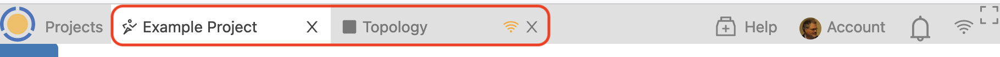
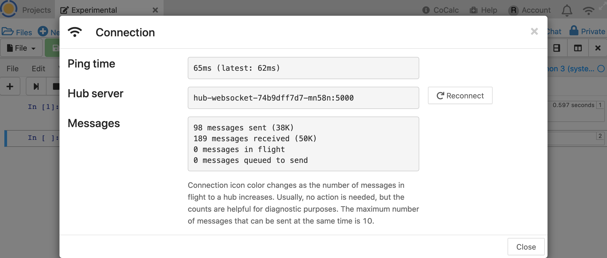

.. index:: Project Toolbar
.. index:: Toolbars; project
.. _project-toolbar:

========================
Project Toolbar
========================

Here's a tour of the topmost toolbar in CoCalc, the **Project Toolbar**.

.. contents::
   :local:
   :depth: 1

.. figure:: img/project-toolbar.png
    :width: 90% 
    :align: center
    :alt: the top toolbar is the project toolbar

    the top toolbar is the project toolbar

Going from left to right:

.. index:: Project Toolbar; projects button
.. index:: Project Toolbar; project list

Project List
==========================

|cocalc-logo| Click the Projects (cocalc logo) button to create a new project and see a list of your existing projects. Any text you type into the **Search for Projects** field will be used to select which projects are displayed. Any project with matching text in Title or Description will appear in the filtered list. If you have any hidden or deleted projects, a checkbox will appear to allow you to show those. Learn more here about the :doc:`project-list`.

.. index:: Project Toolbar; open projects

Open Projects
=============

To the right of the Projects button, tab buttons will appear for each project you have open.

* To the left of the project title in each button, you will see a run icon |run-icon| if the project is running, and a stop icon |stop-icon| if the project is stopped.
* To the right of the project title in each button, a red disconnect icon |disconnect-icon| will appear if the project is not connected. It is normal for the disconnect icon to appear if the project is not running.
* At the far right in each button, there is a close-project icon |remove-icon| that allows you to close the project.

A member-hosted project that is running will continue running after it is closed until its idle time has been reached. At that point it will be stopped.

If you close your browser window or sign out, CoCalc will remember your open projects and files (this is your :ref:`CoCalc session <cocalc-session>`), and restore the project tabs the next time you sign in.

.. index::
   Support; create support request
   seealso: Help; Support
.. _help-button:

Help
====

|medkit| **Use the Help button if you have any questions about CoCalc.** If you have a question while you have a file open in CoCalc, clicking **Help** will automatically include a link to the file in your request, allowing our support team to understand the issue better. If you are getting a result that you don't expect, it helps to include steps for us to reproduce the problem.

.. index:: Project Toolbar; account tab

Account
=======

|avatar-sample| The Account button has the avatar for your account in a small circle just left of the word "Account". Click here to update your profile, sign out, order subscriptions, view your upgrades, `add SSH Keys <http://blog.sagemath.com/cocalc/2017/09/08/using-ssh-with-cocalc.html>`_, and check on support tickets. Read more about account actions :doc:`here <account-toolbar>`.

.. index:: Project Toolbar; notification (bell) icon

Notification Bell
==================

|bell| A count is displayed over the notification bell if there are chat updates or file edits in projects you own or collaborate on. Click the bell to view a list of pending notifications, showing which account originated them and a link to the project or file being updated at the time.

.. index:: Connection Status

.. _connection-status:

Connection Status
=================

|wifi| The connection status icon changes color as shown below to indicate changes in the connection between your browser and CoCalc servers.

.. image:: img/getting-started/conn-stat.png
    :width: 35%
    :alt: See below for connection status icon color codes.

Colors for the connection status icon:

* Grey: connected, no messages in flight.

* Dark Blue: connected, moderate load.

* Light Blue: connected, significant load.

* Red: connected, serious message backlog.

* Orange: disconnected / connecting.

  Clicking the connection status icon brings up a window with additional connection detail, including round-trip ping time to the CoCalc servers. If the ping time doesn't appear right away, wait a bit; it's tested every 30 seconds when the window is open.

.. index:: Project Toolbar; fullscreen mode

Fullscreen Mode
=================

|expand| Clicking here will toggle fullscreen mode, to hide or show the project and file toolbars.

.. |cocalc-logo| image:: img/icons/cocalc-logo.svg
    :height: 20px
    :width: 20px
    :alt: cocalc logo icon
.. |info-circle|
     image:: https://github.com/encharm/Font-Awesome-SVG-PNG/raw/master/black/png/128/info-circle.png
     :width: 16px
     :alt: info i-circle icon
.. |medkit|
     image:: https://github.com/encharm/Font-Awesome-SVG-PNG/raw/master/black/png/128/medkit.png
     :width: 16px
     :alt: help medkit icon
.. |bell|
     image:: https://github.com/encharm/Font-Awesome-SVG-PNG/raw/master/black/png/128/bell-o.png
     :width: 16px
     :alt: notifications bell icon
.. |wifi|
     image:: https://github.com/encharm/Font-Awesome-SVG-PNG/raw/master/black/png/128/wifi.png
     :width: 16px
     :alt: connection status wifi icon
.. |expand| image:: img/icons/expand.png
    :height: 20px
    :alt: expand fullscreen icon

.. |stop-icon| image:: img/antd-icons/stop-icon.png
    :height: 20px
    :alt: stopped project icon
.. |remove-icon| image:: img/antd-icons/remove-icon.png
    :height: 20px
    :alt: close project icon
.. |disconnect-icon| image:: img/antd-icons/disconnect-icon.png
    :height: 20px
    :alt: project disconnected icon

