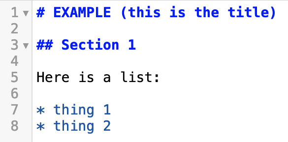
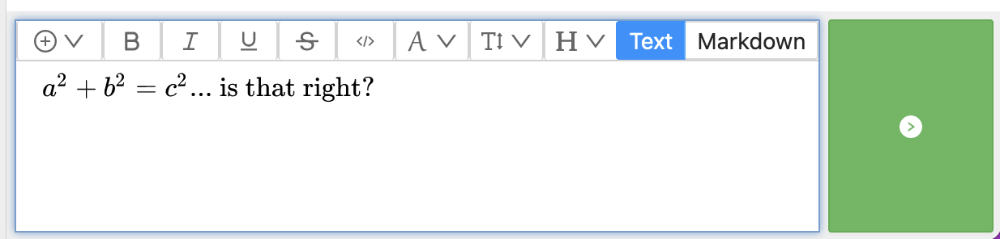
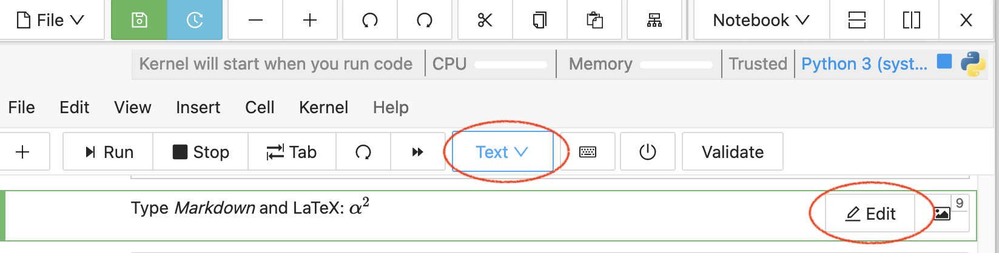
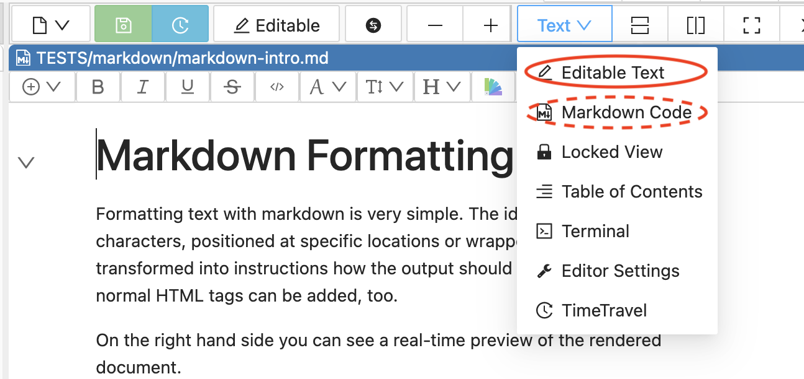

.. index:: rich text

========================
Rich Text Editing
========================

.. contents::
     :local:
     :depth: 2

##########################
Introduction
##########################

With *Rich text editing*, as you enter content, your work is displayed in a form that resembles the final result, i.e. you do not see formatting commands mixed in with text.

Here is how some sample content will appear **as you enter it** with rich text editing. For each line, use the usual markdown formatting characters, i.e. start the first line with a "#" and a space:

.. image:: img/yes-rich.png
    :width: 50%
    :align: center
    :alt: rich text editing does not show formatting commands

And here is how it would appear if you type the same markdown code without rich text editing:

With rich text editing, you see the final result right away.

Note that you can also set title and subtitle font size by selecting the text and using "H" (headings) in font options, as shown below.

#####################################
Where Rich Text Editing is Available
#####################################

* :doc:`markdown` and :doc:`frame-editor`: when editing Markdown (.md) files. Select "Editable Text".

* :doc:`chat` as well as :ref:`side-chat`.

* :doc:`tasks`.

* :doc:`whiteboard` In text, sticky notes, and task lists.

* :doc:`jupyter` In text or Markdown cell types.

########################
Features
########################

***********************
Real-time Collaboration
***********************

Multiple users can use rich text editing on a file, and see one another's work at the same time.

***************************
LaTeX in Rich Text Editing
***************************

When using rich text editing, you can embed LaTeX directives between dollar signs ($) *followed by a space*. You must add a space to cause conversion to mathematical characters.

Here is an example of latex entry in :ref:`side-chat` for a file, before typing a space after the second $:

.. image:: img/rich-text-latex-1.png
    :width: 60%
    :align: center
    :alt: rich text editing with latex, before final space

Here is the formatting that results after typing the space:

********************
Font options
********************

You can specify font family, face (bold, italics, etc.), size, and color.

If you select "Text" mode (instead of Markdown) for editing content between code cells,
then you can highlight any text and click the color palette icon, then set the color of that text.

For a markdown file: select "Editable Text" for font options.

.. image:: img/font-options-md.png
    :width: 60%
    :align: center
    :alt: font options while editing a .md file

For a Jupyter cell: select "Text" cell type, then "Edit" for font options.

.. image:: img/font-options-ipynb2.png
    :width: 60%
    :align: center
    :alt: font options while editing a .md file

(Implementation note: rich text font options use ...
under the hood.
The format is sufficiently well-defined that it doesn't get removed by CoCalc XSS processing. So it works even if e.g., a student opens the file and doesn't switch to trusted mode.)

########################
Limitations
########################

At present, the markdown "Editable Text" editor does not offer an easy way to add a link. And adding an image is limited to copying an image that has been added to the paste buffer. To add a link, or to add an image from a file at this time, choose "Markdown Code" in the pulldown menu at the top.

