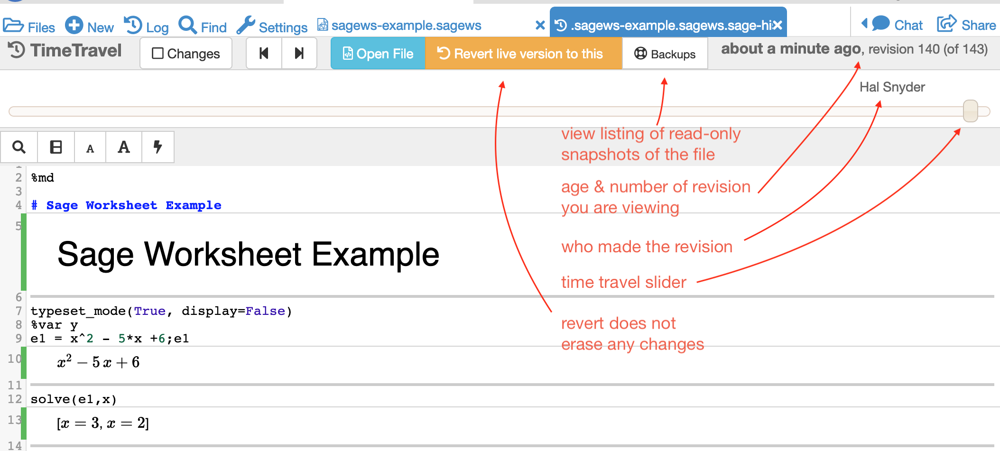
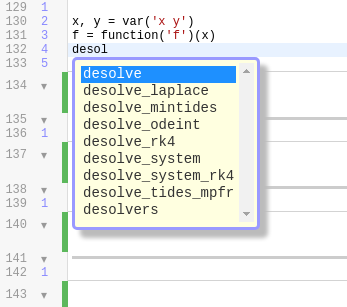

.. index:: Sage Worksheets
.. _sage-worksheet:

===============
Sage Worksheets
===============

.. contents::
   :local:
   :depth: 2

Introduction
============

Sage Worksheets were developed for collaborative, notebook-style computing with `SageMath <https://www.sagemath.org>`_ on the `CoCalc <https://cocalc.com>`_ platform. Like Jupyter Notebooks, Sage Worksheets support many programming environments. More than one language environment can be used in the same Sage Worksheet.

Note: in the CoCalc User Manual, we will generally use the term *SageMath* to refer to the `open source mathematical system <https://www.sagemath.org>`_ that runs on CoCalc and in many other environments. Elsewhere, you may see it referred to simply as *Sage*.

In CoCalc, there are at least three ways to run SageMath:

* in a Sage Worksheet
* in a Jupyter Notebook
* from the command line in a terminal

.. _what-is-sagews:

What's a Sage Worksheet?
==============================

A Sage Worksheet is a file ending in ``.sagews`` and is subdivided into cells. Each cell has an input region and an output region, which might be 0, 1, 2, or many lines long.

The input can be mathematical, in the Sage syntax, or it could be in many other formats, including :doc:`markdown`, HTML, Python 2 or 3, and R. To use a format other than Sage syntax, start the cell with a mode directive such ss "%md" for markdown. See this `CoCalc blog article <https://blog.cocalc.com/smc/2016/08/08/custom-magic-commands.html>`_ for more information about built-in and custom sagews modes.

When you *run* a cell, by clicking ``Run`` or typing ``Shift-Enter``, the input is executed (or formatted, for text processing). The result appears in the output after the calculation is done.

To begin work on a Sage Worksheet, create a file ending with ``.sagews``.

.. figure:: img/sagews/sagews-example.png
     :width: 90%
     :align: center

     *example of a Sage Worksheet*

How to Revert/Undo Changes in a Sage Worksheet
==============================================

For tiny changes, control+Z (or command+Z on a mac) will give you an instantaneous undo.

When it comes to undoing larger changes, one of the most useful things about CoCalc is that it will keep all versions of all of your files. This means that you can revert back to previous versions easily.

.. index:: TimeTravel; in Sage Worksheet

TimeTravel
----------

From any worksheet, click on TimeTravel.

.. figure:: img/sagews/sagews-example-tt.png
     :width: 30%
     :align: center

     ..

Using the slider, look at all the versions. Find the revision that you want and then click "Revert live version to this."

     *looking at a Sage Worksheet with TimeTravel*

.. index:: Backups; Sage worksheets

Backups (snapshots)
--------------------

For a list of snapshots taken by CoCalc, use the ``Backups`` button from the TimeTravel view or the Files list. Note that these backups are read-only. If you want to continue working on a file from a snapshot in Backups, you will need to copy it into a writable folder in your project.

Understanding Error Messages
============================

*Question: I did xyz and now I have this huge error message! Why?*

Often when SageMath encounters an error, a long error message appears. This output is called a "stack trace" and it can be very useful to experienced programmers. However, often it is enough to **look at the last line of the error message** to understand what has gone wrong.

.. figure:: img/sagews/sagews-stacktrace.png
     :width: 100%
     :align: center

     *making sense of error messages*

Help for Programmers
=====================

Extended Documentation
-----------------------

To see verbose documentation for language features, including commands, methods, and attributes, use the ``help()`` function.

.. figure:: img/sagews/sagews-help.png
     :width: 70%
     :align: center

     ..

Concise Documentation
-----------------------

To see concise documentation (docstrings) for language features, attributes, append a single question mark and run the cell. This information is similar to what you get with ``help()``.

.. figure:: img/sagews/sagews-1q.png
     :width: 70%
     :align: center

     ..

Source Code
-----------------------

To see source code for language features, append two question marks and run the cell.

.. figure:: img/sagews/sagews-2q.png
     :width: 70%
     :align: center

     ..

Tab Completion
-----------------------

To get a hint for possible completions of a function name, method argument, etc., type the beginning of what you are looking for then press the ``[tab]`` key. This is a quick way to browse through the methods for an object.

     ways to solve `differential equations in SageMath <http://doc.sagemath.org/html/en/reference/calculus/sage/calculus/desolvers.html>`_

.. index:: Sage Worksheets; plot slows down worksheet
.. index:: Sage Worksheets; enable/disable svg plot

Sage Worksheet Slow When Plotting? Disable svg.
============================================================

Plots can generate a large number of points. The default display format for plots is ``svg``, which gives excellent detail, but consumes an amount of memory proportional to the number of points and can markedly slow down worksheet performance.

You can efficiently display plots with as many points as you want if you use ``show()`` with an option of ``svg=False``, for example::

    show(plot(sin(x^2),(x,0,10)),svg=False)

This approach also works with ``list_plot()``. There's no way at present to default to svg disabled. You must use the setting with each plot.

.. index:: Sage Worksheets; lifetime of definitions

How Long are Definitions Stored in a Sage Worksheet?
=====================================================

Definitions (of variables, functions, etc.) are stored in the worksheet process and are retained until that process terminates. The worksheet process may end by itself, for example when ``Restart`` is clicked at the top of the worksheet. It is also terminated when the sage worksheet server terminates or is restarted, when the project is stopped or restarted, and when the host virtual machine restarts.

Projects are stopped after some number of hours of non-interactive use (see :ref:`Idle Timeout <idle-timeout>`). If your project is on a free server, it will be stopped whenever the Google pre-emptible server instance restarts, typically once per 24 hours.

SageMath built-in functions ``save``, ``load``, ``save_session`` and ``load_session`` are useful for saving and restoring state. See `Loading and saving sessions and listing all variables <http://doc.sagemath.org/html/en/reference/misc/sage/misc/session.html>`_.

Wiki resources
==================

.. _sagews-wiki:

Sage Worksheets
-------------------

* A previous version of this page is at `Sage Worksheet UI and Help <https://github.com/sagemathinc/cocalc/wiki/sagews>`_
* `Custom "Mode Commands" in Sage Worksheets <https://github.com/sagemathinc/cocalc/wiki/sagews-custom-modes>`_
* `Search the CoCalc wiki <https://github.com/sagemathinc/cocalc/search?utf8=%E2%9C%93&q=&type=Wikis>`_ Enter your search text in the "Search or jump to..." blank at the top.

Conversion utilities
----------------------

* There are buttons in the UI to convert to PDF, a print-button or a Jupyter Notebook
* `SageWS to HTML <https://github.com/sagemathinc/cocalc/wiki/sagews2html>`_ (including a utility to extract the sagews file from a generated HTML file)
* Run ``cc-sagews2pdf --help`` in a :doc:`./terminal` for more information about converting to PDF
* Similarly, ``cc-sagews2ipynb`` is a command-line utility to convert Sage worksheet to Jupyter notebook, and ``cc-ipynb2sagews`` does the reverse conversion, from Jupyter notebook to Sage worksheet.

Help about SageMath
====================

Items relating strictly to SageMath, whether or not you are using CoCalc.

* **Quickstart:** read the `documentation <https://doc.sagemath.org/html/en/>`_, in particular the `Tutorial <https://doc.sagemath.org/html/en/tutorial/index.html>`_.
* `The Top Mathematical Syntax Errors in Sage <https://github.com/sagemathinc/cocalc/wiki/MathematicalSyntaxErrors>`_
* :ref:`Questions about Sage <sage-question>` -- how to get help working with Sage.
* `Sage Bugreport <https://github.com/sagemathinc/cocalc/wiki/SageBug>`_ -- I am using Sage and think I have found a bug

Howto
==================

.. index:: Attach Sage files
.. _attach-sage-files:

Attach Sage files to Sage Worksheets
---------------------------------------------------------------

**Is there a way to write functions in one worksheet, and then import them to another and use them there?**

Not exactly, but you can write code in a ``.sage`` file and then load it into another Sage Worksheet as illustrated at
https://cocalc.com/share/4a5f0542-5873-4eed-a85c-a18c706e8bcd/support/2018-06-12-sage-code/?viewer=share

#. Put code in a new file with extension ``.sage``, e.g. ``code.sage``
#. In a Sage worksheet or the terminal, run this: ``%attach code.sage`` or ``attach("code.sage")``
#. Now all code in ``code.sage`` is available in your worksheet, and whenever it changes, it will get reloaded automatically.
#. If you're using Jupyter, this is all broken (see https://github.com/sagemathinc/cocalc/issues/2916), but at least you can use ``load("code.sage")`` instead.

How can I connect an HTML form with my Python code?
---------------------------------------------------------------

.. note::

    The following explanation might be outdated!

To create a connection between your HTML form in a .sagews file created using HTML, CSS and JS, you need to use the ``worksheet.execute_code()`` function in your JS code.

Because ``worksheet.execute_code`` isn't a standard JS function, but special CoCalc function, you need to load your JS code with ``worksheet.execute_code()``.  In particular do NOT use

::

    load('path/to/js/code.js')

but instead use

::

    salvus.javascript(open('path/to/js/code.js').read())

For example in a ``.sagews`` file suppose you created a div with ``id='myApp'`` as follows::

    %html
    

    ....
        

        

    

Let's say your Python function will double ``x``::

    def myfunc(x):
        print(x*2)

In your JS code type::

    worksheet.execute_code({
        code: 'myfunc(n)',
        data: {n: 2},
        preparse: true,
        cb: function(msg){
                if(msg.stdout){$('#myApp #msgLog').html(msg.stdout);}
                if(msg.stderr){$('#myApp #msgErr').html(msg.stderr);}
        }
    });

Please note that ``myfunc()`` doesn't ``return`` anything.
On the contrary, it uses ``print()`` to send output. This is because JS and python are different languages, and you can't just use ``return`` in your Python function to return some answer. ``stdout`` in JS code means standard output stream.
That is, the ``print`` function in your Python code places the result of ``myfunc()`` in the output stream.
That's why you need to use ``print()`` but not ``return()`` in your Python code.

Also, if your Python code will raise some exception,
then it will result in output to ``stderr`` the standard error stream.
If you JS code (as in the example above) catches stderr,
you can get any error message from your Python code.

How can I play sounds?
-----------------------------

CoCalc runs on a remote machine in the cloud.
To make a wav, mp3 or ogg file play on your computer, it must travel from the cloud to your browser.
That's done by first saving the waveform to a file in CoCalc and then downloading it into the website inside an `HTML5 audio tag`_.

.. _HTML5 audio tag: https://developer.mozilla.org/de/docs/Web/HTML/Using_HTML5_audio_and_video

1. Run the code below to render a waveform to a file using `scipy.io.wavfile.write`_:

.. _scipy.io.wavfile.write: https://docs.scipy.org/doc/scipy/reference/generated/scipy.io.wavfile.write.html

.. code-block:: python

    from scipy.io.wavfile import write as write_wav
    import numpy as np
    # Samples per second
    sps = 22050
    # Frequency / pitch of the sine wave
    freq_hz = 440

    # Duration per segment
    duration_s = 1.0

    xx = np.arange(duration_s * sps)  / sps
    yy = []
    for i in range(5):
        yy.append(np.sin(2 * np.pi * xx * freq_hz) * np.cos(0.2 + (i/5.0) * np.pi * xx * (100 + freq_hz)))
    yy = 0.3 * np.concatenate(yy) # 0.3 adjusts volume
    yy16bit = np.int16(yy * 32767)

    # Write the .wav file
    write_wav('sound.wav', sps, yy16bit)

2. Put this in a block of code. After evaluating it you'll see an embedded player::

    %md
    <audio controls=true src="sound.wav"/>

.. note::

    Currently, embedding into HTML5 via a `%md` Markdown cell does not work.
    Please check the status of `ticket #4240 <https://github.com/sagemathinc/cocalc/issues/4240>`_.

    Until it is resolved, run ``salvus.file('sound.wav')`` and click on the generated link to open the file in a new tab.
    Your browser should show you a little player.

