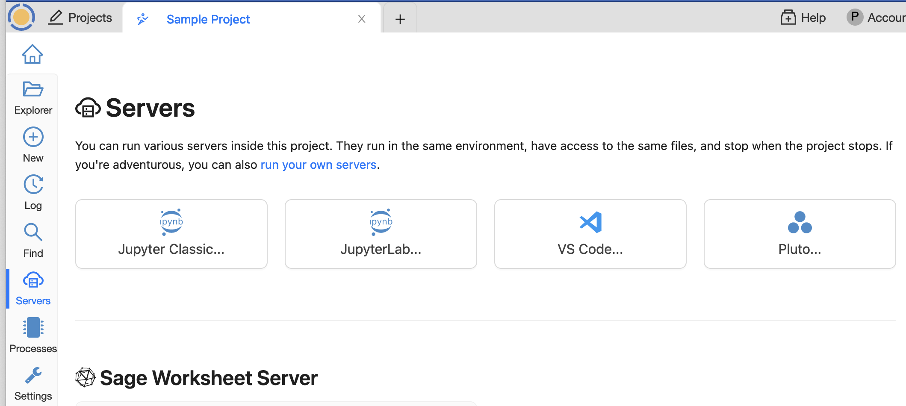

.. index:: Servers

=============================
Servers
=============================

|servers| Servers
==================

After opening a project, you can run various servers in addition to the main CoCalc service. Click "Servers" in the :doc:`activity-bar` to see what's available. Options include Jupyter Classic, JupyterLab, VS Code Server, Pluto, and even possibly custom servers of your own design.

     ..

