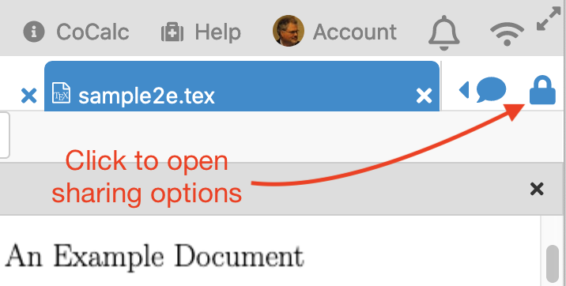
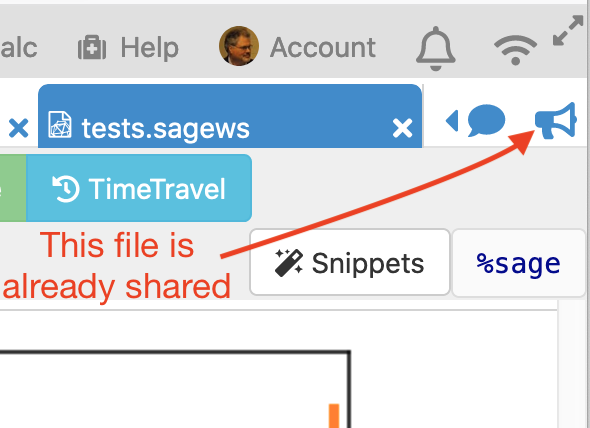
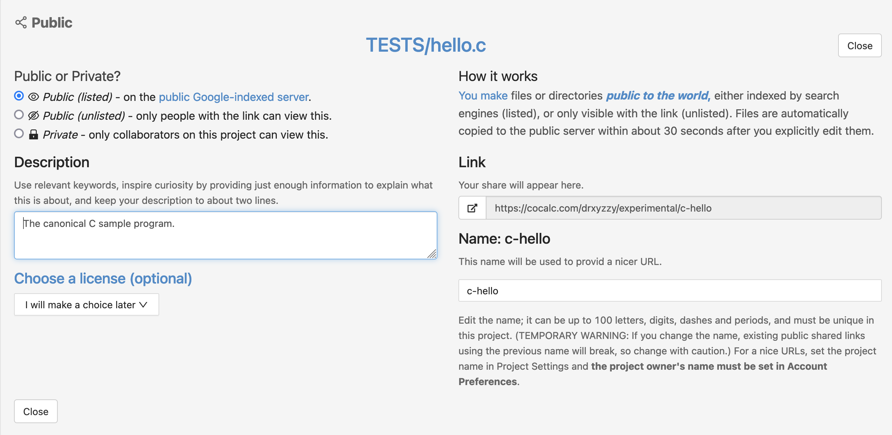

.. index:: Sharing files
.. index:: Publishing files
.. _sharing-files:

==========================
Sharing Files
==========================

.. contents::
     :local:
     :depth: 1

Make a file or directory publicly visible to the world.

.. note::

    CoCalc's share server is available at https://cocalc.com/share/

.. _publishing-files:

#################
Publishing Files
#################

You can make individual files and folders public.
First, do either of the following:

* With the file open, click the lock icon |lock| at upper right. Note: if you see the bullhorn icon |bullhorn| instead of the lock, that means your file is already shared; you could click it to change sharing settings.

     *click lock icon to enter file-sharing dialog*

     *lock is replaced by bullhorn if file is already shared*

* In the Files listing for your project, check the box in the leftmost column for your file, and click |public| Share. You can also select more than one file in order to share them together (e.g. an HTML page that includes images)

.. |info| image:: https://github.com/encharm/Font-Awesome-SVG-PNG/raw/master/black/png/16/info-circle.png
.. |lock| image:: https://github.com/encharm/Font-Awesome-SVG-PNG/raw/master/black/png/16/lock.png
.. |bullhorn| image:: https://github.com/encharm/Font-Awesome-SVG-PNG/raw/master/black/png/16/bullhorn.png

After either of these steps, you can see the "Share" dialog.
You may enter a description for the file being shared,
then click ``Make item public`` and your file is shared.

In addition to the above settings, you may specify an optional public file name. Setting this name provides much nicer URL's for shared public documents. See :ref:`vanity-urls` below to learn more.

.. index:: Sharing files; vanity URLs
.. _vanity-urls:

#################
Vanity URLs
#################

You can now make it so
``https://cocalc.com/name-of-your-choice``  (e.g.,
``https://cocalc.com/wstein``) lists all of the documents you have shared
publicly.

CoCalc lets you assign a username, project names, and file names, so that you can create links to shared files that are easy to type and remember.

* Set your username in :ref:`Account Preferences <username>`.

* Set your project name in :ref:`Project Settings <set-project-title>`.

* Set your file name as shown in :ref:`Publishing Files <publishing-files>`.

If you set all these you get a nice url, e.g.,
https://cocalc.com/wstein/support/examples

.. index:: Sharing files; share server
.. _share-server:

View Your File on the Share Server
==================================

After clicking ``Make item public`` as above, the **public URL** will be displayed under ``Shared publicly``.
You can click the |external| button to open it at the share server.

.. |external|
    image:: https://github.com/encharm/Font-Awesome-SVG-PNG/raw/master/black/png/128/external-link.png
    :width: 16px
    :alt: Icon for external link

With that link, your file is available read-only on the CoCalc lightweight `share server`_.
A CoCalc login is not needed to access files on the share server.
Files on the share server are `indexed by Google <https://www.google.com/search?q=site%3Acocalc.com%2Fshare>`_ unless you click the checkbox next to "Unlisted: Only allow those with a link to view this.".

.. index:: Sharing files; direct from project

#################
File Sharing Tips
#################

* If your document depends on auxiliary files (e.g., images embedded in a markdown file) make sure these auxiliary files are also published. A convenient way to do this is to have auxiliary files in a common folder and share that folder.

* Serving raw files: you can host arbitrary html, etc. through the share server. Files can be viewed in "raw" form, i.e. without CoCalc controls, by opening in the share server and clicking "Raw" at upper right.

* Interactive elements that use server processes, such as notebooks with Jupyter widgets and worksheets with Sage ``@interact``, will not operate in files viewed from the share server. That is because documents on the share server are truly static. There is no kernel or Sage server running in the background to facilitate any sort of interactive computing. Controls that run completely in the browser work when served from the share server, for example 3d plots like `this cardioid <https://cocalc.com/share/public_paths/7eee8ccdeb4acf37e6c258df1cd973871373df05>`_.

.. _star-shared-file:

##########################
Starring Shared Files
##########################

You can star shared public files on the share server and see everything you starred here: https://cocalc.com/stars.
You must be signed into CoCalc to star a shared file.

.. figure:: img/add-star.png
     :width: 80%
     :align: center
     :alt: star a file on the share server

     star a shared file so you can find it easily later

When you click "Star", the count increases by one and the prompt changes to "Starred". You can undo the operation by clicking "Starred", after which the star count will decrease by one.

.. figure:: img/remove-star.png
     :width: 80%
     :align: center
     :alt: remove previously-added star from a file on the share server

     click "starred" to remove a previously-added star

.. _share server: https://cocalc.com/share/
