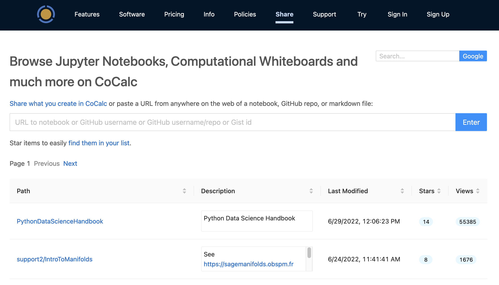
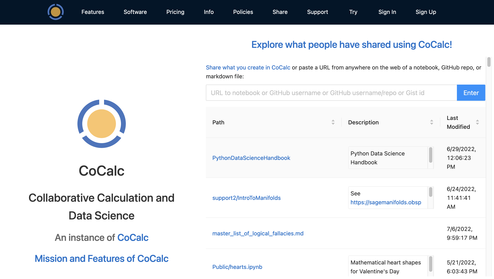

.. index:: Sharing files
.. index:: Publishing files

.. _sharing-files:

==========================
Shared Files
==========================

.. contents::
     :local:
     :depth: 2

Files and folders published (shared) to CoCalc's `share server <https://cocalc.com/share>`_ are viewable by the public with no login required.

####################################
Viewing Files on the Share Server
####################################

To see CoCalc files that people have shared, browse to https://cocalc.com/share. You can search for text in the title and contents of shared files using the search box at upper right. You can sort the list of files by any of the columns listed, in increasing or decreasing order, by clicking in the column headings.

     search and sort shared files at share server home page

There is also a preview at the CoCalc home page, allowing people who are just learning about CoCalc to view a sample of shared files:

     preview of shared files on CoCalc home page

When you select a shared folder, you get a view of the contents. Click "Edit" to copy a shared file or folder to a project that you own or collaborate on.

.. figure:: img/shared-folder.png
     :width: 90%
     :align: center
     :alt: share server showing shared folder "k3d"

     listing of shared folder "k3d"

.. _publishing-files:

#################
Publishing Files
#################

You can make individual files and folders public.
First, do either of the following:

* With the file open, click the lock icon |lock| at upper right. Note: if you see the bullhorn icon |bullhorn| instead of the lock, that means your file is already shared; you could click it to change sharing settings.

.. figure:: img/icons/lock.png
     :width: 50%
     :align: center
     :alt: Lock icon at upper right of file view showing file is not published

     *click lock icon to enter file-sharing dialog*

.. figure:: img/icons/bullhorn.png
     :width: 50%
     :align: center
     :alt: Bullhorn icon at upper right of file view showing file is published

     *lock is replaced by bullhorn if file is already shared*

* In the Files listing for your project, check the box in the leftmost column for your file, and click |public| Share. You can also select more than one file in order to share them together (e.g. an HTML page that includes images)

.. |info| image:: https://github.com/encharm/Font-Awesome-SVG-PNG/raw/master/black/png/16/info-circle.png
.. |lock| image:: https://github.com/encharm/Font-Awesome-SVG-PNG/raw/master/black/png/16/lock.png
.. |bullhorn| image:: https://github.com/encharm/Font-Awesome-SVG-PNG/raw/master/black/png/16/bullhorn.png
.. |public| image:: img/antd-icons/public-icon.png
      :width: 1.5em

After either of these steps, you can see the "Share" dialog.
You may enter a description for the file being shared,
then click ``Make item public`` and your file is shared.

In addition to the above settings, you may specify an optional public file name. Setting this name provides much nicer URL's for shared public documents. See :ref:`vanity-urls` below to learn more.

.. image:: img/share-dialog.png
     :width: 100%
     :align: center
     :alt: Dialog which appears after clicking "Share"

.. index:: Sharing files; vanity URLs
.. _vanity-urls:

#################
Vanity URLs
#################

You can now make it so
``https://cocalc.com/name-of-your-choice``  (e.g.,
``https://cocalc.com/wstein``) lists all of the documents you have shared
publicly.

CoCalc lets you assign a username, project names, and file names, so that you can create links to shared files that are easy to type and remember.

* Set your username in :ref:`Account Preferences <username>`.

* Set your project name in :ref:`Project Settings <set-project-title>`.

* Set your file name as shown in :ref:`Publishing Files <publishing-files>`.

If you set all these you get a nice url, e.g.,
https://cocalc.com/wstein/support/examples

.. index:: Sharing files; share server
.. _share-server:

##################################
View Your File on the Share Server
##################################

After clicking ``Make item public`` as above, the **public URL** will be displayed under ``Shared publicly``.
You can click the |external| button to open it at the share server.

.. |external|
    image:: https://github.com/encharm/Font-Awesome-SVG-PNG/raw/master/black/png/128/external-link.png
    :width: 16px
    :alt: Icon for external link

With that link, a read-only copy of your file is available on the CoCalc  `share server`_.
Files on the share server are `indexed by Google <https://www.google.com/search?q=site%3Acocalc.com%2Fshare>`_ unless you click the checkbox next to "Unlisted: Only allow those with a link to view this.".

.. _star-shared-file:

##########################
Starring Shared Files
##########################

You can star shared public files on the share server and see everything you starred here: https://cocalc.com/stars.

.. figure:: img/add-star.png
     :width: 80%
     :align: center
     :alt: star a file on the share server

     star a shared file so you can find it easily later

When you click "Star", the count increases by one and the prompt changes to "Starred". You can undo the operation by clicking "Starred", after which the star count will decrease by one.

.. figure:: img/remove-star.png
     :width: 80%
     :align: center
     :alt: remove previously-added star from a file on the share server

     click "starred" to remove a previously-added star
     
.. _url-proxy:
.. _share-rendered-notebook:

##########################
Sharing Rendered Notebooks
##########################

CoCalc's share server offers a simple way to share fully-rendered Jupyter notebooks and certain other file types. All you need is a URL to the file, folder, or repository you want to share. Rendered document sharing is done by means of URL proxying (see :ref:`url-proxy-notes` below).

The URL schema is exactly the same as what https://nbviewer.org uses, i.e., github/<github url>, url/<anything on the internet> and gist/[github user]/[gist id].

*******************************
File Types
*******************************

In addition to the file types shown below, any file that CoCalc can render is sharable in rendered form. See :ref:`url-proxy-cocalc-diff`.

Jupyter notebook
===================

https://cocalc.com/url/archive.org/download/musing_math/Volume_Solutions_To_Snub_Dodecahedron.ipynb

GitHub Repo
=============

https://cocalc.com/github/sagemanifolds/IntroToManifolds

GitHub Gist
============

https://cocalc.com/gist/darribas/4121857

.. _url-proxy-cocalc-diff:

*********************************
Differences Relative to nbviewer
*********************************

The main differences are:

* You can put a URL to any file CoCalc can render or edit, and you'll see it:

  * Here's a **markdown file**: https://cocalc.com/github/sagemathinc/cocalc/blob/master/README.md which nbviewer doesn't render (it only renders ipynb).
  * Here's a **whiteboard**: https://cocalc.com/github/williamstein/scratch/blob/main/2022-06-27-ws.board
  * And a **Sage worksheet**: https://cocalc.com/github/williamstein/scratch/blob/main/2022-06-30-061806.sagews

* When you click Edit (analogue of mybinder for some nbviewer content), the content is copied to a project in CoCalc and you can use it. E.g., Sage notebooks actually work, since Sage is installed. The mybinder flakiness is avoided. Also, all content is editable, not just content that has been setup to work with mybinder.

.. _url-proxy-notes:

***********************
Notes on URL proxying
***********************

* Editing whole git repositories isn't implemented yet. In CoCalc, any time anybody views one of these URL proxies in the share server, a new entry is created in the list of shared documents starting at https://cocalc.com/share/public_paths/page/1

* Anybody can star a document shared in this way, to make it easy to come back to it later (via https://cocalc.com/stars), and also to signify that it is interesting.

* See also the  `initial implementation comment <https://github.com/sagemathinc/cocalc/issues/6015#issuecomment-1172967091>`_ in the CoCalc sources.

.. index:: Sharing files; direct from project

#################
File Sharing Tips
#################

* You can share files from a free CoCalc account. At one time, the :ref:`Internet access <view-resources>` upgrade was required in order to share files; this is no longer the case.

* If your document depends on auxiliary files (e.g., images embedded in a markdown file) make sure these auxiliary files are also published. A convenient way to do this is to have auxiliary files in a common folder and share that folder.

* Serving raw files: you can host arbitrary html, etc. through the share server. Files can be viewed in "raw" form, i.e. without CoCalc controls, by opening in the share server and clicking "Raw" at upper right.

* Interactive elements that use server processes, such as notebooks with Jupyter widgets and worksheets with Sage ``@interact``, will not operate in files viewed from the share server. That is because documents on the share server are truly static. There is no kernel or Sage server running in the background to facilitate any sort of interactive computing. Controls that run completely in the browser work when served from the share server, for example 3d plots like `this cardioid <https://cocalc.com/share/public_paths/7eee8ccdeb4acf37e6c258df1cd973871373df05>`_.

