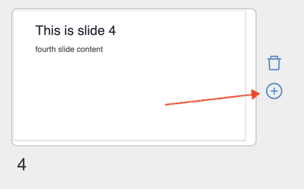
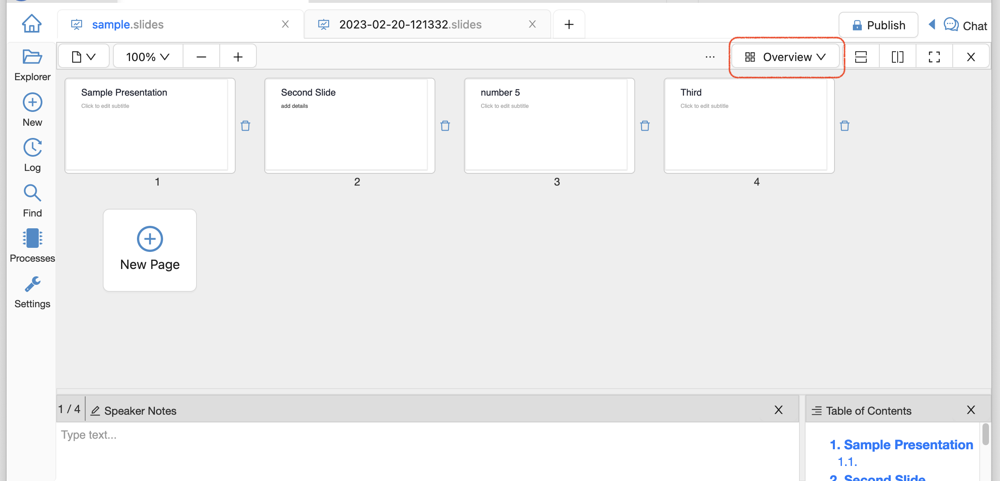
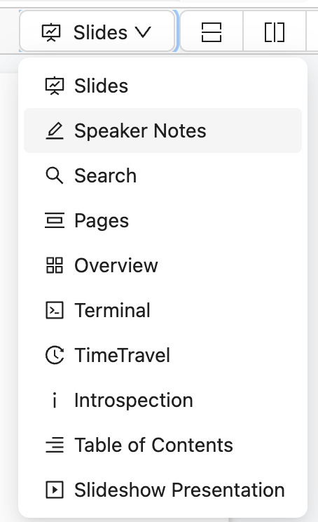
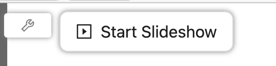
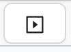

.. index:: Slides

========================
Slides
========================

Give presentations with code and mathematics using CoCalc Slides. Here's the introduction on our website: `Online Collaborative Slides with Jupyter Code Cells and LaTeX Mathematics <https://cocalc.com/features/slides>`_.

A slides presentation is any CoCalc file with the extension ".slides". CoCalc slides let you use all the same tools as from the whiteboard: text, notes, freehand drawing, Jupyter code cells, mind maps, icons, and frames. Of course, text is editable in both markdown and rich text modes, with full latex formula and code block support.

Here are the CoCalc feature announcements:

* presentation mode: `ANN: Presentation mode for slideshows <https://github.com/sagemathinc/cocalc/discussions/6475>`_.

* original announcement: `ANN: CoCalc Slides -- create slides in CoCalc for presentations, with Jupyter code and latex math <https://github.com/sagemathinc/cocalc/discussions/6420>`_.

.. figure:: img/slides/slides.png
    :width: 100%
    :align: center
    :alt: example of CoCalc slides

    CoCalc Slides

.. contents::
     :local:
     :depth: 1

##############################
Chat
##############################

Chat with collaborators. Open multiple chat boxes in the document as well as the usual CoCalc :ref:`side-chat` for the entire slides file. Learn about CoCalc Chat at this link: :doc:`chat`.

Keyboard shortcut to create Chat boxes: "C".

.. figure:: img/whiteboard/chat.png
    :width: 90%
    :align: center
    :alt: example chat box and side chat

    chat box and side chat

##############################
Collaborative Editing
##############################

Many users can edit at the same time, see what the others are doing in real time, and center their view at the location of another's cursor.

##############################
Cut or Copy and Paste
##############################

Click "Select" (arrow icon) then drag the cursor to create a rectangular region. Doing so will select all objects that lie partially or completely in the region. "Cut" removes all the objects from their current position and saves them to the clipboard. "Copy" keeps the objects in their current position and saves them to the clipboard. "Paste" will drop the group of objects in the clipboard into the current page or into any page of any slides or whiteboard you have open.

.. figure:: img/whiteboard/cut-copy-paste.png
    :width: 70%
    :align: center
    :alt: select, cut or copy, and paste

    cut, copy, paste in whiteboard

Keyboard shortcut to enable rectangular selection: "V".

########################
Edges
########################

Create edges (arrows) between all objects.

Keyboard shortcut to create Edges: "E".

########################
Frames
########################

Use frames to group objects and organize a page into sections.

Keyboard shortcut to create a Frame: "F".

.. _slides-hashtags:

########################
Hashtags
########################

You can put hashtags on notes, e.g. :code:`#foo` and search for those as well, or put :code:`-` (minus sign) in front to exclude matching items from search, e.g. :code:`-#foo`. You can search for regular expressions by enclosing them in slashes, for example ``/^# /``.

########################
Icons
########################

Choose from a wide selection of Icons to add to your document.

Keyboard shortcut to open the table of available Icons: "I".

########################
Insert Slide
########################

You can insert a slide after the present slide in Pages View or Overview Map by clicking the |insert-icon| icon to the right:

.. _slides-jupyter-cells:

##########################
Jupyter Cells
##########################

A CoCalc slides document can include Jupyter code cells. Code cells allow:

* over a dozen supported kernels
* CoCalc's massive library of pre-installed software
* interactive widgets
* execution order determined by a directed graph

.. image:: img/code-cells-in-wb.png
    :width: 80%
    :align: center
    :alt: slides with two code cells and a sticky note

Keyboard shortcut to create a Jupyter Code Cell: "J".

##############################
LaTeX Expressions
##############################

Text inside slides items supports LaTeX mathematical typesetting.

##############################
Navigate With Arrow Keys
##############################

While in Slides view, you can use the arrow keys: "↑" to move up one slide and "↓" to move down one slide from the current slide. Use Home (Fn–Left Arrow on some Mac keyboards) to go to the first slide and End (Fn–Right Arrow on some Mac keyboards) to go to the last slide.

##########################
Overview Map
##########################

You can see an overview map of all slides in the current file by selecting "Overview" in the mode menu at upper right. There is a trashcan icon next to each slide in the map, allowing you to delete slides. At present, you can't rearrange slides in the map. Use the Pages view for that.

    overview map

.. _slides-pages-view:

##########################
Pages View
##########################

Pages view is available in the mode menu at upper right.
If you click the "Pages" icon: |pages-icon|, the Pages frame appears.

.. figure:: img/slides-pages.png
    :width: 90%
    :align: center
    :alt: pages and slides views side by side
    
    Pages (left) and Slides (right) views side by side

There's a button "+ New" that creates a new page. You can see previews of all your pages in the pages frame, and click a preview to jump to any page.

Page numbers determine the order of slides in the Search panel.

By clicking the three horizontal lines at the left of a slide in the Pages view and dragging, you can change the order of slides.

By clicking the trashcan icon at the right of a slide in the Pages view, you can delete a slide.

When a page is selected in Slides view, the page number is displayed at upper left. You can click the number or change it and hit Enter to go to a specific page number.

.. figure:: img/page-one-of-two.png
    :width: 40%
    :align: center
    :alt: page number displayed at upper left

    slides is showing page 1 of 2

##########################
Pens
##########################

Choose one of the different pen shapes to draw freehand. Supported pointing devices include most forms of mouse and trackpad as well as many Wacom tablets and iPencil and Apple Pencil.

Keyboard shortcut to start using Pens: "P".

##########################
Presentation Mode
##########################

To use it, click on the present icon: |present-icon|, or select "Slideshow Presentation" from the dropdown:

then click the "Start Slideshow" button:

This will transition to fullscreen with only the actual slide displayed (nothing outside the margins), always maximally zoomed, like in Powerpoint or Google slides. There's a little wrench icon (that appears only when you move the mouse):

.. image:: img/slides/toggle-slides-toolbar.png
    :width: 30%
    :align: center
    :alt: button to enter presentation mode

you can click it to toggle the toolbar, in case you want to select a pen or click on code and run it live during your talk, or access any other editing tools.

Press Esc on your keyboard to exit presentation mode.

##########################
Publish
##########################

You can :ref:`publish <publishing-files>` your slides to the CoCalc share server.

.. _slides-search-view:

##########################
Search View
##########################

To see the Search view, select "Search" from the mode menu at upper right.

The Search view lists all text, sticky notes and code in order, with a search box at the top. You can search for text and click on any matching item to center the view on it. The ordering of items is lexicographic by the \(y,x\) coordinates: items closer to the top are listed first; items at the same height are listed left to right.

Search view can make your slides documents easier to manage as they get larger.

.. figure:: img/wb-search-view.png
    :width: 100%
    :align: center
    :alt: example search view

    slides, showing search view in right panel

The Search frame works well with to-do lists. To find all not done items, put :code:`"[ ]"` (note the quotes) in the search box. To find all completed items, search for :code:`"[x]"`.

##############################
Split Windows
##############################

Infinitely split windows horizontally and vertically to view multiple parts of the document simultaneously.

##############################
Sticky Notes
##############################

A sticky note is a rectangle, with a colored background, for enclosing text. When creating a sticky note, it's easy to select from a variety of eye-catching background colors and text fonts and sizes.

Keyboard shortcut to create a Sticky Note: "N".

.. _slides-timers:

##############################
Stopwatches and Timers
##############################

Add stopwatches (count up) and timers (count down) to keep meetings and discussions on schedule.

.. figure:: img/whiteboard/timers.png
    :width: 50%
    :align: center
    :alt: stopwatches and timers

    stopwatches and timers in slides

Keyboard shortcut to create Stopwatches and Timers: "S".

When a timer counts down to zero, a pop-up announcement will be displayed if the slides file is open at the time.

.. figure:: img/whiteboard/wb-timer-expired.png
    :width: 50%
    :align: center
    :alt: timer expired pop-up

    notification displayed when slides timer expires

##############################
Table of Contents
##############################

You can view contents as an outline in a panel on the left and click to view any item instantly.

##############################
Text
##############################

A text box is a rectangle, with a transparent background, for enclosing text.

Keyboard shortcut to create a Text box: "T".

##############################
TimeTravel
##############################

As with other native CoCalc applications, every change is recorded via browsable :doc:`time-travel` You can see what changed, and who changed it, and copy/paste from any point in the history.

.. _slides-to-do-lists:

##########################
To-do Lists
##########################

In a sticky note, text, etc., you can mark action items by placing a pair of brackets in the item, preceded and followed by a space and with a space between the brackets. The item will be displayed with an empty checkbox. Click the checkbox when the item is done, or place an "x" between the brackets, and it will show as a checked item.

----

.. note::

    At this time, the only way to export an image slides document is by taking a screenshot. Exporting slides to a pdf, png, or svg file is not yet implemented. See `CoCalc issue #6024 <https://github.com/sagemathinc/cocalc/issues/6024>`_.

.. figure:: img/wb-tasks-code.png
    :width: 60%
    :align: center
    :alt: code for to-do list in a sticky note
    
    Code for an unchecked box and a checked box in a sticky note.

.. figure:: img/wb-tasks-rendered.png
    :width: 50%
    :align: center
    :alt: rendered list in a sticky note

    How the unchecked and checked boxes are displayed

.. |search-icon| image:: img/antd-icons/search-icon.png
    :height: 20px
    :alt: search icon

.. |pages-icon| image:: img/antd-icons/pages-icon.png
    :height: 20px
    :alt: pages icon

