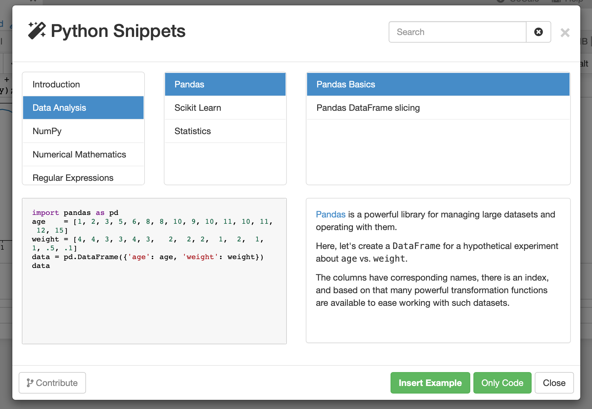
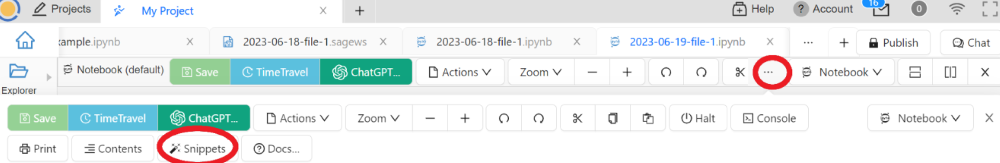

.. index::
    Snippets
    Jupyter Notebooks; snippets
    Sage Worksheets; snippets

.. _snippets:

===============
Snippets
===============

.. contents::
   :local:
   :depth: 1

####################
System-wide Snippets
####################

Snippets are short examples of working code.
CoCalc offers curated, annotated snippets with Jupyter Notebooks and Sage Worksheets.
They can save you time when you're learning a new programming technique
or need a reminder how to do something.
CoCalc offers code snippets in many programming languages, including Python, R, Sage, Bash, Julia, Octave, and GAP.

.. figure:: img/snippets/snippets-langs.png
     :width: 75%
     :align: center

     Snippets are available in many programming languages

     example of Python Snippet

     opening Snippets from a Jupyter Notebook. Click on the three dots to access Snippets. 

.. figure:: img/snippets/snippets-btn-sagews.png
     :width: 95%
     :align: center

     opening Snippets from a Sage Worksheet

You can browse categories and titles, and search for keywords.

With one click, you can insert a code snippet with accompanying description, right where you are in your document.
After that, you are ready to inspect and modify the inserted code.

If you have a snippet you'd like to contribute, click ``Contribute`` at lower left in the Snippets pane and you will be taken to the
`CoCalc Snippets <https://github.com/sagemathinc/cocalc-snippets>`_ source code repository on GitHub.

Note: Snippets first appeared in CoCalc under the name "Assistant" and were announced in this blog article: `Examples Assistant <http://blog.sagemath.com/cocalc/2018/04/05/assistant.html>`_.

.. index::
    Custom Snippets
    Snippets; custom
.. _custom-snippets:

####################
Custom Snippets
####################

Add your own snippets to a project by placing Jupyter Notebooks containing markdown/code cell pairs into ``$HOME/code-snippets``, e.g., ``snippets.ipynb`` or, if defined, into the directory specified by :ref:`environment variable <project-env-vars>` ``COCALC_CODE_SNIPPETS_DIR``.

After changing the files, click the link in the Snippets sidebar,
"click here to reload custom snippets". Your snippets will appear in a new category "Custom Snippets" at the top of the snippets list.

Regarding the content of the notebooks, the first cell must be a Markdown title header, i.e., # Title. The next cells should be alternating between Markdown (with a 2nd level header, i.e., ## Snippet Name and a description) and followed at least one line of explanatory text and one or more code cells. The language of the snippet notebook must match the language of your notebook in order to see the snippets! Include one snippet in each notebook.

_NOTE:_ Spaces are not allowed in the path or filename of the snippets notebooks.

.. figure:: img/snippets/custom-snippets.png
     :width: 65%
     :align: center

     adding custom Snippets in a project

