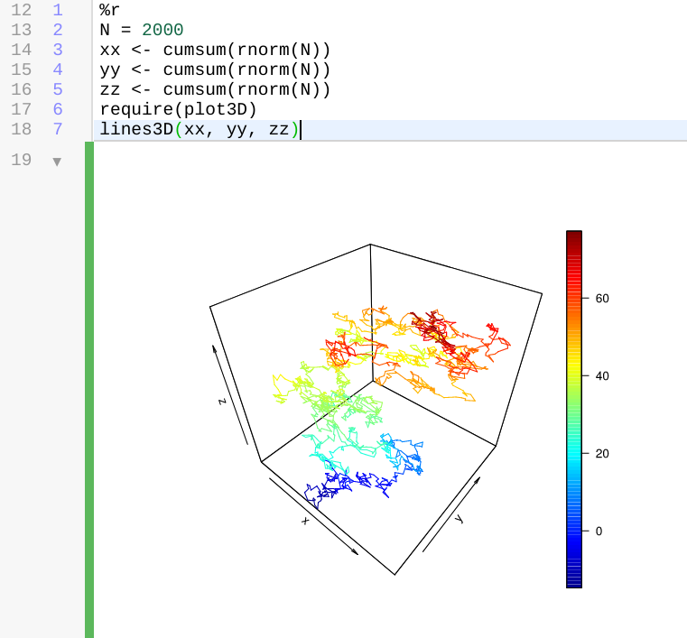

.. _software-updates-2019:

Software Updates 2019
======================================

.. .. contents::
..      :local:
..      :depth: 1

.. _update-2019-12-15:

2019-12-15: SymPy 1.5
--------------------------------------------

- Python 3:
    - (upd) `sympy`_ ``1.5.0`` – `SymPy 1.5 Release Notes <https://github.com/sympy/sympy/wiki/Release-Notes-for-1.5>`_

- R `bioconductor`_:
    - (upd) `puma`_ ``3.26``, ``pumadata`` ``2.20``, `oligo`_ ``1.48``, ...

- Software:
    - (upd) `macaulay2`_ ``1.15``
    - various Linux package updates, including R packages
    - (upd) `xpra`_ ``3.0.3`` for :doc:`../x11` support
    - Node.js modules:
        - ``npm@6.13.4``
        - ``tldr@3.3.2``
        - ``reveal-md@3.4.1``
        - ``data-cli@0.9.6``
        - ``pm2@4.2.1``
        - ``webpack@4.41.2``
        - ``typescript@3.7.3``

.. _update-2019-12-07:

2019-12-07: Design of Experiment Generator
--------------------------------------------

- Python 3 (system-wide)
    - (new) `doepy`_ ``0.0.1``: *Design of Experiment Generator in Python*  (+ `diversipy`_ ``0.8`` dependency)
    - (new)  `pdpipe`_ ``0.0.32``: *Easy pipelines for pandas DataFrames*
    - (upd) `scikit-learn`_ ``0.22``: `scikit learn 0.22 release notes <https://scikit-learn.org/0.22/auto_examples/release_highlights/plot_release_highlights_0_22_0.html>`_
    - (upd) `nltk`_ ``3.4.5``,  `pymc3`_ ``3.8``, `pytables`_ ``3.5.2``, `dask`_/`distributed`_ ``2.9.0``

- SageMath:
    - (upd) development version ``9.0.beta8``

- Software:
    - various Linux package updates, including R packages

.. _update-2019-11-29:

2019-11-29: Julia 1.3
--------------------------------------------

- Julia
    - (new) `Julia 1.3 <https://github.com/JuliaLang/julia/blob/v1.3.0/NEWS.md>`_ now available: run ``julia-1.3`` or the corresponding Jupyter kernel. It will become the default version soon!
    - (dep) Julia 1.2 is deprecated.

- SageMath
    - (new) optional package `pynormaliz`_ – *Normaliz backend for polyhedral computations*::

          sage: P = Polyhedron(vertices=[[0,0],[0,1],[1,0]], backend="normaliz"); P
          A 2-dimensional polyhedron in ZZ^2 defined as the convex hull of 3 vertices

          sage: P.ehrhart_series()
          1/(-t^3 + 3*t^2 - 3*t + 1)

- Python 3 (system-wide)
    - (new) `adtk`_ ``0.4.1`` - *Anomaly Detection Toolkit (ADTK) is a Python package for unsupervised / rule-based time series anomaly detection.*
    - (upd) `pint`_ ``0.9`` – *makes units easy*
    - (upd) `bokeh`_ ``1.4.0``

- Python 3 (Anaconda 2019)
    - (upd) `plotly`_ ``4.3.0``

- Software
    - (upd) `git-lfs`_ ``2.9.1``, `bazel`_ ``1.2.1``, `Python`_ ``3.6.9``
    - (upd) `rust`_ ``rustc +nightly``: ``1.41.0-nightly (412f43ac5 2019-11-24)``

.. _update-2019-11-23:

2019-11-23: various Python 3 package updates
--------------------------------------------

- Software
    - (upd) `bazel`_ ``1.2.0``
    - (upd) `drracket`_ ``7.5.0``
    - … and various other Linux system libs

- Python 3 (system-wide)
    - (upd) scientific: `geopandas`_ ``0.6.2``, `pyomo`_ ``5.6.7``, `pystan`_ ``2.19.1.1``, `symengine`_ ``0.5.1``,
      `cvxpy`_ ``1.0.25``, `qutip`_ ``4.4.1``,
      `qiskit`_ ``0.13.0``, `qiskit-aer`_ ``0.3.2``, `qiskit-aqua`_ ``0.6.1``, `qiskit-terra`_ ``0.10.0``
    - (upd) utils: `dask`_/`distributed`_ ``2.8.1``,  `dill`_ ``0.3.1.1``, `cytoolz`_ ``0.10.1``, `psycopg2`_ ``2.8.4``,
      `fsspec`_ ``0.6.0``, `gcsfs`_ ``0.4.0``

- Python 3 (Anaconda 2019)
    - (upd) basic `scipy`_ ``1.3.2``, `numpy`_ ``1.16.5``, `xarray`_ ``0.14.1``, `numba`_ ``0.46.0``
    - (upd) scientific `geopandas`_ ``0.6.2``, `pyproj`_ ``2.4.1``,  `pystan`_ ``2.19.1.1``,
      `coverage`_ ``4.5.4``, `dask`_ ``2.8.0``, `datrie`_ ``0.8``, `distributed`_ ``2.8.0``,
      `llvmlite`_ ``0.30.0``, `datashader`_ ``0.8.0``,  `django`_ ``2.2.6``, `symengine`_ ``0.5.0``,
      `emcee`_ ``3.0.2``, `cvxpy`_ ``1.0.25``,  `fenics`_ ``2019.1.0``,  `kwant`_ ``1.4.1``,
      `pyomo`_ ``5.6.7``,  `scikit-surprise`_ ``1.1.0``
    - (upd) utils:  `joblib`_ ``0.14.0``, `cython`_ ``0.29.1``,  `folium`_ ``0.10.0``,
      `cherrypy`_ ``18.4.0``, `ipyleaflet`_ ``0.11.4``,  `psycopg2`_ ``2.8.4``,
      `qutip`_ ``4.4.1``, `mpi4py`_ ``3.0.2``, `natsort`_ ``6.2.0``, `cytoolz`_ ``0.10.1``,
      `memory_profiler`_ ``0.56.0``,  `petsc`_ ``3.11.3``,  `slepc`_ ``3.11.2``, `dill`_ ``0.3.1``

.. _update-2019-11-19:

2019-11-19: improved support for Rust
------------------------------------------

- Software
    - (new/upd) `Rust`_ available in stable, beta and nightly channels and code formatting (red arrow below) via ``rustfmt``!

    ::

        ~$ rustc --version
        rustc 1.39.0 (4560ea788 2019-11-04)
        ~$ rustc +beta --version
        rustc 1.40.0-beta.2 (2a0ba54fa 2019-11-16)
        ~$ rustc +nightly --version
        rustc 1.41.0-nightly (5c5b8afd8 2019-11-16)

    .. figure:: https://storage.googleapis.com/cocalc-extra/rust.png
        :width: 75%
        :align: center

        *Rust in a frame-editor, side-by-side with a Terminal*

- Python 3
    - (upd) `networkX`_ ``2.4``, `SQLAlchemy`_ ``1.3.11``,  `monty`_ ``3.0.2``, `mypy`_ ``0.740`` and ``mypy-extensions-0.4.3``, `plotly`_ ``4.3.0``

.. _update-2019-11-16:

2019-11-16
----------------------

- Python 3
    - (new) `periodictable`_  ``1.5.1`` – *The periodictable package provides an extensible periodic table of the elements prepopulated with data important to neutron and X-ray scattering experiments*
    - (new) `teneto`_ ``0.4.6`` – *various tools for analyzing temporal network data*
    - (new) `python-highcharts`_ ``0.4.2`` – *a simple translation layer between Python and Javascript for* `Highcharts`_ *projects (highcharts, highmaps, and highstocks)*
    - (upd) `scipy`_ ``1.3.2``, `numpy`_ ``1.17.4``, `dask`_/`distributed`_ ``2.7.0``
    - (upd) data science libs:  `sklearn-porter`_ ``0.7.3``,   `sklearn-pandas`_ ``1.6.0``, `scikit-image`_ ``0.16.2`` `scikit-posthocs`_ ``0.6.1``
    - (upd) `scikit-surprise`_ ``1.1.0`` – *a Python scikit building and analyzing recommender systems that deal with explicit rating data*
    - (upd) Pandas related: `pandas`_ ``0.25.3``, `pandas-bokeh`_ ``0.4``, `pandas-datareader`_ ``0.8.1``,  `pandas-gbq`_ ``0.11.0``
    - (upd) Google GCP libs: google-api-core ``1.14.3``, google-cloud-bigquery ``1.21.0``, google-cloud-core ``1.0.3``,   google-cloud-storage ``1.22.0``, googleapis-common-protos ``1.6.0``

.. _update-2019-11-09:

2019-11-09
----------------------

- Platform:
    - (new) `Multifile LaTeX Support <https://doc.cocalc.com/latex-features.html#latex-multi-file-support>`_ ( `announcement <https://groups.google.com/d/topic/cocalc/LNsBScZEWcc/discussion>`_ ) – open the master file and once it compiled once, you can switch between child tex files, edit them side-by-side, etc.

- Software:
    - (upd) `Jupyter Lab`_ ``1.1.4``
    - (upd) Node.js related ``coffeescript@2.4.1``, ``typescript@3.7.2``, and ``npm@6.13.0``

- Python3:
    - (upd) **Tensorflow 2**  ``tensorflow-2.0.0``, ``tensorboard-2.0.1``, ``tensorflow-estimator-2.0.1``, ...
      (Tensorflow 1 is still available in the Anaconda 2019 kernel)
    - (new) `ortools`_ ``7.4.7247`` – *a fast and portable software for combinatorial optimization*
    - (upd) `Cython`_ ``0.29.14``, `joblib`_ ``0.14``, `numpy`_ ``1.17.3``, `h5py`_ ``2.10.0``, `keras`_ ``2.3.1``

- SageMath:
    - (upd) Development version ``9.0.beta4``

.. _update-2019-10-25:

2019-10-25
----------------------

- Platform
    - (new) Sytnax highlighting for `Verilog`_ files (``.v`` and ``.vh``)
    - (enh) :doc:`TimeTravel <../time-travel>` opens up in a frame

- Software
    - (new) `iverilog`_ – *compiles Verilog (IEEE-1364) into some target format*
    - (new) `GTKWave`_ (in :doc:`../x11`) for viewing Verilog VCD/EVCD files

- SageMath:
    - (fix) hotfix for viewing ``plot3d`` renderings in the Jupyter Notebook – `issue #28648 <https://trac.sagemath.org/ticket/28648>`_

.. _update-2019-10-19:

2019-10-19
----------------------

- SageMath
    - (upd) `SageMath`_ ``8.9`` including many extra packages and libs. This also implies an update of :ref:`SageTeX <latex-sagetex>` to ``3.3``.

- Software
    - (new) `moreutils`_ ``0.60`` – *Linux bash command-line tools*
    - (new) `lerna.js`_ ``3.18.1``
    - (upd) `Go`_ ``1.13.1``

- Python 3:
    - (ann) **soon,** `Tensorflow`_ **will be version 2 – this has breaking changes**
    - (new) `tpot`_ ``0.10.2`` – *is a Python Automated Machine Learning tool that optimizes machine learning pipelines using genetic programming.*
    - (new) `scikit-mdr`_ ``0.4.4`` – *a scikit-learn-compatible Python implementation of Multifactor Dimensionality Reduction (MDR) for feature construction.*
    - (new) `scikit-rebate`_ – ``0.6`` *a scikit-learn-compatible Python implementation of ReBATE, a suite of Relief-based feature selection algorithms for Machine Learning*
    - (upd)  `dask`_/`distributed`_ ``2.6.0``, `numba`_ ``0.46.0``, `textract`_ ``1.6.3``, `beautifulsoup4`_ ``4.8.0``, `pytables`_ ``3.5.2``, `xgboost`_ ``0.90`` and ``pip 19.3``

- Anaconda 2019:
    - (new) `tpot`_ ``0.10.2``

.. _update-2019-10-11:

2019-10-11
----------------------

- Platform
    - (enh) :doc:`CoCalc's NbGrader <../teaching-nbgrader>`: `updates about its development status <https://groups.google.com/d/msgid/cocalc/CA%2BjwZMhzyFm7X8e_fjPEN_Fzszcau62rzMZMynFkQMcGXeHLCg%40mail.gmail.com>`_.
    - (enh) :doc:`CoCalc's LaTeX Editor <../latex>` moved it's build directory to a temporary in-memory location at ``/tmp/...``. Less clutter, more speed!
    - (new) `CoCalc Docker`_ mailing list: `join here <https://groups.google.com/a/sagemath.com/group/cocalc-docker/subscribe>`_

- SageMath
    - (upd) `admcycles`_ ``0.2`` in Sage 8.8 and 8.9
    - (upd) Development version ``9.0.beta0``

- Software
    - (upd) various Linux package updates, including `xpra`_ 3.0 and R packages.
      The Xpra update contains various improvements for the :doc:`remote graphical desktop <../x11>`.
    - (upd) `bazel`_ ``1.0.0``

- Python 3:
    - (new) `sherpa`_ ``1.0.2`` – *a Python Hyperparameter Optimization Library*
    - (upd)  `GPy`_ ``1.9.8`` & `GPyOpt`_ ``1.2.5`` – *a Python open-source library for Bayesian Optimization*

    .. figure:: https://storage.googleapis.com/cocalc-extra/20191011-gpyopt.png
        :width: 75%
        :align: center

        *GPyOpt*

    - (upd) ``flask-1.1.1``, ``lz4-2.2.1`` and ``brotli-1.0.7`` compression libs
    - (fix) missing basemap dependency on ``shapefile`` – `PyShp`_ ``2.1.0``

.. _update-2019-10-05:

2019-10-05
----------------------

- Platform
    - (new) The ``$MPLBACKEND`` environment variable is set for `matplotlib`_ based on the terminal type. This means you can plot to a file or to a graphical window in X11 without having to explicitly set it (`ticket #4120 <https://github.com/sagemathinc/cocalc/issues/4120>`_).

- SageMath
    - (new) `SageMath`_ ``8.9`` rollout on CoCalc, including additional packages and extensions. Try the "Sage 8.9" Jupyter Kernel! Soon, it will become the default version for running Sage. Sage Worksheets currently do not support Sage 8.9.

- Anaconda Python 3:
    - (new) `DEAP`_ ``1.3.0`` *a novel evolutionary computation framework for rapid prototyping and testing of ideas. It seeks to make algorithms explicit and data structures transparent.*
    - (new) `simanneal`_ ``0.4.2`` *This module performs simulated annealing optimization to find the optimal state of a system.*

- Python 3:
    - (new) `DEAP`_ and `simanneal`_ as well.

.. _update-2019-09-30:

2019-09-30
----------------------

- Software
    - (upd) `Jupytext`_ ``1.2.4`` – a command-line tool to convert ipynb files to markdown, Rmarkdown, etc.
    - (fix) Updating Jupyter Console, because the previous update broke it.

- Julia:
    - (upd) ``1.0.5`` Long Term Release
    - (upd) various packages for ``1.2.0``

.. _update-2019-09-28:

2019-09-28
----------------------

- CoCalc platform:
    - CoCalc's Jupyter Notebook's **nbgrader toolbar** inserts templates for automatically graded answers and corresponding tests for Python, R and Julia. This makes creating new test cells for your course assignments much easier!

- Software:
    - (new) `IPOPT`_ interior point solver, stand-alone binary::

         ~$ ipopt --version
         Ipopt 3.12.12 (Linux x86_64), ASL(20160307)

- Anaconda 2019:
    - (new) tools for all your `SOAP`_ needs: `suds-jurko`_ and `zeep`_
    - (new/upd) `IPOPT`_ ``3.12.12``, ``coincbc 2.10.3``, ``glpk 4.65``, and `pyomo`_
    - (upd) wide range of package updates. from `dask`_ ``2.4.0``, over `matplotlib`_ ``3.1.1``, to `tensorflow`_ ``1.14``, and many more ...

- Python 3:
    - (new) Tools for all your `SOAP`_ needs: `suds-community`_ ``0.8.3`` and `zeep`_ ``3.4.0``
    - (new) `IPOPT`_: interior point solver, see `ipopt examples`_ using `cyipopt`_ bindings – also available via `PyOMO`_ ``5.6.6``. This allows you to solve more types of optimization problems.
    - (upd) `scikit-learn 0.21.3 <https://scikit-learn.org/stable/whats_new.html#version-0-21-3>`_, `scipy`_ ``1.3.1``, `mypy`_ ``0.730``
    - (upd) Continuing from last update's introduction of `pandas-bokeh`_, also `bokeh`_ got updated to ``1.3.4`` (`bokeh example notebook`_). This let's you create interactive plots of various types right inside CoCalc's Jupter Notebook.

      .. image:: https://share.cocalc.com/share/b9bacd7b-6cee-402c-88ed-9d74b07f29a1/2019-09-28-bokeh-plot-cocalc.png?viewer=raw
          :width: 50%

.. _update-2019-09-21:

2019-09-21
----------------------

* Python 3
    - (new) `pandas-bokeh`_ ``0.3``

      .. image:: https://storage.googleapis.com/cocalc-extra/cocalc-pandas-bokeh.gif
             :width: 50%

    - (new) `nglview <http://nglviewer.org/nglview/latest/#installation>`_, `pyberny <https://github.com/jhrmnn/pyberny>`_
    - (new) `pyswarms <https://pyswarms.readthedocs.io/en/latest/>`_  – *an extensible research toolkit for particle swarm optimization (PSO) in Python*
    - (new) `music`_
    - (upd) ``xlrd-1.2.0``, ``distributed-2.4.0``

- R (system-wide)
    - (upd) various packages, including `BioConductor`_
    - (new) installing `oligo`_ ``1.48.0`` and some other BioConductor packages

- Sage Development version ``8.9.rc0``

- :ref:`Custom Software Environments <custom-software-environment>`:
    - (upd) ``ModSimPy`` to enable ipynb to PDF exports

.. _update-2019-09-09:

2019-09-09
----------------------

- Software:
    - (upd) `TypeScript`_ ``3.6.2``
    - (upd) `prettier`_ ``1.18.2``
    - (upd) Selenium ``4``, ChromeDriver ``76``, GeckoDriver ``1.16.2``
    - (upd) `Spyder`_ ``3.3.6``
    - (upd) various Linux package updates, including some R packages

- Python 3:
    - (new) `arch <https://arch.readthedocs.io/en/latest/>`_ ``4.9.1``: *Autoregressive Conditional Heteroskedasticity (ARCH) and other tools for financial econometrics, written in Python (with Cython and/or Numba used to improve performance)*
    - (new) `linearmodels`_ ``4.13``: *Linear (regression) models for Python. Extends statsmodels with Panel regression, instrumental variable estimators, system estimators and models for estimating asset prices.*
    - (upd) ``pip 19.2.3``
    - (upd) `pandas`_ ``0.25.1`` and ``pandas-datareader-0.7.4``
    - (upd) `psycopg2`_ ``2.8.3``
    - (upd) `numpy`_ ``1.17.2``
    - (upd) `matplotlib`_ ``3.1.1``
    - (upd) `pytest`_ ``5.1.2`` + associated libraries
    - (rem) ``axelrod`` blocks updates, use Anaconda 2019

- Anaconda 2019:
    - (new) ``contextily 1.0rc2`` + ``geopy 1.20.0``

.. _update-2019-08-28:

2019-08-28
----------------------

- Python 3:
    - (new) `pomegranate <https://pomegranate.readthedocs.io>`_: *implements fast and flexible probabilistic models ranging from individual probability distributions to compositional models such as Bayesian networks and hidden Markov models*
    - (upd) `Cython`_ ``0.29.13``
    - (upd) `RISE`_ ``5.5.1``

- Julia 1.2:
    - (upd) `JuMP`_ ``0.20.0``

- Jupyter Classic:
    - (fix) re-enabling ``nbextensions`` configurator

.. _update-2019-08-25:

2019-08-25
----------------------

* CoCalc Platform
    * (new) Jupyter Notebooks **Table of Contents** (initial release).
      Structure large notebooks using headers in Markdown cells and then use the ToC to navigate more easily.
    * (new) `Premium Course Plan <https://cocalc.com/policies/pricing.html#courses>`_ to upgrade your course beyond  "Basic" and Standard".

* Anaconda 2019
    * (upd) various package update, e.g. ``scipy 1.3.1``, ``scikit-image-0.15.0``, ``pandas 0.25.0``, ...

* Python 3:
    * (upd) `Tensorflow`_ ``1.14``
    * (upd) Numpy ``1.16.4``
    * (upd) `Scikit Image`_ ``0.15``
    * (upd) `Astroalign`_ ``2.0``
    * (upd) `Qiskit`_ related package updates
    * (upd) `Keras`_ ``2.2.5``
    * (new) AsyncIO related: ``aiohttp`` and ``curio``
    * (upd) several other support libraries, .e.g ``jinja2-2.10.1``

* SageMath
    * (new) Package `admcycles <https://gitlab.com/jo314schmitt/admcycles>`_

* Software
    * (upd) `GAP`_ ``4.10.2``
    * (upd) `Jupyter Lab`_ ``1.0.6``

* Julia
    * (new) `Julia 1.2 <https://docs.julialang.org/en/v1.2/NEWS/>`_
    * (dep) deprecation of ``Julia 1.1.x``. Only ``1.0.x`` w/ LTS remains, ``1.1`` will be removed soon.
    * (new) Julia 1.2: `HomotopyContinuation <https://www.juliahomotopycontinuation.org/>`_ (`quick julia 1.2 test <https://share.cocalc.com/share/b9bacd7b-6cee-402c-88ed-9d74b07f29a1/julia-1.2.ipynb?viewer=share>`_)

* :ref:`Custom Software Environments <custom-software-environment>`:
    * (upd) "Tensorflow 2" ``2.0.0-rc0``: the first release candidate for ``2.0.0``

* :doc:`../api/index`:
    * (enh) :doc:`Scheduled copy operations <../api/copy_path_between_projects>`
    * (new) :doc:`../api/copy_path_status` and :doc:`../api/copy_path_delete`

.. _update-2019-08-10:

2019-08-10
----------------------

- Julia:
   - (new) Package `Gen <https://probcomp.github.io/Gen/>`_ in Julia 1.1

      *"A general-purpose probabilistic programming system with programmable inference."*

- Sagemath:
    - (new) ``TIDES`` package, providing `desolve_tides_mpfr <http://doc.sagemath.org/html/en/reference/calculus/sage/calculus/desolvers.html#sage.calculus.desolvers.desolve_tides_mpfr>`_
    - (upd) Development version ``8.9.beta5``

- Python
    - (upd) ``pip-19.2.1``, ``dask-2.2.0``, ``distributed-2.2.0``, ``numba-0.45.1``

- Software:
    - (new) `GRASS GIS`_: ``grass 7.4.0``, ``grass-gui``, etc. + ``grass-session`` in Python 2
    - (upd) ``npm@6.10.3``

.. _update-2019-07-28:

2019-07-28
----------------------

* SageMath
    * (del) removing packages ``meataxe`` and ``p_group_cohomology`` to avoid a bug.

* Python 3:
    * (new) **Anaconda 2019** – a fresh setup from scratch!
      It provides Python 3.7 and replaces the Anaconda 5 environment.
    * (rem) **Removal of Anaconda3** – it was deprecated and notebooks will tell you to switch the kernel to Anaconda 2019.
    * (dep) Deprecation of Anaconda 5 starts now.
    * (upd) `numba`_ ``0.44.1`` and ``llvmlite-0.29.0``
    * (upd) ``plotly 4.0.0`` – `Plotly 4.0 release notes <https://medium.com/@plotlygraphs/plotly-py-4-0-is-here-offline-only-express-first-displayable-anywhere-fc444e5659ee>`_

* Software:
    * (upd) Linux package update, including some R packages
    * (upd) `yapf`_ ``0.28``, ``git-lfs 2.8.0`` and ``xpra 2.5.3``

.. _update-2019-07-15:

2019-07-15
----------------------

* CoCalc Platform
    - (new) **Jupyter NBGrading**: initial support for creating test cells via the NBGrader toolbar and running validation tests in the notebook.
    - (new) **Dedicated VMs**: get your own node in CoCalc's cluster – `pricing info <https://cocalc.com/policies/pricing.html#dedicated>`_.
    - (chg) Jupyter Kernels: renaming "Python 2/3 (Ubuntu Linux)" to **"Python 2/3 (system-wide)"**. There is no change except for the naming.
    - :ref:`Library <project-library>` update, adding NBGrader examples

* `R Statistical Software`_:
    - (upd) **Version 3.6.1** and 4000+ packages

      .. note::

          Compiled packages in projects need to be reinstalled!

* Python 3:
    - (new) `NEURON`_ -- see :ref:`howto NEURON on CoCalc <howto-neuron>`
    - (upd) `JAX`_ ``0.1.39``, ``jaxlib-0.1.21``
    - (upd) ``mypy-0.720`` (`Mypy: New semantic analyzer <http://mypy-lang.blogspot.com/2019/07/mypy-0720-released.html>`_), ``typed-ast-1.4.0``, ``typing-extensions-3.7.4``

* SageMath:
    - (upd) Sage Development version ``8.9.beta2``

* Software:
    - (upd) ``npm 6.10.0`` and a couple of global npm packages, e.g. ``typescript 3.5.3``
    - (upd) general Linux package update, including ``bazel 0.28`` and Rust ``1.34``

.. _update-2019-07-08:

2019-07-08
----------------------

- SageMath:
    - (new) **Version 8.8** becomes the default
    - (upd) Development Version ``8.9.beta1``

- Python 3:
    * `pip-upgrader`_: helps managing custom package setups in virtual environments

- Updating all :ref:`Custom Software Environments <custom-software-environment>`.

.. _update-2019-06-30:

2019-06-30
----------------------

* (new) **SageMath 8.8**: general available on CoCalc with various enhancements. When the testing phase passes, it'll be the default (in about a week). (`Sage 8.8 Notebook   <https://share.cocalc.com/share/20e4a191-73ea-4921-80e9-0a5d792fc511/sage-8.8.ipynb?viewer=share>`_)

* Python 3:

    * (upd): `Dask 2.0 <https://docs.dask.org/en/latest/changelog.html#id1>`_: ``dask-2.0.0`` ``distributed-2.0.1``, ``dask-jobqueue-0.5.0``, and ``dask-ml-1.0.0``
    * (new) `tensorly`_ ``0.4.3`` (`TensorLy example <https://share.cocalc.com/share/b9bacd7b-6cee-402c-88ed-9d74b07f29a1/tensorly.ipynb?viewer=share>`_)

* Linux package update, including ``imagemagick-6 6.9.7.4``.

.. _update-2019-06-24:

2019-06-24
----------------------

* SageMath:
    * (upd) Development Version ``8.8.rc0``

* Python 3:
    * (new) `jieba`_ ``0.39``: “结巴”中文分词：做最好的 Python 中文分词组件

* Julia 1.1:
    * (new) `Distributions <julia_distributions>`_
    * (upd) all other global Julia packages, if applicable

.. _update-2019-06-17:

2019-06-17
----------------------

* SageMath:
    * (upd) Development Version ``8.8.rc0``

* Python 3:
    * (upd) ``dill-0.2.9``

* Software:
    * (upd) Python 3.6.8
    * (upd) `xpra`_ ``2.5.2``
    * (upd) Google Chrome 75
    * (upd) `bazel`_ 0.26.1

* :ref:`Library <project-library>`:
    * (new) "Public Finance 2018/2019 UCSC"
    * updating entries

.. _update-2019-06-08:

2019-06-08
----------------------

* Software:
    * `pandoc`_ ``2.7.2``

* Python 3:
    - `psycopg2`_ ``2.8.2``
    - `PyTorch`_ ``1.1.0`` and ``torchvision-0.3.0``

* :ref:`Custom Software Environments <custom-software-environment>`:
    * Updating *Tensorflow 2* to ``2.0.0-beta0``

.. _update-2019-06-02:

2019-06-02
----------------------

* Python 3:
    * `Cython`_ ``0.29.9``
    * `pymc3`_ ``3.7`` &  `theano`_ ``1.0.4``

* R:
    * `IRkernel`_ 1.0.1, ``IRDisplay 0.7.0``, ``repr 1.0.1``, ``pillar 1.4.1``, and ``vctrs 0.1.0``
      – this solves certain rich object `representation issues <https://github.com/IRkernel/IRkernel/issues/590>`_

.. _update-2019-05-26:

2019-05-26
----------------------

* CoCalc
    * (new/beta) :ref:`Custom Software Environments <custom-software-environment>`:
      bundle software environment configurations (compatible with `Binder`_)
      with accompanying content to run.

* Julia:
    * (upd) language ``1.0.4`` LTS and ``1.1.1``: `release notes julia 1.0.4 and 1.1.1 <https://discourse.julialang.org/t/julia-v1-0-4-and-v1-1-1-have-been-released/24298>`_

* Python 3:
    * (upd) `SciPy 1.3.0 <https://scipy.github.io/devdocs/release.1.3.0.html>`_
    * (upd) `statsmodels`_ updated to recent development version, because of a `SciPy incompatibility <https://github.com/statsmodels/statsmodels/issues/5759>`_.
    * (upd) `cvxpy`_ 1.0.23
    * (upd) `scikit-learn 0.21.2 <https://scikit-learn.org/stable/whats_new.html#version-0-21-2>`_
    * (upd) ``matplotlib 2.2.4``
    * (upd) `Dask`_ ``1.2.2``, ``dask-ml 0.13.0``, and ``distributed 1.28.1``
    * (upd) `OpenCV`_ ``4.1.0.25`` (incl ``opencv-contrib-python``)
    * (upd) pip 19.1.1 (also for python 2)
    * (upd) ``pytest-4.5.0``, ``pytest-arraydiff-0.3``, ``pytest-astropy-0.5.0``,
      ``pytest-cov-2.7.1``, ``pytest-doctestplus-0.3.0``, ``pytest-forked-1.0.2``,
      ``pytest-html-1.20.0``, ``pytest-ipynb-1.1.1``, ``pytest-metadata-1.8.0``,
      ``pytest-mock-1.10.4``, ``pytest-openfiles-0.3.2``, ``pytest-remotedata-0.3.1``,
      ``pytest-repeat-0.8.0``, ``pytest-selenium-1.16.0``, ``pytest-timeout-1.3.3``,
      and ``pytest-xdist-1.28.0``
    * (new) ``pytest-watch-4.2.0`` and ``pytest-testmon-0.9.16``
    * (new) ``nest-asyncio-1.0.0``, ``osbot-aws-0.6.51``, ``osbot-browser-0.3.1``,
      ``osbot-jupyter-0.4.2``, ``pyee-6.0.0``, `pyppeteer`_ ``0.0.25``,
      and `syncer <https://github.com/notion/a_sync>`_  ``1.3.0``
    * (upd/new) `geopandas`_ related: `contextily <https://github.com/darribas/contextily>`_ ``0.99.0``,
      `pysal <https://pysal.org/>`_ ``2.0.0`` (major version update!),
      ``esda-2.0.0``, ``libpysal-4.0.1``
      ``mercantile-1.0.4`` and ``palettable-3.1.1``
    * (new) `scikit-rf`_ ``0.14.9`` – *package for RF/Microwave engineering* (also for Anaconda 5).
      `Scikit RF example <https://share.cocalc.com/share/b9bacd7b-6cee-402c-88ed-9d74b07f29a1/scikit-rf.ipynb?viewer=share>`_

* SageMath:
    * (upd) development version ``8.8.beta6``

* Linux Software Updates:
    * ``rustc`` 1.32 / ``cargo`` 0.33
    * ``bazel`` 0.25.3

.. _update-2019-05-18:

2019-05-18
----------------------

* Sage:
    * updating development version to ``8.8.beta5``

* Python 3:
    * (new) Google Spreadsheet API libs: `gspread`_ and `pygsheets`_
    * (new) `imbalanced learn <https://imbalanced-learn.readthedocs.io/en/stable/install.html>`_
    * (new) `memory profiler <https://pypi.org/project/memory-profiler/>`_
      for Jupyter Notebooks: `%memit example <https://share.cocalc.com/share/b9bacd7b-6cee-402c-88ed-9d74b07f29a1/memory-profile.ipynb?viewer=share>`_
    * (upd) ``geographiclib-1.49``, ``geopy-1.19.0``, `geopandas`_ ``0.5.0``

* Software
    * (new) more `BibTeX`_ related packages: ``search-ccsb``, ``search-citeseer``,
      ``bibtool``, ``kbibtex``, ``bibclean``, ``bibcursed``, ``bibtex2html``, and
      ``bibtexconv``

.. _update-2019-05-11:

2019-05-11
----------------------------

* CoCalc:
    * `ipywidgets`_ support in CoCalc's Jupyter notebooks.
      This isn't 100% done, but suitable for all basic applications.
      The coolest part? It syncs across all collaborators of the same notebook!

      .. image:: ../img/cocalc-ipywidgets-sync-2019-05-08.gif
          :align: center
          :width: 75%

* R:
    * Due to blowups of image sizes, we switched the default graphics format to
      `PNG <https://en.wikipedia.org/wiki/Portable_Network_Graphics>`_.
      To continue plotting `SVG <https://en.wikipedia.org/wiki/Scalable_Vector_Graphics>`_ images,
      please run

      ::

          options(jupyter.plot_mimetypes = c('image/svg+xml'))

      in your notebook.

* Python 3:

    * (upd) `Qiskit`_ 0.10.1 and deps: ``fastdtw-0.3.2``, ``pyeda-0.28.0``, ``pylatexenc-1.4``,
      ``qiskit-aer-0.2.0``, ``qiskit-aqua-0.5.0``, ``qiskit-chemistry-0.5.0``,
      ``qiskit-ibmq-provider-0.2.2``, ``qiskit-ignis-0.1.1``, ``qiskit-terra-0.8.0``

    * (upd) `VQE Playground`_ and PyGame 1.9.6

* Anaconda 5 environment:

    * Adding `RDKit`_, updating matplotlib, ...::

          The following NEW packages will be INSTALLED:
            lame               conda-forge/linux-64::lame-3.100-h14c3975_1001
            matplotlib-base    conda-forge/linux-64::matplotlib-base-3.0.3-py36h5f35d83_1
            pycairo            conda-forge/linux-64::pycairo-1.18.1-py36h438ddbb_0
            rdkit              conda-forge/linux-64::rdkit-2019.03.1-py36h9c20d5c_0

          The following packages will be UPDATED:
            cairo                               1.14.12-h80bd089_1005 --> 1.16.0-ha4e643d_1000
            dbus                    pkgs/main::dbus-1.13.2-h714fa37_1 --> conda-forge::dbus-1.13.6-he372182_0
            ffmpeg                                   4.0.2-ha0c5888_2 --> 4.1.3-h167e202_0
            glib                                 2.56.2-had28632_1001 --> 2.58.3-hf63aee3_1001
            gnutls                                  3.5.19-h2a4e5f8_1 --> 3.6.5-hd3a4fd2_1002
            gst-plugins-base   pkgs/main::gst-plugins-base-1.14.0-hb~ --> conda-forge::gst-plugins-base-1.14.4-hdf3bae2_1001
            gstreamer          pkgs/main::gstreamer-1.14.0-hb453b48_1 --> conda-forge::gstreamer-1.14.4-h66beb1c_1001
            harfbuzz                              1.9.0-he243708_1001 --> 2.4.0-h37c48d4_0
            libxml2                                  2.9.8-h422b904_5 --> 2.9.9-h13577e0_0
            matplotlib                           2.2.3-py36h8e2386c_0 --> 3.0.3-py36_1
            nettle                                              3.3-0 --> 3.4.1-h1bed415_1002
            opencv               3.4.4-py36_blas_openblashbbbf1d5_201 --> 3.4.4-py36_blas_openblash641cfe3_1205
            pango                               1.40.14-hf0c64fd_1003 --> 1.40.14-h4ea9474_1004
            pyqt                                 5.6.0-py36h8210e8a_7 --> 5.9.2-py36hcca6a23_0
            qt                         pkgs/main::qt-5.6.3-h8bf5577_3 --> conda-forge::qt-5.9.7-h52cfd70_1
            sip                                 4.18.1-py36hfc679d8_0 --> 4.19.8-py36hf484d3e_1000
            x264                            1!152.20180717-h470a237_1 --> 1!152.20180806-h14c3975_0

          The following packages will be DOWNGRADED:
            poppler                              0.67.0-h2fc8fa2_1002 --> 0.67.0-h2ad7f00_6

.. _update-2019-05-04:

2019-05-04
----------------------------

* Python 3:
    * (upd) `PyGame`_ 1.9.4
    * (upd) ``pip-19.1``
    * (upd) `Dask`_ 1.2.0, ``dask-ml-0.12.0`` and ``distributed-1.27.0``
    * (upd) `rpy2-2.8.6 <https://rpy2.readthedocs.io/>`_ (the latest release)
    * (upd) ``selenium-3.141.0`` in combination with chromedriver

* R:
    * (new) `ggformula 0.9.1 <https://cran.r-project.org/package=ggformula>`_: *Provides a formula interface to 'ggplot2' graphics* + `ggstance <https://cran.r-project.org/package=ggstance>`_, ...
    * (upd) `tidyverse 1.2.1 <https://cran.r-project.org/package=tidyverse>`_ and ``ggplot 3.1.1``

* Node.js: (upd) ``chromedriver@74.0.0``

* Linux package updates: ``fenics 1:2019.1.0``, ``gcc 8.3``, and ``gcc 7.4`` for ``g++`` and ``gfortran`` , ...

.. _update-2019-04-27:

2019-04-27
--------------------------------

* Software
    * (upd) **Nodejs 10**, including all system-wide node packages
    * (upd) `QGIS`_ 3.6.2
    * (upd) `Gradle`_ 4.4.1
    * ... and various Linux libraries

* Python 3:
    * (upd) `arctic`_ ``1.74.0`` to fix a pandas incompatibility

.. _update-2019-04-21:

2019-04-21
-------------------------

* Python 3:
    - (upd) **pandas 0.24.2**: check `pandas release notes <https://pandas.pydata.org/pandas-docs/stable/whatsnew/index.html#version-0-24>`_ for changes since 0.23.
    - (new) `umap-learn <https://umap-learn.readthedocs.io/en/latest/>`_ (`UMAP example <https://share.cocalc.com/share/b9bacd7b-6cee-402c-88ed-9d74b07f29a1/umap.ipynb?viewer=share>`_):
      *Uniform Manifold Approximation and Projection (UMAP) is a dimension reduction technique that can be used for visualisation similarly to t-SNE, but also for general non-linear dimension reduction.*

* R:
    * (new) `Seurat 3.0.0 <https://cran.r-project.org/package=Seurat>`_: *A toolkit for quality control, analysis, and exploration of single cell RNA sequencing data.* <https://satijalab.org/seurat/>
    * (new) `bibliometrix <https://cran.r-project.org/package=bibliometrix>`: *An R-Tool for Comprehensive Science Mapping Analysis*

* Software:
    * (new) ``ttf-mscorefonts`` Linux package to provide more fonts, primarily for XeLaTeX.
    * (upd) routine Linux package update, including ``xpra-2.5.1``.

.. _update-2019-04-14:

2019-04-14
-------------------------------

* SageMath 8.7
    * (new) package ``plot3D`` in Sage's R, along with ``tidyverse`` and ``dplyr``

* Anaconda 5:
    * (new) additionally to `hoomod blue <http://glotzerlab.engin.umich.edu/hoomd-blue/>`_,
      ``freud-1.0.0``, ``fresnel-0.8.0``, ``embree3-3.5.2``, and ``gsd-1.6.1``

* Python 3:
    * (upd) `SymPy 1.4 <https://github.com/sympy/sympy/wiki/Release-Notes-for-1.4>`_
    * (new) `Orange 3 <https://orange.biolab.si/>`_: *Open source machine learning and data visualization for novice and expert.*
    * (upd) `Qiskit`_ related: ``qiskit-0.8.0``, ``qiskit-aer-0.1.1``, ``qiskit-ignis-0.1.0``, ``qiskit-terra-0.7.1``

* Library:
    * all entries are updated to their latest upstream version
    * adding `VQE Playground`_: *gaining intuition about Variational Quantum Eigensolver*

* R:
    * (upd) also updating ``tidyverse`` and ``dplyr``

.. _update-2019-04-07:

2019-04-07
--------------------------

* SageMath 8.7 is the **default** ``sage``.
    * You can still use the previous one via ``sage-8.6``,
      select the appropriate kernel,
      or switch it in your project by running ``sage_select 8.6`` in a :doc:`../terminal`.
    * `SnapPy <https://www.math.uic.edu/t3m/SnapPy/>`_ tests do not pass, I don't know why ...

* R (R-Project):
    * (upd) `bioconductor`_ packages,
      in particular ``affy``, ``limma``, ``puma``, etc.

* Python:
    * (upd/py3) ``mypy-0.700`` -- `MyPy 0.700 release notes <http://mypy-lang.blogspot.com/2019/04/mypy-0700-released-up-to-4x-faster.html>`_
    * (new) ``opencv-contrib-python`` -- https://pypi.org/project/opencv-contrib-python/

* Software:
    * `Spyder IDE 3.3.4 <https://www.spyder-ide.org/>`_ (:doc:`via X11 <../x11>`) and Python 3 deps:
      ``PyQt5-sip-4.19.15``, ``pyqt5-5.12.1``, ``pyqtwebengine-5.12.1``, ``qtawesome-0.5.7``,
      ``qtpy-1.7.0``, ``spyder-kernels-0.4.3``, and ``wurlitzer-1.0.2``.
    * VS Code 1.33
    * `Gyoto <https://gyoto.obspm.fr/>`_

.. _update-2019-03-31:

2019-03-31
--------------------------

* CoCalc UI:
    * (new) **"TimeTravel export"**: https://doc.cocalc.com/howto/export-timetravel.html
    * (new) new Jupyter Notebooks explicitly ask for the Jupyter Kernel (i.e. no memorized default)
    * file listing speed improvements
    * Jupyter Notebook related Python 2 Kernel changes:
        * ``python2`` changes to use the system-wide Python 2 environment;
        * ``python2-sagemath`` the Python environment of SageMath (formerly ``python2``);
        * existing ``python2-ubuntu`` removed, use "Python 2 (Ubuntu Linux)"

* Python 3:
   * (new) ``dit-1.2.3``: `discrete information theory <http://docs.dit.io/en/latest/>`_
   * (new) ``skyfield-1.10``: https://rhodesmill.org/skyfield/: *Elegant Astronomy for Python*:
     Skyfield computes positions for the stars, planets, and satellites in orbit around the Earth. `Skyfield Demo <https://share.cocalc.com/share/b9bacd7b-6cee-402c-88ed-9d74b07f29a1/skyfield.ipynb?viewer=share>`_ –  deps: ``jplephem-2.9`` and ``sgp4-1.4``
   * (upd) tensorflow related: ``tensorflow-1.13.1``,  ``tensorboard-1.13.1``,
     ``tensorflow-estimator-1.13.0`` and ``tensorflow-probability-0.6.0``
     – https://www.tensorflow.org/probability/overview

   * (upd) ``numba-0.43.1`` and ``llvmlite-0.28.0``

* Julia 1.1 (new/upd):
    * `Images <https://juliaimages.org/latest/>`_
    * `Primes <http://juliamath.github.io/Primes.jl/stable/>`_
    * `LightGraphs <https://github.com/JuliaGraphs/LightGraphs.jl>`_
    * `Flux <https://github.com/FluxML/Flux.jl>`_ – `The Elegant Machine Learning Stack <https://fluxml.ai/>`_
    * and ``DiffEqFlux`` – https://julialang.org/blog/2019/01/fluxdiffeq
    * `Knet <https://github.com/denizyuret/Knet.jl>`_
    * `Turing <https://github.com/TuringLang/Turing.jl>`_ –
      a language for `probabilistic programming <http://turing.ml/>`_
    * `StatsPlots <https://github.com/JuliaPlots/StatsPlots.jl>`_,
    * more from `JuliaOpt <http://www.juliaopt.org>`_, ``Convex``, ``BlackBoxOptim`` and ``NLsolve``
    * and some more updates like ``IJulia`` for the notebook.
    * There are also less issues installing custom packages in a notebook via ``Pkg.add()``,
      because ``JULIA_PROJECT`` is set to ``/home/user/.julia/environment/v1.0`` or ``./v1.1`` (see `julia discourse 13922/27 <https://discourse.julialang.org/t/how-does-one-set-up-a-centralized-julia-installation/13922/27>`_)

* SageMath:
    * **Version 8.7**: initial deployment, still needs testing. Try it and give us feedback!
      – `SageMath 8.7 demo <https://share.cocalc.com/share/b9bacd7b-6cee-402c-88ed-9d74b07f29a1/sage-8.7.ipynb?viewer=share>`_.
    * (upd) Development version to **8.8 beta0** (Python 3)

* Software, Linux package updates:
    * ``rustc`` 1.31, ``cargo`` 0.32, ``bazel`` 0.24, ...

.. _update-2019-03-23:

2019-03-23
----------------------

* (UI/LaTeX) **LaTeX editor**: `"shell-escape" mode <https://doc.cocalc.com/latex.html#enable-shell-escape-and-plot-using-gnuplot>`_ to e.g. draw plots using Gnuplot

* (UI/Chat) **@Mention** a project collaborator in a chat to ping her/him via email.

* (new) **ROOT Kernel**: `ROOT is a modular scientific software toolkit <https://root.cern.ch/>`_. It provides all the functionalities needed to deal with big data processing, statistical analysis, visualization and storage. `ROOT example Jupyter worksheet <https://share.cocalc.com/share/d552e619-3c8e-4722-bda1-8f6a75f78443/cocalc-root.ipynb?viewer=share>`_

* (new) **rclone** -- `rsync for cloud storage <https://rclone.org/>`_

* **R**: installing `qdap <https://cran.r-project.org/web/packages/qdap/index.html>`_ library and updating a couple of other ones ...

* **Python 3**: ``Sphinx`` 1.8.5

* **Julia 1.1**: adding ``Images`` and updating various packages like `JuMP 0.19 <https://github.com/JuliaOpt/JuMP.jl/blob/master/NEWS.md>`_!

* **Linux**: various package updates, in particular ``bazel`` 0.23.2, ``xpra`` 2.5, `git-lfs`_ ``2.7.1``, and ``code`` 1.32

* (upd) **SageMath Development** version 8.7.rc0

.. _update-2019-03-11:

2019-03-11
------------------------

* Python:
    * ``tzwhere-3.0.3`` (new for py2 and py3) -- https://github.com/pegler/pytzwhere
    * ``typing-extensions-3.7.2`` (Py3) for `MyPy <http://mypy-lang.org/>`_

* Software:
    * ``ts-node`` to run TypeScript files from the command line more easily
    * updating ``npm`` to version 6.9.0

* Disabling jupyter lab drawio, because it didn't build correctly

.. _update-2019-03-02:

2019-03-02
--------------------------------

* Software:
   - Dr. Racket 7.2.0 -- https://racket-lang.org/ (Open/create an :doc:`../x11` file and run ``drracket`` in the Terminal)
   - ``data`` command-line utility to work with https://datahub.io/ -- a service like GitHub but for data and also ``datapackage`` Python 3 library (`datapackage demo <https://share.cocalc.com/share/b9bacd7b-6cee-402c-88ed-9d74b07f29a1/datahub/datahub.ipynb?viewer=share>`_)
   - ``reveal-md`` 3.0.1
   - various linux package updates, e.g. ``qgis/libqgis`` 3.6.0, ``postgresql`` 11.2, ``git-lfs`` 2.7.0, ...

* Python 3:
    * new ``mlxtend 0.15``: `Mlxtend (machine learning extensions) <http://rasbt.github.io/mlxtend/>`_ *is a Python library of useful tools for the day-to-day data science tasks.* (also available in Anaconda 5), `mlxtend demo <https://share.cocalc.com/share/b9bacd7b-6cee-402c-88ed-9d74b07f29a1/mlxtend.ipynb?viewer=share>`_
    * ``distributed 1.26``
    * ``pefile-2018.8.8``  -- https://github.com/erocarrera/pefile
    * ``Cython-0.29.6``
    * ``turicreate-5.3.1`` -- https://github.com/apple/turicreate
    * ``pyvis-0.1.5.0`` -- https://pyvis.readthedocs.io/en/latest
    * ``scikit-learn-0.20.3`` -- https://scikit-learn.org/stable/
    * ``pydicom 1.2.2`` -- https://pydicom.github.io/pydicom/stable/index.html
    * ``pdfkit-0.6.1``

* Python 2:
    - ``pefile-2018.8.8`` -- https://github.com/erocarrera/pefile
    - ``turicreate-5.3.1`` -- https://github.com/apple/turicreate (our MXNet is slightly too new)

* Classical Jupyter: ``hide_code`` extension -- https://github.com/kirbs-/hide_code

* SageMath Development Version 8.7.beta5

.. _update-2019-02-23:

2019-02-23
----------------------

- Sage Development Version 8.7.beta4

- Python:
    - `pygame 1.9.4 <https://www.pygame.org/wiki/GettingStarted>`_  -- open an :doc:`../x11` environment and use the :doc:`../terminal` on the left to launch it
    - `qiskit-0.7.3 <https://qiskit.org/>`_
    - ``pip2`` and ``pip3`` 19.0.3

- Fixing an inconsistency with nbgrader in Classical Jupyter

.. _update-2019-02-16:

2019-02-16
------------------

- New `SPARQL kernel <https://github.com/paulovn/sparql-kernel>`_: see `issue #3573 <https://github.com/sagemathinc/cocalc/issues/3573>`_. You can query remote endpoints. Make sure your project has :doc:`internet access <../upgrade-guide>` enabled! (`SPARQL demo notebook <https://cocalc.com/share/b9bacd7b-6cee-402c-88ed-9d74b07f29a1/sparql-vanGogh.ipynb?viewer=share>`_)

- `LEAN 3.4.2 <https://github.com/leanprover/lean/releases/tag/v3.4.2>`_, with a precompiled mathlib in ``/ext/lean/lean/mathlib``.

- Python 3 changes:
    - `JAX <https://github.com/google/jax>`_ (`jax demo worksheet <https://share.cocalc.com/share/b9bacd7b-6cee-402c-88ed-9d74b07f29a1/jax.ipynb?viewer=share>`_)
    - tornado 5.1.1, distributed 1.25.3
    - `mypy 0.6.7.0 <https://mypy-lang.blogspot.com/2019/02/mypy-0670-released.html>`_
    - `cython-0.29.5 <https://github.com/cython/cython/blob/master/CHANGES.rst#0295-2019-02-09>`_
    - pylint-2.2.2
    - requests-2.21.0
    - scipy-1.2.1 (see `1.2.0 <https://scipy.github.io/devdocs/release.1.2.0.html>`_ and `1.2.1 <https://scipy.github.io/devdocs/release.1.2.1.html>`_ notes)
    - `mesa-0.8.5 <https://github.com/projectmesa/mesa>`_
    - Sphinx-1.8.4 (update) and commonmark 0.8.1 and recommonmark-0.5.0 for developing `sphinx-rtd-theme-0.4.3 <https://sphinx-rtd-theme.readthedocs.io/en/latest/>`_ out of the box!
    - cookiecutter-1.6.0
    - `wordcloud-1.5.0 <https://amueller.github.io/word_cloud/>`_

- Python 2 changes: scipy-1.2.1, decorator-4.3.2, networkx-2.2, keras-applications-1.0.7, keras-preprocessing-1.0.9, tensorflow-1.12.0

- Sage's Python2: pip-19.0.2, PySingular-0.9.7, soupsieve-1.7.3, and a couple of dependencies

- R:
    - `ggmap 3.0.0 <https://cran.r-project.org/web/packages/ggmap/>`_
    - `conjoint 1.41 <https://cran.r-project.org/web/packages/conjoint/index.html>`_
    - `ggfortify 0.4.5 <https://cran.r-project.org/web/packages/ggfortify/index.html>`_

- Linux: `PyPy 7.0.0 <https://pypy.org/>`_ and a set of minor linux package updates

- Node: `npm 6.8.0 <https://github.com/npm/cli/releases/tag/v6.8.0>`_

.. _update-2019-02-09:

2019-02-09
------------------------

- (Linux)
   - new: `Cantera <https://cantera.org/>`_ 2.4.0 for Python 2 and Python 3
   - updates: `macaulay2 <http://www2.macaulay2.com/Macaulay2/>`_ 1.13, bazel 0.22, chrome and firefox, and various other packages

- (Python3)
   - new: pyfftw 0.11.1, pymp-pypi 0.4.2
   - updates: dask-1.1.1

- (Node): npm 6.7.0

- (Julia): making **Julia 1.1.0 the default** (`v1.1.0 release notes <https://github.com/JuliaLang/julia/blob/v1.1.0/NEWS.md#julia-v11-release-notes>`_) and removing older, no longer maintained versions. Maybe cleanup the build cache, by running ``rm -rf ~/.julia`` in the Terminal/Miniterm.

- (Anaconda 5): various updates to packages

- (Sage) Development version 8.7 beta 3 (Python 3)

.. _update-2019-01-26:

2019-01-26
-------------------------

- (sage): **Sage 8.6** is the default! (use ``sage_select 8.4`` to switch back). Enjoy the shorter startup time, which also speeds up compiling :ref:`latex-sagetex` documents!
    - A Python3 version of Sage 8.6 is also available: ``sage-8.6-py3`` or in a Jupyter Notebook: `sagemath-8.6-python3.ipynb <https://share.cocalc.com/share/b9bacd7b-6cee-402c-88ed-9d74b07f29a1/smc-build/sagemath-8.6-python3.ipynb?viewer=share>`_. (this is experimental)

- (py3):
   - new:
      - `ipyvolume <https://github.com/maartenbreddels/ipyvolume#ipyvolume>`_ 0.5.1 (`demo notebook <https://share.cocalc.com/share/b9bacd7b-6cee-402c-88ed-9d74b07f29a1/ipyvolume-demo.ipynb?viewer=share>`_, requires the plain jupyter server!)
      - `qiskit-chemistry <https://github.com/Qiskit/qiskit-chemistry>`_ 0.4.2 – a set of tools, algorithms and software to use for quantum chemistry research
      - `PySCF <https://sunqm.github.io/pyscf/>`_ – a simple, light-weight, and efficient platform for quantum chemistry calculations

   - updated:
      - ``pip3`` 19.0.1
      - `qiskit`_ 0.7.2, qiskit-aqua 0.4.1
      - `scikit-bio <http://scikit-bio.org/>`_ 0.5.5
      - `dask`_ 1.1.0
      - nbgrader 0.5.5
      - ipython 6.5.0
      - Cython 0.29.2
      - setuptools 40.6.3
      - tensorboard 1.12.2
      - tmuxp 1.4.2
      - `axelrod <https://axelrod.readthedocs.io/en/stable/>`_ 4.4.0

- (R):
   - new:
      - `styler <http://styler.r-lib.org>`_ 1.1.0 – will be used soon to format R code; `tidyverse styleguide <https://style.tidyverse.org>`_
      - `usethis <https://usethis.r-lib.org>`_ 1.4.0
      - `tidytransit <https://cran.r-project.org/web/packages/tidytransit/index.html>`_

   - updated: knitr 1.21, ggplot 3.1.0, data.table 1.20.0, dplyr 0.7.8, Rcpp 1.0, rlang 0.3.1, forecast 8.5, psych 1.8.12, plotly 4.8, yaml 2.2

- (Julia): new: `D4M package <https://github.com/Accla/D4M.jl.git>`_ – *Dynamic Distributed Dimensional Data Model*
- (node/upd): **npm 6.6.0**, TypeScript 3.2.4, tslint 5.12.1, forever 0.15.3, CoffeeScript 2.3.2, reveal-md 2.4.1, prettier 1.16.0, tldr 3.2.6, docsify-cli 4.3.0, chromedriver 2.45.0
- (Linux) various system packages, noteworthy: xpra 2.4.3

.. _update-2019-01-20:

2019-01-20
-------------------------------

* (new) `SageMath`_ version 8.6 (`sage-8.6`) + Jupyter Kernel available (not the default yet!)
* (new) `Cadabra2`_ _"a field-theory motivated approach to computer algebra"_ available via ``cadabra2`` or in an `X11 desktop <https://doc.cocalc.com/x11.html>`_ as ``cadabra2-gtk`` (`screenshot <https://storage.googleapis.com/cocalc-extra/2019-01-19-cadabra2.png>`_)
* (chg) As announced previously, **Julia version 1** is the **default** now. Symlink ``~/bin/julia`` to ``julia-0.7`` if you need to switch back.
* (new): Julia 1 packages: SymPy, Combinatorics, UnicodePlots, Bokeh and Nemo
* (py3):

   - **new**:

      - `surprise <http://surpriselib.com/>`_ 1.0.6
      - `python-twitter <https://github.com/bear/python-twitter>`_ 3.5
      - `mlrose 1.0 <https://mlrose.readthedocs.io>`_: Machine Learning, Randomized Optimization and SEarch. `example <https://cocalc.com/share/b9bacd7b-6cee-402c-88ed-9d74b07f29a1/py3-mlrose.ipynb?viewer=share>`_

   - **updates**:

      - `sphinx <http://www.sphinx-doc.org/en/master/>`_ 1.8.3
      - `statsmodels`_ 0.9.0 + `patsy <https://patsy.readthedocs.io/en/latest/>`_ 0.5.1 fixing some problems with formulas
      - `pymc3 <https://docs.pymc.io/>`_ 3.6
      - distributed 1.25.2
      - `Cython <https://cython.org>`_ 0.29.2
      - llvmlite 0.27.0 & `numba <http://numba.pydata.org/>`_ 0.42.0
      - `xarray <http://xarray.pydata.org/en/stable/>`_ 0.11.2
      - `quandl <https://www.quandl.com/tools/python>`_ 3.4.5
      - `plotly <https://plot.ly/python/>`_ 3.5.0
      - `apache-libcloud <https://libcloud.apache.org/>`_ 2.4.0
      - `black <https://github.com/ambv/black>`_ 18.9b0

.. _update-2019-01-12:

2019-01-12
-------------------------------

* (r): `Rstan <https://mc-stan.org/users/interfaces/rstan>`_ 2.18.2 → `demo worksheet <https://share.cocalc.com/share/b9bacd7b-6cee-402c-88ed-9d74b07f29a1/rstan.ipynb?viewer=share>`_, with some setup instructions specific to CoCalc
* (py2/py3): `PyStan`_ 2.18.1 (`demo  pystan.ipynb <https://share.cocalc.com/share/b9bacd7b-6cee-402c-88ed-9d74b07f29a1/smc-build/pystan.ipynb?viewer=share>`_)
* Julia 1:
  * JuMP & Ipopt (`demo julia-1-jump.ipynb <https://share.cocalc.com/share/b9bacd7b-6cee-402c-88ed-9d74b07f29a1/julia-1-jump.ipynb?viewer=share>`_)
  * We'll also switch the default version of Julia to be 1.0.x soon!
* Linux updates, notably bazel 0.21
* Fonts: ocr-a, ocr-b, `opendyslexic <https://gumroad.com/l/OpenDyslexic>`__, mononoki, comic-neue, linex, roboto, vollkorn, tuffy. `Testing some fonts in LuaTeX <https://share.cocalc.com/share/8baad8828430618da0446ee80d6ebcacb83bba14/fonts-luatex/fonts-in-luatex.pdf?viewer=share>`_ (`tex source <https://share.cocalc.com/share/8baad8828430618da0446ee80d6ebcacb83bba14/fonts-luatex/fonts-in-luatex.tex?viewer=share>`_)

.. _update-2019-01-06:

2019-01-06
-------------------------------

* Julia 1.0.3: comes with packages PyPlot, Plots, DifferentialEquations, Compat, LinearAlgebra, GLM, etc. now!
* Sage development version 8.6.rc0

.. _Jupyter Lab: https://jupyterlab.readthedocs.io/en/stable/
.. _Scikit Image: https://scikit-image.org/
.. _scikit-image: https://scikit-image.org/
.. _Astroalign: https://astroalign.readthedocs.io/en/master/
.. _GAP: https://www.gap-system.org/
.. _SageMath: https://sagemath.org
.. _Cadabra2: https://cadabra.science
.. _Qiskit:  https://qiskit.org
.. _qiskit-terra: https://github.com/Qiskit/qiskit-terra
.. _qiskit-aqua: https://qiskit.org/aqua
.. _qiskit-aer: https://qiskit.org/aer
.. _dask: https://dask.org
.. _distributed: https://distributed.dask.org/
.. _QGIS: https://www.qgis.org
.. _arctic: https://arctic.readthedocs.io/en/latest/
.. _Gradle: https://gradle.org/
.. _PyGame: https://www.pygame.org/
.. _ipywidgets: https://ipywidgets.readthedocs.io/en/stable/user_guide.html
.. _VQE Playground: https://github.com/JavaFXpert/vqe-playground/
.. _RDKit: http://www.rdkit.org/docs/index.html
.. _BibTeX: http://www.bibtex.org/
.. _gspread: https://github.com/burnash/gspread
.. _pygsheets: https://pygsheets.readthedocs.io/en/stable/
.. _statsmodels: https://www.statsmodels.org/
.. _cvxpy: https://www.cvxpy.org/
.. _OpenCV: https://github.com/skvark/opencv-python
.. _pyppeteer: https://github.com/miyakogi/pyppeteer
.. _scikit-rf: https://scikit-rf.readthedocs.io/
.. _Binder: https://mybinder.readthedocs.io/en/latest/introduction.html
.. _pymc3: https://docs.pymc.io/
.. _theano: http://deeplearning.net/software/theano/
.. _IRkernel: https://irkernel.github.io/
.. _psycopg2: http://initd.org/psycopg/docs/
.. _PyTorch: https://pytorch.org/
.. _pandoc: https://pandoc.org/
.. _xpra: http://xpra.org/
.. _bazel: https://bazel.build/
.. _jieba: https://github.com/fxsjy/jieba
.. _julia_distributions: https://github.com/JuliaStats/Distributions.jl
.. _tensorly: http://tensorly.org/
.. _pip-upgrader: https://github.com/simion/pip-upgrader
.. _jax: https://github.com/google/jax
.. _R Statistical Software: https://www.r-project.org/
.. _NEURON: https://www.neuron.yale.edu/neuron/
.. _yapf: https://github.com/google/yapf
.. _GRASS GIS: https://grass.osgeo.org/
.. _Tensorflow: https://www.tensorflow.org/
.. _RISE: https://github.com/damianavila/RISE
.. _JuMP: http://www.juliaopt.org/JuMP.jl/stable/
.. _linearmodels: https://bashtage.github.io/linearmodels/
.. _typescript: https://www.typescriptlang.org/
.. _prettier: https://prettier.io/
.. _pandas: https://pandas.pydata.org/
.. _numpy: https://numpy.org/
.. _matplotlib: https://matplotlib.org/
.. _pytest: https://docs.pytest.org/en/latest/
.. _spyder: https://www.spyder-ide.org/
.. _pandas-bokeh: https://github.com/PatrikHlobil/Pandas-Bokeh
.. _oligo: https://www.bioconductor.org/packages/release/bioc/html/oligo.html
.. _BioConductor: https://www.bioconductor.org
.. _music: https://github.com/ttm/music
.. _sckit-learn: https://scikit-learn.org/stable/
.. _SOAP: https://en.wikipedia.org/wiki/SOAP
.. _suds-jurko: https://bitbucket.org/jurko/suds/src/default/README.rst
.. _zeep: https://python-zeep.readthedocs.io/
.. _suds-community: https://github.com/suds-community/suds
.. _IPOPT: https://coin-or.github.io/Ipopt/
.. _ipopt examples: https://cocalc.com/share/b9bacd7b-6cee-402c-88ed-9d74b07f29a1/ipopt.ipynb?viewer=share
.. _PyOMO: http://www.pyomo.org/
.. _cyipopt: https://github.com/matthias-k/cyipopt
.. _bokeh example notebook: https://share.cocalc.com/share/b9bacd7b-6cee-402c-88ed-9d74b07f29a1/bokeh-plots.ipynb?viewer=share
.. _scipy: https://scipy.org/
.. _bokeh: https://bokeh.pydata.org/en/latest/
.. _Jupytext: https://jupytext.readthedocs.io/en/latest/introduction.html
.. _DEAP: https://deap.readthedocs.io/en/master/
.. _simanneal: https://github.com/perrygeo/simanneal
.. _admcycles: https://gitlab.com/jo314schmitt/admcycles
.. _sherpa: https://parameter-sherpa.readthedocs.io/en/latest/
.. _GPyOpt: https://sheffieldml.github.io/GPyOpt/
.. _GPy: http://sheffieldml.github.io/GPy/
.. _CoCalc Docker: https://github.com/sagemathinc/cocalc-docker
.. _PyShp: https://github.com/GeospatialPython/pyshp
.. _go: https://golang.org/
.. _beautifulsoup4: https://www.crummy.com/software/BeautifulSoup/
.. _textract: https://textract.readthedocs.io/en/stable/
.. _tpot: https://epistasislab.github.io/tpot/
.. _scikit-mdr: https://github.com/EpistasisLab/scikit-mdr
.. _scikit-rebate: https://github.com/EpistasisLab/scikit-rebate
.. _pytables: http://www.pytables.org/
.. _xgboost: https://xgboost.readthedocs.io/en/latest/
.. _lerna.js: https://lerna.js.org/
.. _moreutils: https://joeyh.name/code/moreutils/
.. _coffescript: https://coffeescript.org/
.. _iverilog: http://iverilog.icarus.com/
.. _Verilog: https://en.wikipedia.org/wiki/Verilog
.. _GTKWave: http://gtkwave.sourceforge.net/
.. _keras: https://keras.io
.. _ortools: https://developers.google.com/optimization
.. _joblib: https://joblib.readthedocs.io/
.. _h5py: https://www.h5py.org/
.. _periodictable: http://www.reflectometry.org/danse/elements.html
.. _teneto: https://teneto.readthedocs.io/
.. _sklearn-porter: https://github.com/nok/sklearn-porter
.. _sklearn-pandas: https://github.com/scikit-learn-contrib/sklearn-pandas
.. _scikit-posthocs: https://scikit-posthocs.readthedocs.io/
.. _pandas-datareader: https://pandas-datareader.readthedocs.io/
.. _pandas-gbq: https://pandas-gbq.readthedocs.io/
.. _scikit-surprise: http://surpriselib.com/
.. _python-highcharts: https://github.com/kyper-data/python-highcharts
.. _Highcharts: https://www.highcharts.com/
.. _monty: https://github.com/materialsvirtuallab/monty
.. _rust: https://www.rust-lang.org/
.. _networkx: https://networkx.github.io/documentation/stable/
.. _sqlalchemy: https://www.sqlalchemy.org/
.. _datrie: https://github.com/pytries/datrie
.. _cherrypy: https://cherrypy.org/
.. _coverage: https://github.com/nedbat/coveragepy
.. _petsc: https://www.mcs.anl.gov/petsc/
.. _slepc: http://slepc.upv.es/
.. _fenics: https://fenicsproject.org/
.. _memory_profiler: https://pypi.org/project/memory-profiler/
.. _dill: https://github.com/uqfoundation/dill
.. _cytoolz: https://github.com/pytoolz/cytoolz
.. _emcee: https://emcee.readthedocs.io/
.. _qutip: http://qutip.org/
.. _geopandas: http://geopandas.org/
.. _pyproj: https://github.com/pyproj4/pyproj
.. _pystan: https://pystan.readthedocs.io/
.. _symengine: https://github.com/symengine/symengine
.. _llvmlite: http://llvmlite.pydata.org/en/latest/
.. _datashader: https://datashader.org/
.. _django: https://www.djangoproject.com/
.. _kwant: https://kwant-project.org/
.. _psycopg2: http://initd.org/psycopg/docs/
.. _folium: https://python-visualization.github.io/folium/
.. _ipyleaflet: https://ipyleaflet.readthedocs.io/en/latest/
.. _natsort: https://natsort.readthedocs.io/en/master/
.. _mpi4py: https://mpi4py.readthedocs.io/en/stable/
.. _drracket: https://racket-lang.org
.. _fsspec: https://filesystem-spec.readthedocs.io/
.. _gcsfs: https://gcsfs.readthedocs.io/
.. _pint: https://pint.readthedocs.io/
.. _pynormaliz: http://doc.sagemath.org/html/en/reference/discrete_geometry/sage/geometry/polyhedron/backend_normaliz.html
.. _git-lfs: https://git-lfs.github.com/
.. _python: https://www.python.org/
.. _adtk: https://arundo-adtk.readthedocs-hosted.com/
.. _pdpipe: https://github.com/shaypal5/pdpipe
.. _nltk: https://www.nltk.org/
.. _doepy: https://doepy.readthedocs.io/en/latest/
.. _diversipy: https://www.simonwessing.de/diversipy/doc/
.. _scikit-learn: https://scikit-learn.org/
.. _puma: https://www.bioconductor.org/packages/release/bioc/html/puma.html
.. _oligo: https://www.bioconductor.org/packages/release/bioc/html/oligo.html
.. _sympy: https://www.sympy.org/
.. _pypy: https://www.pypy.org/
.. _kplr: http://dfm.io/kplr/
.. _pillow: https://pillow.readthedocs.io/en/stable/
.. _pywavelets: https://pywavelets.readthedocs.io/en/latest/
.. _imageio: http://imageio.github.io/
