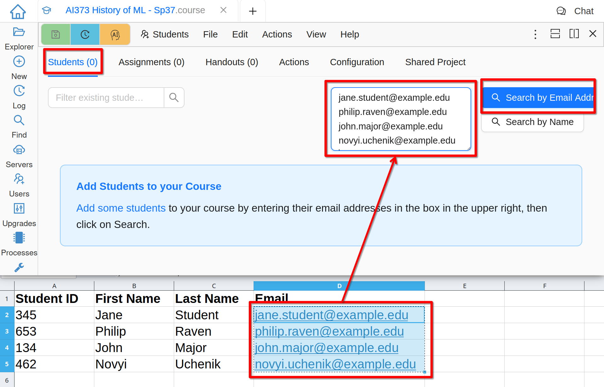
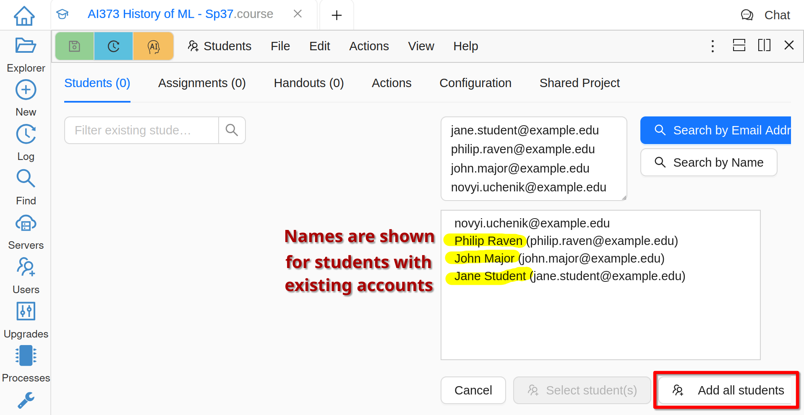
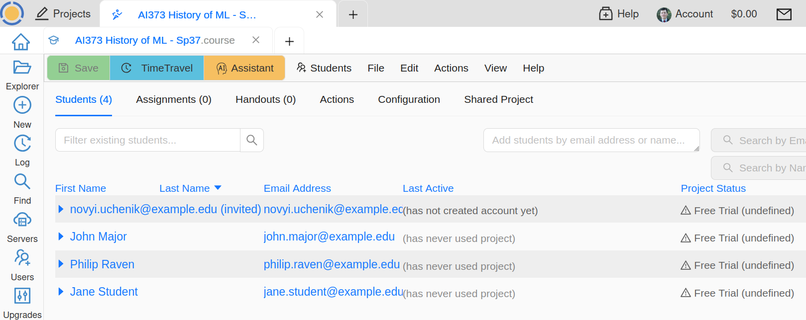

.. index:: Courses; adding students
.. _adding-students:

Add Students to the Course
##########################

Typically you will have a list of your students in a spreadsheet. Select the column of emails and copy-paste it to the right box on the **Students** tab of your course file: `📺 video <yt-apply-course-license_>`_

.. _yt-apply-course-license: https://youtu.be/QTHzEgZAJSw?feature=shared

     
     Put Students' Emails into Add Students Box

Click **Search by Email Address**, verify that the list of students looks correct, and click **Add all students**:

     
     Add All Students After Searching by Email Addresses

Next, the student projects will be created. Please be patient until all students are processed and do not close CoCalc.

     
     List of Students in the Course

In your list of added students email addresses that are followed by **(invited)** do not have an associated CoCalc account yet. This note will disappear as soon as these students sign up.

Student Projects
################

A separate and isolated project is created for each student. The owner of this project is you, i.e. the owner of the instructor project that contains the course file. The corresponding student is added to it as a collaborator, as well as all other instructors and TAs, that were added as collaborators on the instructor project. This allows you to check on students work at any time and help them whenever needed.

Depending on your course configuration, it may be possible to add more collaborators, for example, you may want your students to work in groups.

Any student who does not have an account on CoCalc yet will be sent an email invitation to create an account and join your course. For security reasons, CoCalc does not automatically send email invitations to students added if they already have a CoCalc account.

.. warning::

    Some email services, notably Hotmail and Yahoo Mail, may silently block emails sent from CoCalc. In that case, an invitation will not appear in the inbox or even spam folder of the intended recipient. However, there are no secret or otherwise necessary links in that invitation. Just use another method to direct your students to create an account on CoCalc, *using exactly the same email address that you have used to add them to the course.*

