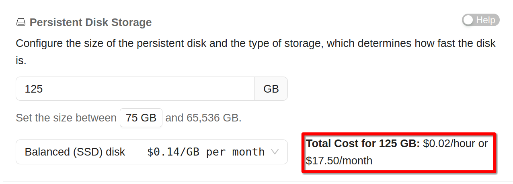
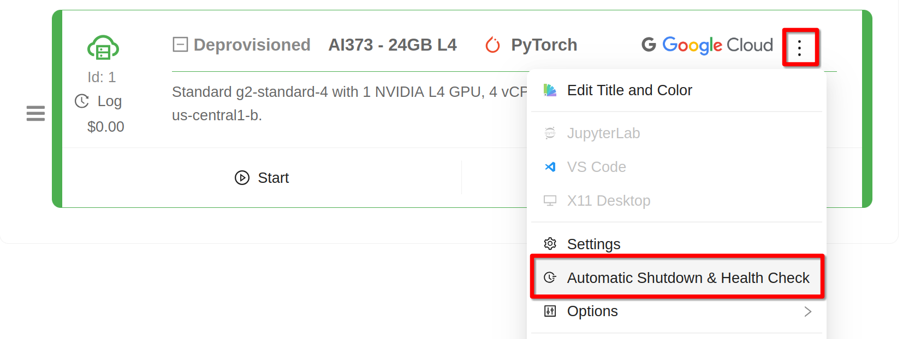
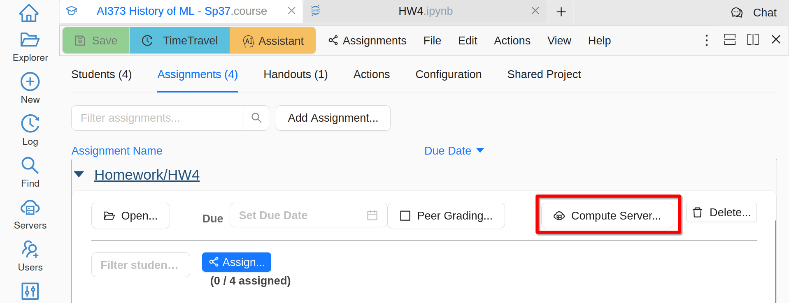
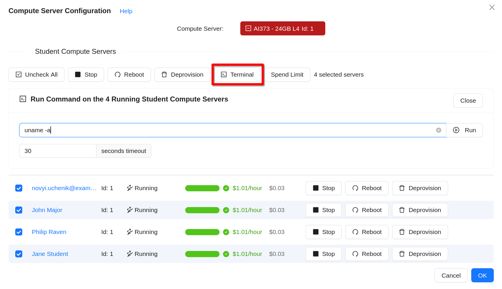
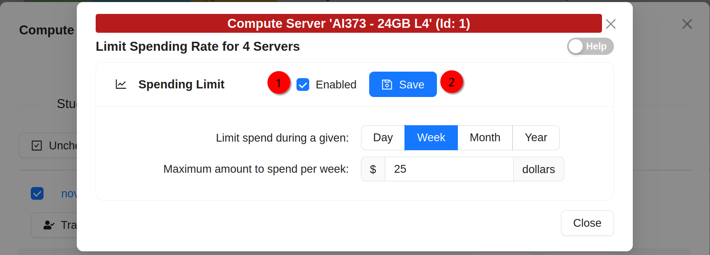
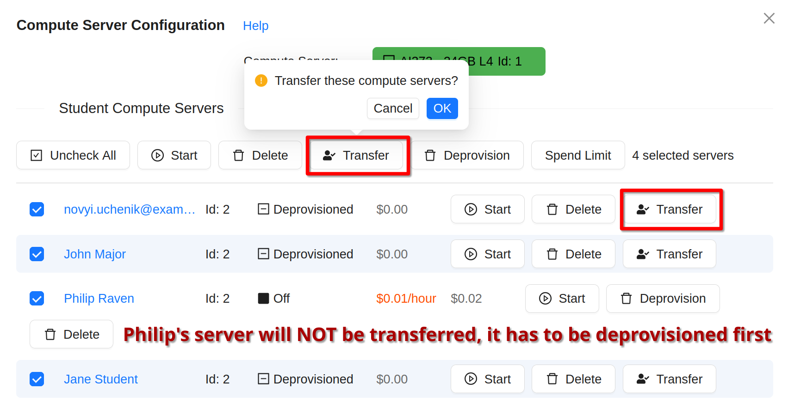

.. _teaching_with_compute_servers:

Compute Servers
===============

Compute servers are a great option to let your students or workshop participants use GPUs or powerful compute resources!

In addition to our general guide on using :doc:`compute_server`, below we cover some extra functionality and tips to facilitate their usage while teaching a course or running a workshop.

Some important points to consider ahead of the course start:

- What configuration do you need for your students?

- Who will pay for running compute servers?

- What are some sensible limits that you can configure to prevent accidental overspending?

In CoCalc compute server usage for courses is configured via assignments and handouts - you can use the same compute server for several of them or different ones. You can also own the servers and pay for them from your own account, or transfer ownership to students and let them pay for it directly, perhaps after making them even more powerful.

The best way to get a sense of what is possible it to experiment yourself in tandem with this video tutorial by CoCalc's Founder, CEO, and Lead Developer William Stein:

.. raw:: html

    
<iframe
        width="640" height="360"
        src="https://www.youtube.com/embed/ikktaiw14Tw?si=6TU6KtZvngRNabUj"
        title="YouTube video player"
        frameborder="0"
        allow="accelerometer; autoplay; clipboard-write; encrypted-media; gyroscope; picture-in-picture; web-share"
        allowfullscreen>
    </iframe>

Availability
------------

When you decide what machines to use, keep in mind that you won't need to start just one of them, but dozens if not hundreds at once - one for each student. With some popular GPUs it may be difficult to reserve the necessary amount and it is impossible to predict in advance. While we are working with our cloud providers to ensure sufficient quotas, it may be a good idea for you to have some "Plan B" - servers with different configuration or in a different region. Also, it may be a good idea to budget for regular compute servers even if you intend to use spot ones. It is impossible to predict how often spot instances will be switched off (or refuse to start at all) while the students are trying to complete their assignment. Anything "more frequent than rarely" is unlikely to be well perceived!

Disk Cost
---------

Typically, disk cost is a small portion of the overall cost of a compute server. However, if your course is running for several months while students are only using these resources a couple hours per week, the disk cost may become comparable to the cost of CPU, GPU, and RAM. Make sure to consider it in your budget. If it is highly desirable to reduce this cost, consider using slower (and cheaper) disks or deprovisioning compute servers between sessions. In the latter case you will need to install and configure all necessary packages and datasets every time, but it may be quick enough to be feasible.

For example, as of this writing "Standard g2-standard-4 with 1 NVIDIA L4 GPU, 4 vCPUs, 16 GB RAM, and a 125 GB SSD disk in us-central1-b" costs $1.03/hour. Only $0.02/hour is due to the disk, but monthly cost of the disk is $17.50:

    Disk Cost for a Compute Server
 
Switching to HDD disk of the same size drops the monthly cost to $7/month. Again, this is only important if you plan to keep the disk for several months. If you can easily install everything you need for every session, then faster SSD disk makes more sense.

Network Cost
------------

While the exact amount is hard to predict, network charges for compute servers are typically negligible since downloading content to compute servers is free and in the course setting outgoing traffic is small.

Creating Compute Servers
------------------------

Creation of compute servers for students in CoCalc is associated with assignment (although we are considering changing it).

First, create a compute server "as usual" and give it some sensible name - your students will use it as well. If you want to enable **Automatic Shutdown & Health Check** other than Spend Limit, this is the time to do it - later changes will not propagate to students copies:

    Shutdown Options for a Compute Server
 
Then go to an assignment (or a handout) which will need to use a compute server and click on **Compute Server...**:

    Configuring Compute Server for an Assignment
 
Select your compute server that you want to clone, then create one for each student - either one by one or using **Check All** and **Create**. This step creates only configuration of compute servers and is still completely free. The resulting servers are all owned by you and have collaborator control enabled - your students will be able to start, use, and stop them. If you prefer your students to be fully responsible for their servers (mostly importantly - they will have to pay for their use), :ref:`transfer ownership <transfer_server_to_student>` to them.

Clicking **Start** would allocate resources for each student and can take some time. Once done, you will see that all servers are running.

.. warning::

    When compute servers are created for students, they share the same configuration as yours, but have a new disk starting with the image you have selected.
    
If you need to perform some manual configuration in students servers, you have to either provide instructions on how to do it or write a non-interactive script and execute it on all servers using **Terminal** button:

    Terminal Command on All Compute Servers
 

Multiple Servers
----------------

While there can be only one compute server associated to each assignment, you can create multiple assignments with different compute servers. In particular, you can make a handout just for the sake of managing a new compute server.

Conversely, you can associate the same compute server with multiple assignments - only one clone will be created for each student in this case.

Setting Limits
--------------

Students cannot alter configuration of compute servers (unless you transfer ownership as explained below), but they can turn them on and *leave them on*. A compute server with a GPU that is running 24/7 can easily cost a few hundreds or thousands dollars over the term. While you should instruct your students on best practices and ask them to be responsible, accidents still may happen. To mitigate them, CoCalc provides a very flexible way to automatically shutdown compute servers if desired:

- when the server is running for too long
- past certain our of the day
- if the allocated budget is used up
- when some custom condition detected by your script happens

To adjust the spend limit, click on **Spend Limit** when some of the students servers are selected or when hovering over the current spend of a particular student. Then check **Enabled** and click **Save**:

    Spending Limit for Compute Servers
 
Other limits have to be configured for your own compute server before you create student ones.

.. _transfer_server_to_student:

Transferring Ownership
----------------------

You may transfer ownership of compute servers that you have created for your students to them. If you do it, you will lose any control of these servers as well as the responsibility to pay for them. Some reasons to do it:

- you want students to pay for compute time themselves
- you want to pay for your students in general, but some are not responsible enough and ran out of the budget that you have provided
- you want students to continue experimenting on their own after the end of the course

.. note::

    In order to transfer ownership of a compute server, it has to be deprovisioned, i.e. it has to be stopped with its disk deleted. The reason is simple - you are not allowed to force another account to pay for any consumed resources.

The transfer button is available in the list of compute servers for all that are deprovisioned:

    Transfer Compute Servers
 

Wrapping Up
-----------

In most cases students keep their course material on CoCalc past the course end. This is subtle with compute servers:

.. warning::

    When the course ends, students still can start compute servers and cost you money, unless you prevent it.
    
Possible actions are:

- deprovision the servers and transfer ownership to students
- delete servers completely
- delete student projects together with compute servers