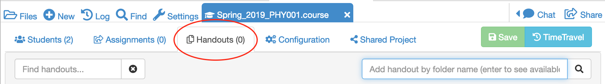
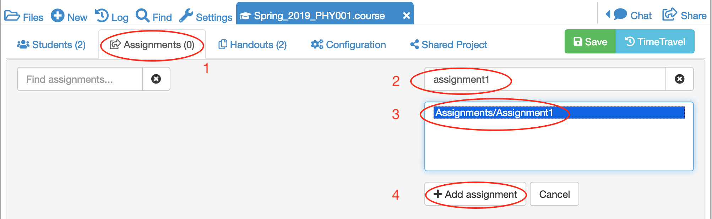
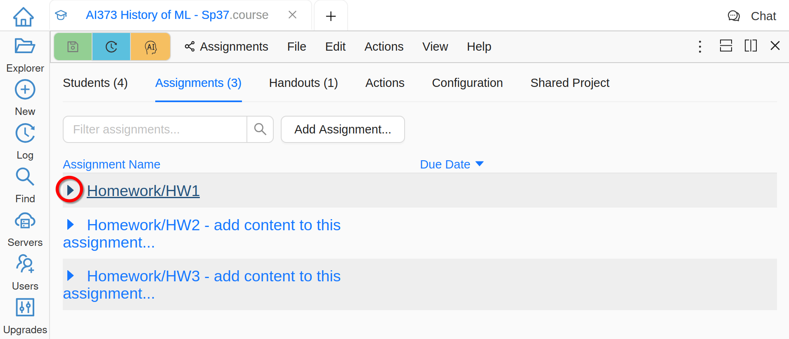
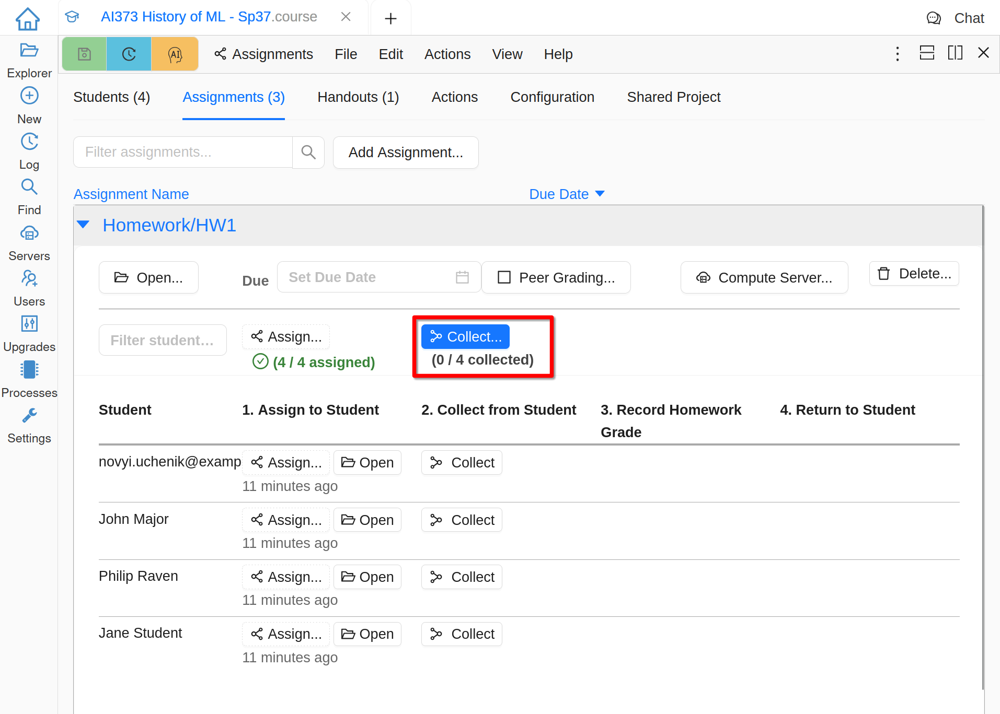
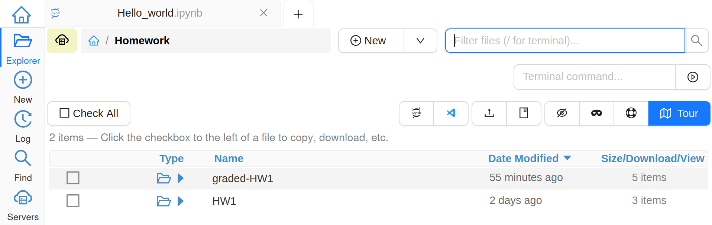

=====================
Course Management
=====================

No matter what you've added in the instructor's view of the course, the students will not see any files until you explicitly assign them.

.. contents::
   :local:
   :depth: 2

.. index:: Courses; create handout
.. _create-handout:

Create a new Handout
===============================

A handout consists of a folder that contains one or more files to be distributed to your students.

Create a folder called **Handouts** in the root directory of your course project. Within this folder create a subfolder called, say, **Handout1** and populate it with one or more files for the handout. These files can be anything - text, Markdown, code, pdf, and may contain subfolders.

Open the **.course** file and click on the **Handouts** tab

Type **handout** in the search box on the right hand of the screen and press enter. Note that search is case-insensitive.

The system will look for any folders with **Handout1** in their path name and  return a set of options. Highlight the one you want and click on **Add selected handout**.

.. image:: img/teaching/find-handout.png
     :width: 100%
     :alt: entering a partial handout folder path in the handout search panel at right

The new handout will be added to the list of handouts available for the course.

.. index:: Courses; create assignment
.. _create-assignment:

Create a new assignment
===============================

An assignment is a folder that contains one or more files that can be distributed to your students and collected at some future time for grading.

Create a folder called **Assignments** in the root directory of your course project.
Within this folder create a subfolder called, say, **Assignment1** and populate it with files that contains questions or problems for your students to answer. For example, an assignment can contain a Jupyter notebook and data files, with instructions for a programming exercise.

Open the **.course** file and click on the **Assignments** tab.
Enter **assignment1** in the search box on the right hand of the screen and press enter.

The system will return a list of folders with **assignment1** in their path name. Highlight the one you want and click on **Add assignment**.

The new assignment will be added to the list of assignments available for this course.

Distributing an assignment to students
======================================

Click on the assignment in the assignment list.
When the assignment opens, set the **Due** date. You can do this in the text area, or using the calendar and clock widgets to the right. Click on the **Assign** button to distribute to all students in the course.

.. image:: img/teaching/send_assignment.png
     :width: 100%
     :alt: distributing an assignment to all students

Alternatively, you can distribute just to individual students.

When an assignment is distributed to a student, a **copy** of the assignment folder will appear in the student project.

Advise the students that all work on the assignment should take place in this folder. Any work performed outside of this folder will not be collected.

Peer Grading
======================================

A very useful function for formative assessment is **peer grading**.
Use peer grading to randomly (and anonymously) redistribute collected homework to your students, so that they can grade it for you.

Within the assignment, click on the **Peer Grading** icon and follow the instructions to activate this feature.

.. image:: img/teaching/peer_grading_activation.png
     :width: 100%
     :alt: enabling peer grading for an assignment

Collecting assignments from students
======================================

After an assignment has been made, a **Collect** icon appears next to each student.
Clicking on one of these will make a copy of the student's assignment folder to your account.
The entire folder will be copied including any extra files the student may have created.

Alternatively, click on the **Collect** icon in the top row to collect from all students simultaneously.

You should make sure that your project has enough disk space to accommodate this.
It may be necessary to purchase an upgrade if you need more than the free allowance (currently 3GB per project).

Once the assignment has been collected, anything the student subsequently does in **their** copy will not be reflected in **your** copy.

If you click on the **Files** icon and go to the root directory of the course project, you'll see that a new folder will have been created with the name **[your_course_name]-collect**

.. image:: img/teaching/filelist_with_collect.png
     :width: 100%
     :alt: folder of collected assignment files appears in files list in instructor project

Navigating within this folder, you'll find that it has a similar file structure to the original assignment.
For example, for this demonstration we had the structure `/assignments/Assignment1` which appears in the collected folder as `[your_course_name]-collect/assignments/Assignment1`.
Entering this folder will give a view of all students' versions of this assignment

.. image:: img/teaching/collected_assignments.png
     :width: 100%
     :alt: "collect" folder for each student

The folder corresponding to each collected assignment will have been given a unique random name.
Navigating inside this folder, you will see all collected files along with a text file whose filename identifies the student.

.. image:: img/teaching/Identify_student.png
     :width: 100%
     :alt: student name appears under the folder with the 

At this point, you can open and mark the student's returned assignment.

An easier interface for opening a student's collected assignment is via the **.course** file.
Simply click on the **Open** icon corresponding to the student you are interested in and you'll be taken to the folder described above.

.. image:: img/teaching/open_assignment.png
     :width: 100%
     :alt: opening a collected assignment in the instructor project

.. _skip-entering-grades:

Returning Assignments Without Grading
=====================================

You can provide comments to students by editing student files that you have collected, or by adding files to the "-course-collect" folder for the assignment and student in question.

If you click the "Skip entering grades" button before returning assignments, your notes and any added files will be sent to the student projects, but the GRADE.md file will contain a statement that either the assignment is ungraded, or a grade is assigned outside of CoCalc.

.. image:: img/teaching/non-nbg-2.png
     :width: 100%
     :alt: Skip entering grades button in Assignments tab of course file

Manual Grading
=======================

You may annotate the student's assignment by modifying the collected file(s) in any way you like. The student will get a copy of everything you do after you return it.

When working with Jupyter notebooks, it can be useful to make annotations in markdown cells and set the color of the annotations to stand out.

You can change the font color in a markdown cell in Text edit mode using the font options toolbar, as explained in the section on :ref:`font-options`.

Or you can edit the cell in Markdown edit mode and enter the HTML tags for desired color explicitly::

    Great work!

.. image:: img/teaching/feedback.png
     :width: 50%
     :alt: highlighting instructor remark using html in a jupyter notebook markdown cell

Once you've finished marking and commenting on the student's notebook, you can enter a grade via the **.course** file.
Click on the **Enter Grade** button to open up the grade entry text box and enter the grade.
This can be a number or any other string that makes sense for your course.

.. image:: img/teaching/Enter_grade.png
     :width: 100%
     :alt: entering a grade for one student's assignment

Automatic Grading
=======================

For automatic grading, see :doc:`teaching-nbgrader`.

Exporting grades
======================================

It is possible to export grades for all assignments as either a .csv file or as executable Python code.
The **Export grades** function is available in the **Configuration** tab of the **.course** file.

.. image:: img/teaching/Export_grades.png
     :width: 66%
     :alt: exporting grades for all assignments from the Configuration tab

The .csv file format looks like this::

    # Course 'Autumn_2016_PHY001'
    # exported 2016-06-13T13:24:40.141Z
    Name,Email,"assignments/Assignment1","Notes"
    "Mike Croucher","some.email@sheffield.ac.uk","80",""
    "Mike_test ","some_other_email@sheffield.ac.uk","100",""
    "bar@sheffield.ac.uk","bar@sheffield.ac.uk","90",""
    "foo@sheffield.ac.uk","foo@sheffield.ac.uk","70",""

The corresponding Python code looks like this::

    course = 'Autumn_2016_PHY001'
    exported = '2016-06-13T13:26:19.407Z'
    assignments = ['assignments/Assignment1','Notes']
    students = [
        {'name':'Mike Croucher', 'email':'some.email@sheffield.ac.uk', 'grades':['80','']},
        {'name':'Mike_test ', 'email':'some_other_email@sheffield.ac.uk', 'grades':['100','']},
        {'name':'bar@sheffield.ac.uk', 'email':'bar@sheffield.ac.uk', 'grades':['90','']},
        {'name':'foo@sheffield.ac.uk', 'email':'foo@sheffield.ac.uk', 'grades':['70','']},
    ]

Returning an assignment to students
======================================

Once an assignment has been graded, the *Return* to student button appears.

.. image:: img/teaching/return_button.png
     :width: 100%
     :alt: return buttons appear as assignments are graded

Clicking on this sends a copy of the graded assignment back to the student.
It appears in their assignments folder like this:

Note that the student now has both their original assignment **and** a copy of the returned, graded assignment.
