Assignments and Handouts
************************

.. contents::
   :local:
   :depth: 2

An "assignment" in CoCalc is a folder/directory with arbitrary files. These files can be anything: Jupyter Notebooks, (small) data files, text, Markdown, code, PDF, or even subfolders. All these files are sent to students to work on, then collected, graded, and returned to students. A "handout" is the same, but with no actions after sending it to students. Let's start with handouts since they are simpler and you may want to use them first, e.g. to distribute a syllabus or some sample/training files.

.. index:: Courses; create handout
.. _create-handout:

Create a Handout
================
    
As mentioned above, a handout is a folder that contains one or more files to be distributed to your students. For example, you may want to create a folder called ``Handouts`` in the root of your course project, then a subfolder ``Syllabus`` within it, and copy or upload ``syllabus.pdf`` there.

To register this handout in your course, go to the **Handouts** tab of the ``.course`` file, click **Add Handout...**, navigate to **Syllabus** subfolder, select it, and click **Add 1 handout**: `📺 video <yt-fullscreen_>`_

.. _yt-fullscreen: https://youtu.be/j8YUwPSm-1g?feature=shared

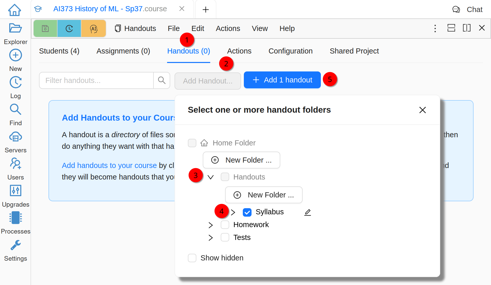
    
    Add a Handout

Distribute a Handout
====================

Next, you need to "distribute" your handout to students, i.e. create a copy of all of its files in each student project. Once done, students can do whatever they want with their copies, including editing them, discussing in side chats, or even deleting. On the **Handouts** tab you will see that it is not transfered to any of the students yet:

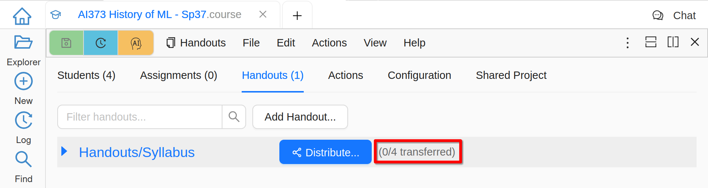
    
    A Handout Before Distributing

You can either click **Distribute** to send it to all students, or expand the handout and be able to send it to selected students only:

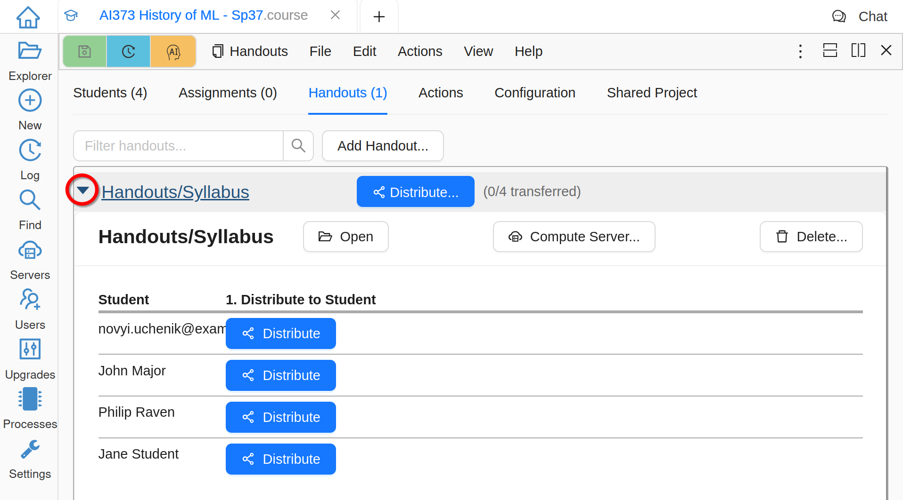
    
    Expanded View of a Handout

Once a handout is distributed, you can use the course interface to access either your "master copy" OR the copy of any enrolled student. While it may not be needed very often for handouts, it is definitely a very useful feature for assignments!

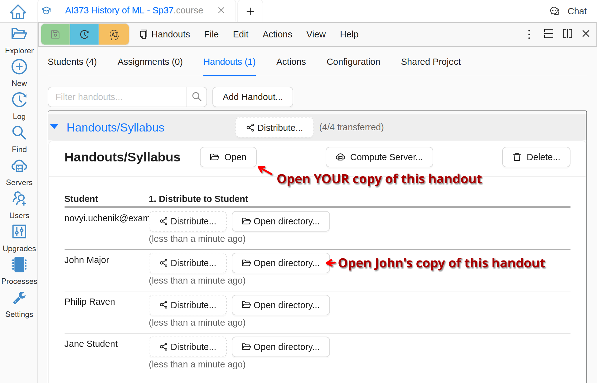
    
    A Handout After Distributing

.. index:: Courses; create assignment
.. _create-assignment:

Create an Assignment
====================

An assignment is a folder that contains one or more files that can be distributed to your students and collected at some future time for grading.

The basic process of creating an assignment and registering it in your course is exactly the same as for a handout described above, you just work in the **Assignments** tab instead of **Handouts**.

Distribute an Assignment
========================

Distributing an assignment is also very similar to distributing a handout covered above, but because of multiple actions associated to an assignment, you have to expand its record:

.. figure:: img/teaching/assignment_list.png
    :width: 90%
    :align: center
    :alt: Assignments List
    
    Assignments List

You can optionally set the **Due Date**. Please note that at the moment this field serves only informational purposes, it is necessary for an instructor or a TA to manually initiate collection process. It is also possible to associate an assignment with a particular compute server, if you are using them. Once ready, click **Assign**:

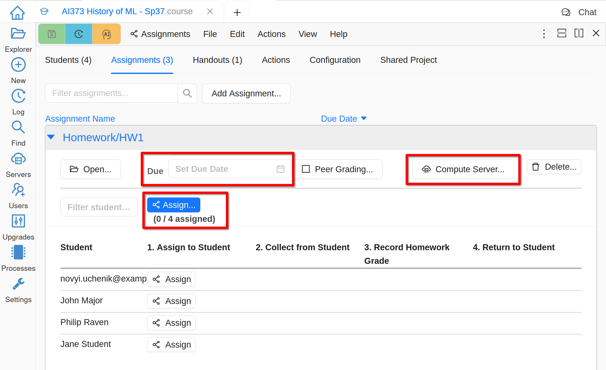
    
    Assign an Assignment

.. warning::

    When an assignment is distributed students, a copy of the assignment folder will appear in each student project. These copied folders are the ones that will be collected later. Please advise your students to NOT rename or move such folders!

Check "Student View"
====================

If you want to see what *exactly* your students will see and experience, the best way is to use your other email to create another CoCalc account (use incognito mode in your browser to prevent interference with your main account), add this "test student" to your course, and assign an assignment just to this test student before the whole class.

Collect an Assignment
=====================

"Collect an assignment" means "copy all current files from the student project into the instructor project". Students still have access to their own copies and can continue working on them if desired, but changes will not be reflected in the instructor project. (Unless the files are manually collected again.)

After an assignment was assigned, **Collect** buttons appear:

.. figure:: img/teaching/collect_assignment.png
    :width: 90%
    :align: center
    :alt: Collect an Assignment
    
    Collect an Assignment

Once collection finishes, you can access both the collected copy in your project for grading and the copy that still remains in the student project (for example, if you want to take a look at the edit history):

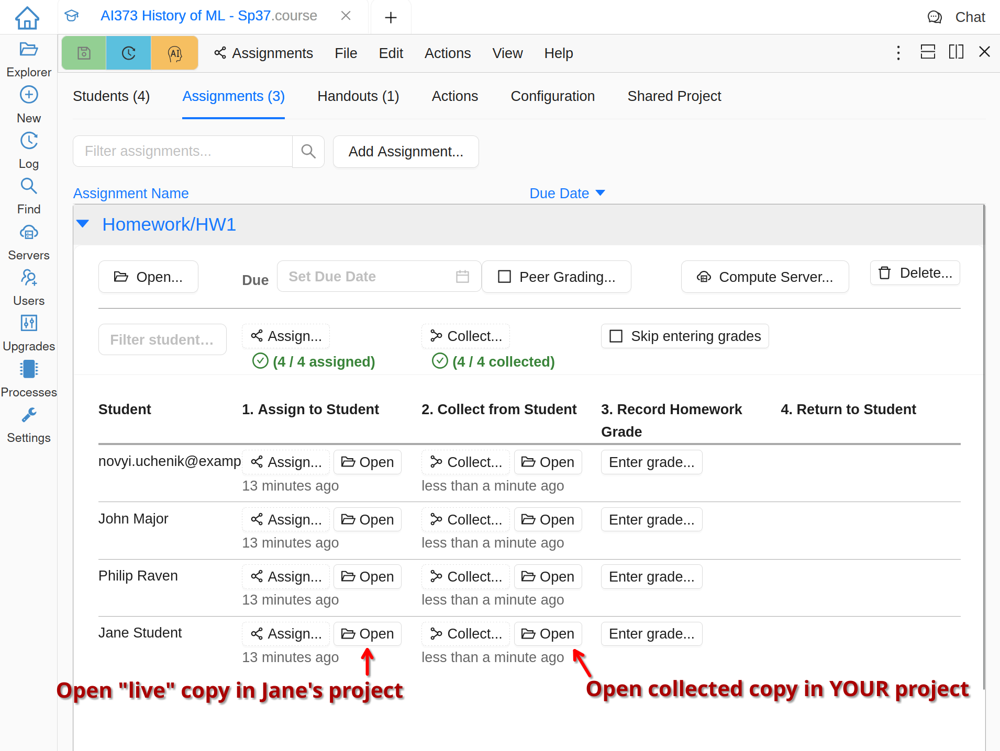
    
    Access Collected Assignments

If you want to access collected files directly in the file system, they are easy to find in the File Explorer in the folder named **[course_name]-collect**:

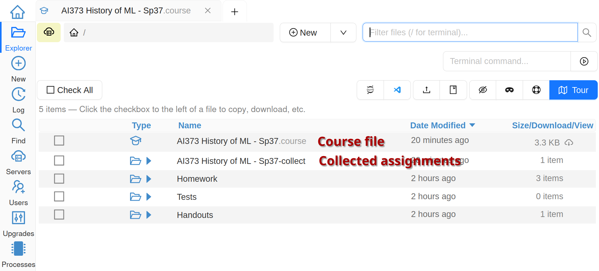
    
    Folder With Collected Assignments

The internal structure of this folder corresponds to the one you use for your assignments, but each student work is in a subfolder with a unique random name. It does have a file, however, identifying the student.

Grade an Assignment
===================

There is a number of ways to do (or avoid!) grading in CoCalc:

- A very useful function for formative assessment is :doc:`teaching-peer-grading`.
- For automatic grading see :doc:`teaching-nbgrader`.
- Open each collected folder one-by-one and annotate the files in any way you like.

When working with Jupyter notebooks, it can be convenient to make annotations in markdown cells and set the color of the annotations to stand out. You can change the font color in a markdown cell in **Text** edit mode using the font options toolbar:

.. figure:: img/teaching/colored_feedback_text.png
    :width: 90%
    :align: center
    :alt: Leaving Feedback in Text Mode
    
    Leaving Feedback in Text Mode

Alternatively, it may be more convenient, e.g. for copy-pasting comment templates, to use **Markdown** mode with explicit HTML tags:

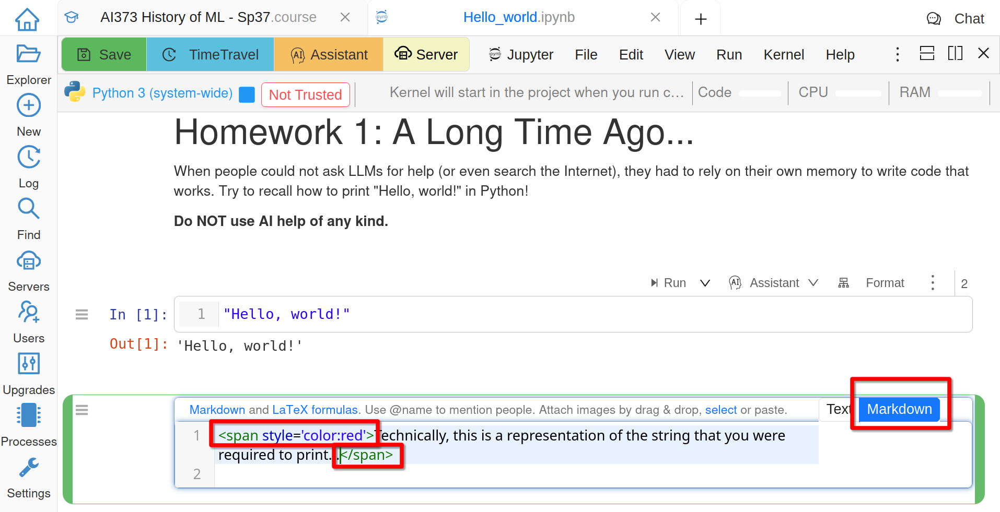
    
    Leaving Feedback in Markdown Mode

Once done, enter a grade in the course file. "A grade" is an arbitrary text, so you can use whatever system you prefer:

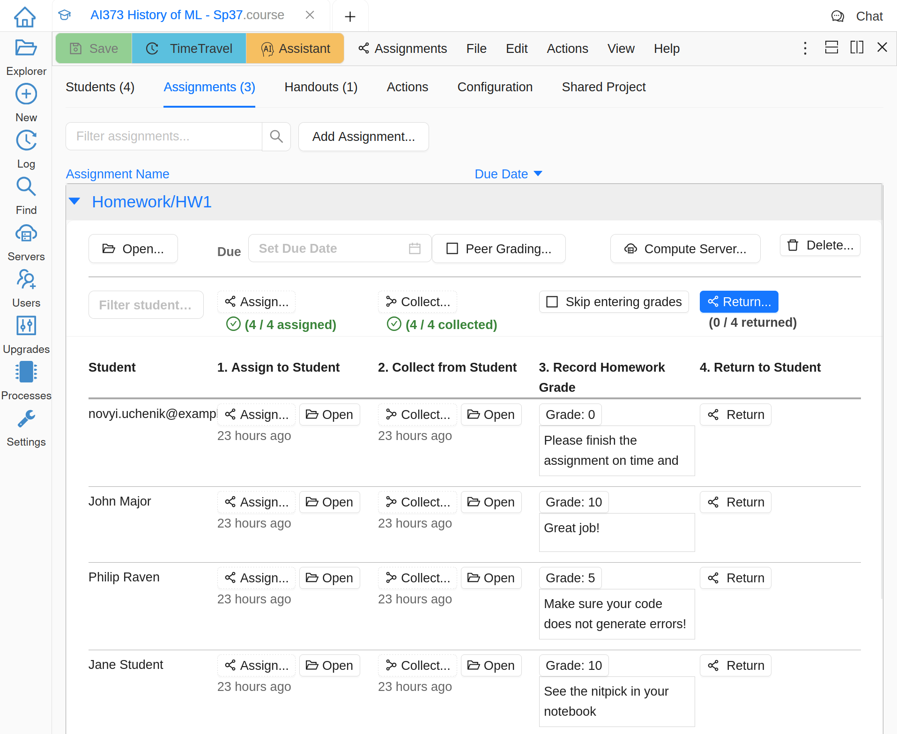
    
    List of Graded Assignments
    
The grades and comments are stored in ``GRADE.md`` files inside each student folder.

.. _skip-entering-grades:

Return an Assignment
====================

Once an assignment has been graded, **Return** buttons appear. Although you can click **Skip entering grades** and return just your notes and any added files to the students. In that case ``GRADE.md`` files will contain a statement that either the assignment is ungraded, or a grade is assigned outside of CoCalc.

Returned assignments are copied to a folder separate from student's work:

.. figure:: img/teaching/returned_assignment.png
    :width: 90%
    :align: center
    :alt: Returned Graded Assignment in Student Project
    
    Returned Graded Assignment in Student Project
    
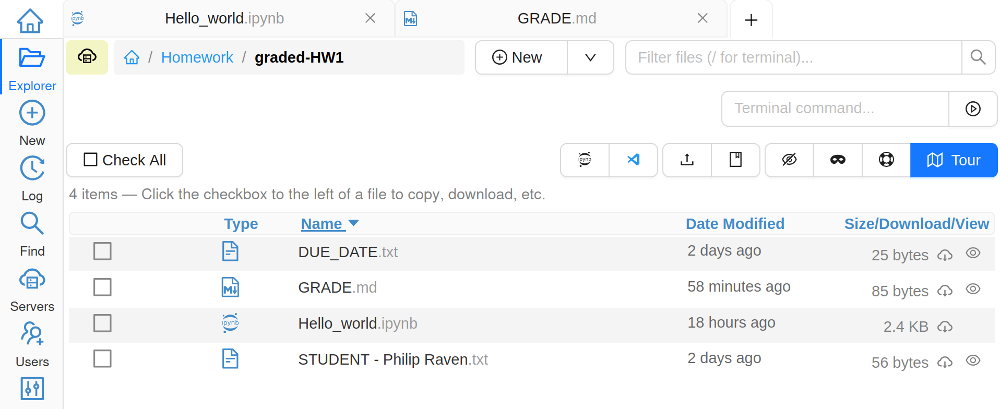
    
    Files of a Graded Assignment
    
    
Export Grades
=============

To export grades for all assignments as a CSV file (or JSON, or Python) go to **Export grades** panel on the **Actions** tab of your course file:

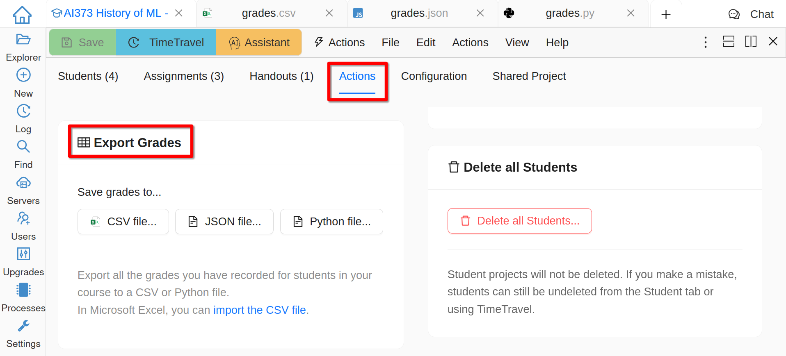
    
    Export Grades
    
