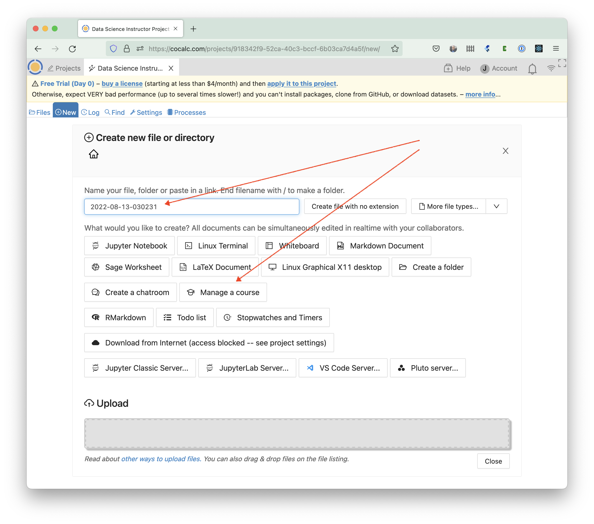
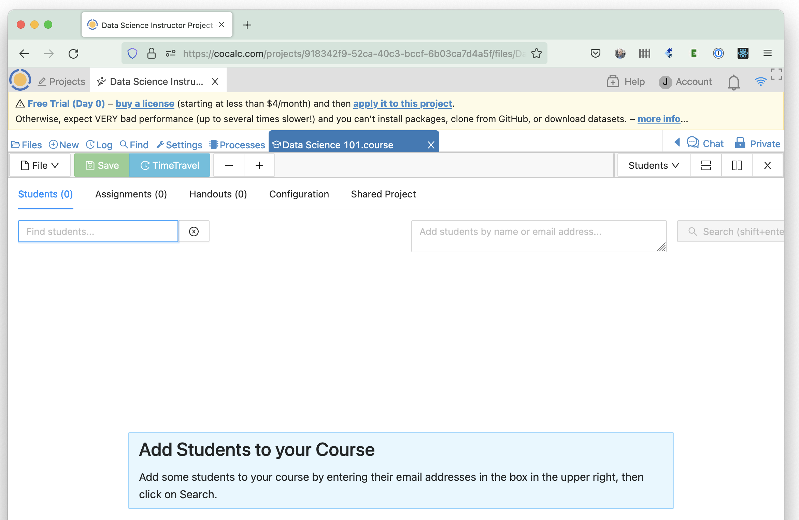
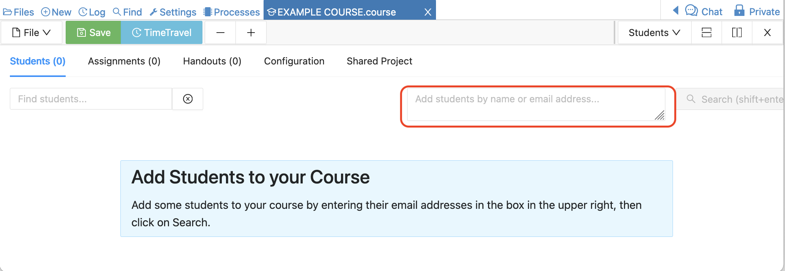
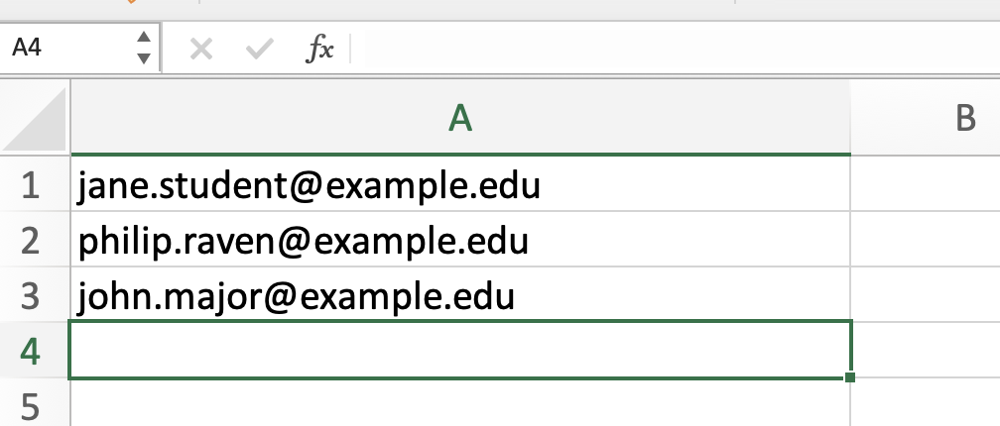
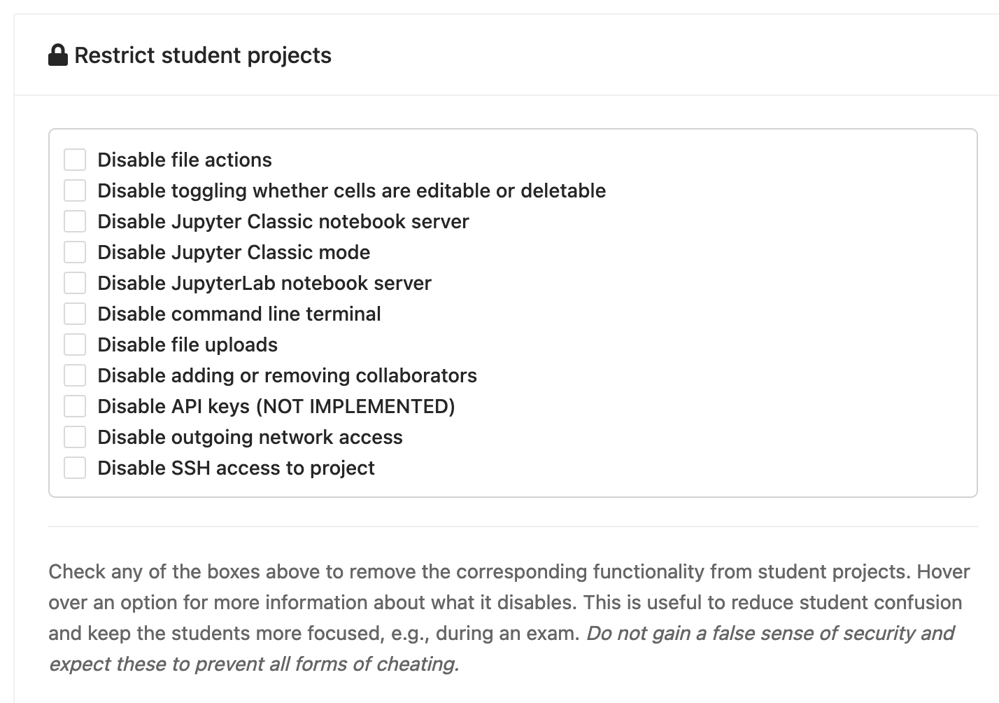
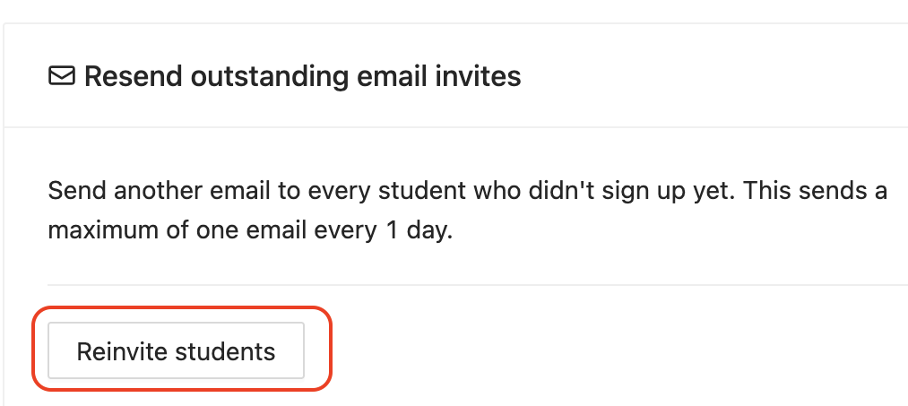

.. _create-a-new-course:

=====================
Creating a New Course
=====================

In this section we will learn how to create a course project,
how to populate it with a course management file and how to invite all of your students to join the course.

.. contents::
   :local:
   :depth: 1

###########################
Creating the Course Project
###########################

The first step is to create a teacher's project to contain the course.

Log into CoCalc and click on the **Projects** icon in the top left hand corner of the screen.

Click on **Create New Project**, fill out the **Title** and **Description** and click on **Create Project**

.. image:: img/teaching/create_new_course_project.png
     :width: 100%
     :align: center
     :alt: entering new project title and description

The new project will appear at the top of the project list. Click on its  title to open it.

.. image:: img/teaching/course_list.png
     :width: 100%
     :align: center
     :alt: new teacher project displayed in project list

.. index:: Courses; adding teaching assistants
.. _teaching-add-ta:

########################################
Adding Teaching Assistants to the Course
########################################

To add teaching assistants or other teachers to the course, open the course project, click on the settings tab and look down to see "Add new collaborators" in the project settings.

Under **Add new collaborators**, you can find or add collaborators by name or email address.
These collaborators will also have access to all associated student projects orchestrated by that project.
Do **not** add any students of yours as project collaborators!

.. image:: img/teaching/collaborators.png
     :width: 50%
     :align: center

If the email address you add as a collaborator is not associated with a CoCalc account,
an email will be sent to that address with instructions how to join.
Once the account with exactly that email address is created, that new user will be added automatically to all projects with pending invitations.

.. index:: Courses; course file

########################
Creating the Course File
########################

Almost all aspects of a course, such as which students are enrolled and assignment management, are controlled by a **.course** file. We'll now create this file.

Open the course project, click on **New** and give the course a title.
Here, I've used `Autumn_2016_PHY001`.
Click on **Manage a Course** to create the course file.

If you go to the root of the course project directory, you will see that a new file has been created with the extension **.course**. This is the course management file and most aspects of your course are controlled by it.

.. index:: Courses; multiple courses in same project
.. note::

    You may have more than one course file in a single project, as is explained in the next section. Be aware that any account you add as a teaching assistant to the project will have access to course files and student work for **all** courses in that project.

.. index:: Courses; split into sections

Split course into multiple groups
-------------------------------------

**Note:** If your course is large, it is possible to partition your class into several groups or sections.
To accomplish that, simply create more than one course file.
For example, ``PHY001_A.course``, ``PHY001_B.course``, ``PHY001_C.course``, ...
for groups ``A``, ``B``, ``C`` and so on.

These course files are independent of each other,
which allows not only different groups of students, but also different due dates, etc.

.. index:: Courses; adding students
.. _adding-students:

#############################
Adding Students to the Course
#############################

Open your new course by clicking on the **course** file. Select the **Students** tab if it is not already shown. You will see a box at upper right where you can add students and search for them in CoCalc.

It's best to add students using their email addresses, because those are unique for cocalc accounts. However, it is also possible to search for students by first and last names.

To add multiple students, you can paste in a comma-separated list of email addresses or names. Another way to enter the information is if you have your students' email addresses in a column of a spreadsheet, for example with Excel or Google Sheets.

You can copy the addresses from the spreadsheet and paste directly in the **Add student** box.

.. image:: img/teaching/add-students-3.png
     :width: 100%
     :align: center
     :alt: copy/paste from spreadsheet into Add Student box

After running the search by clicking "Search" or hitting shift-Enter, you can select which students you want add from the search results (use Ctrl-click or Cmd-click for more than 1 student), or just click the "Add all students" button.

.. image:: img/teaching/add-students-4.png
     :width: 100%
     :align: center
     :alt: selecting all matching students after searching by email address

Next, the student projects will be created. Please be patient until all students are processed and do not close CoCalc. If the process appears stalled after creating some number of student projects, you can refresh your browser to check for updated results.

.. image:: img/teaching/add-students-5.png
     :width: 100%
     :align: center
     :alt: student list after adding all students from the search

If your project (the one with the .course file) has the :ref:`Internet Access upgrade <internet-access>`, any student who does not have an account on CoCalc will be sent an email invitation to create an account and join your course. 

.. note::

    For security reasons, CoCalc does not automatically send email invitations to students added if they already have a CoCalc account.

* Email addresses that are followed by **(invited)** do not have a CoCalc account yet.
  **(invited)** will disappear as soon as they sign up.
* You can see when each student last used the course project. In this case -- never!
* The **! Free** warning next to each student shows that they are running this course on free servers.
  It is **strongly** recommended that you upgrade this to members-only servers for your students. 
  You can also require in the configuration page that your students pay a small one-time fee to upgrade their projects (see below).

.. note::
    Some email services, notably Hotmail and Yahoo Mail, may silently block emails sent from our service. In that case, an invitation to sign up will not appear in the inbox or spam folder of the intended recipient and another method must be used to communicate sign-up information to the student.

.. index:: Courses; reconfigure student projects
.. index:: Reconfigure student projects
.. index:: Courses; re-send email invitations
.. index:: Re-send student email invitations

###############################
Restrict Student Projects
###############################

In the course Configuration tab on the right, check any of the boxes under "Restrict student projects" to remove the corresponding functionality from student projects. See below for more information about each item. This information is also available if you hover over an option in the web dialog.

Because some CoCalc features may not be compatible with course content created by an instructor, restricting a project can reduce student confusion and prevent issues with running and grading assignments. It may also keep students more focused, e.g., during an exam. Do not gain a false sense of security and expect these to prevent all forms of cheating.

     "Restrict student projects" at lower right in course Configuration

* **Disable file actions.** Make it so students can't delete, download, copy, publish, etc., files in their project.
* **Disable toggling whether cells are editable or deletable.** Make it so that in Jupyter notebooks, students can't toggle whether cells are editable or deletable, and also disables the RAW Json Editor and the Jupyter command list dialog. If you set this, you should probably disable all of the JupyterLab and Jupyter classic options too.
* **Disable Jupyter Classic notebook server.** Disable the user interface for running a Jupyter classic server in the student project. This is important, since Jupyter classic provides its own extensive download and edit functionality; moreover, you may want to disable Jupyter classic to reduce confusion if you don't plan to use it.
* **Disable Jupyter Classic mode.** Do not allow opening Jupyter notebooks using classic mode. The Jupyter classic UI has some workarounds for the other restrictions here, and can also cause confusion if you don't want students to use it in your class.
* **Disable JupyterLab notebook server.** Disable the user interface for running a JupyterLab server in the student project. This is important, since JupyterLab provides its own extensive download and edit functionality; moreover, you may want to disable JupyterLab to reduce confusion if you don't plan to use it.
* **Disable command line terminal.** Disables opening or running command line terminals in the student project.
* **Disable file uploads.** Blocks uploading files to the student project via drag-n-drop or the Upload button.
* **Disable adding or removing collaborators.** Removes the user interface for adding or removing collaborators from the student project.
* **Disable API keys (NOT IMPLEMENTED).** Makes it so the HTTP API is blocked from accessing the student project. A student might use the API to get around various other restrictions.
* **Disable outgoing network access.** Blocks all outgoing network connections from the student project.
* **Disable SSH access to project.** Makes any attempt to ssh to the student project fail.

###############################
Reconfigure Student Projects
###############################

In the course Configuration tab on the right, click `Reconfigure all projects` to ensure student projects have correct students and teaching assistants, titles and descriptionsa.
Doing so will also resend email invitations to students who have not already signed up for CoCalc.

.. figure:: img/teaching/course-reconfigure.png
     :width: 90%
     :align: center
     :alt: button to reconfigure all student projects in lower right of course Configuration tab

     "Reconfigure all projects" at lower right in course Configuration

##################################
Resend outstanding email invites
##################################

In the course Configuration tab on the right, click `Reinvite students` to send/resend an email invitation to all students who do not yet have an account on CoCalc. This will send at most one email per student per day.

     "Reinvite students" at lower right in course Configuration

#########################
What do the Students Get?
#########################

On being invited to a course, each student will have a project created for them in their CoCalc account that corresponds to that course. Each project will have you and the course teaching assistants set as collaborators.

The student's course project will have its own individual quotas set for disk storage, internet access and so on (e.g. students get 1GB of RAM). These quotas will be the standard set of quotas that everybody gets with free CoCalc projects.

You can learn more about upgrades and quotas in the :ref:`next chapter <course-upgrading-students>` or the :doc:`upgrade-guide`.
