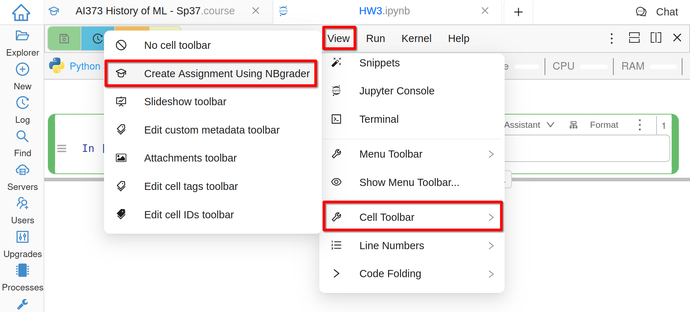
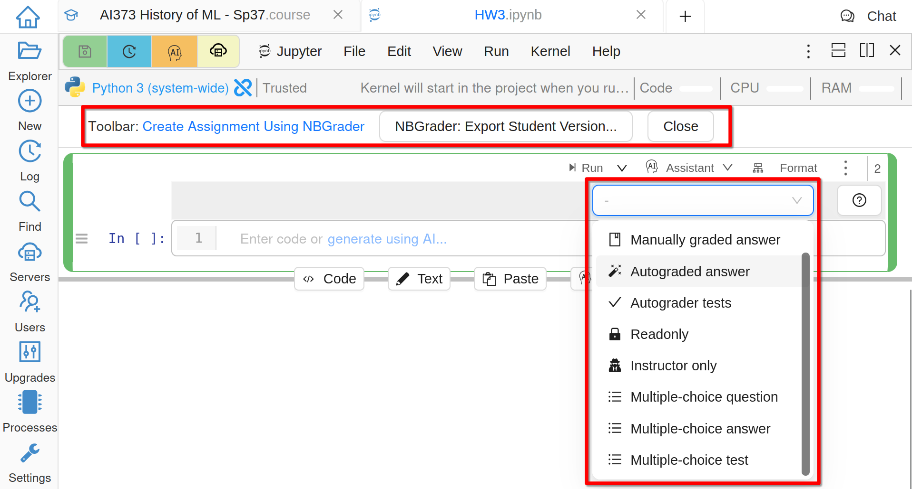
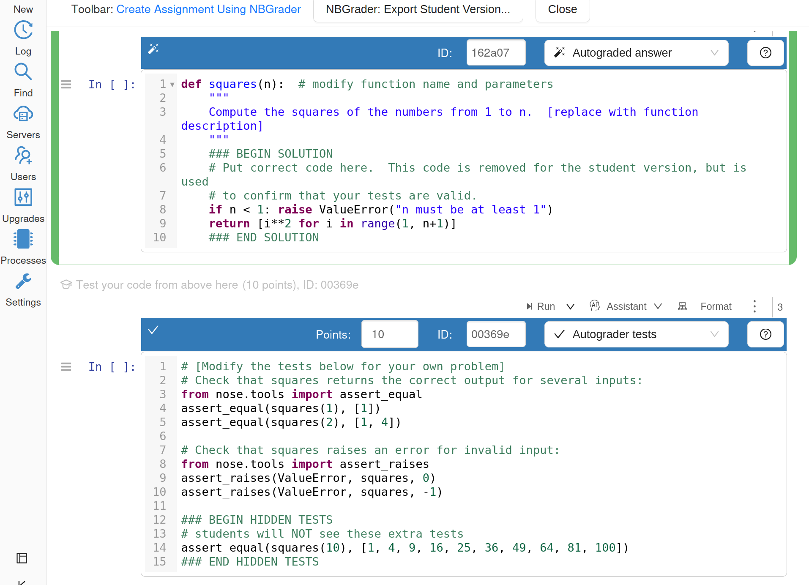
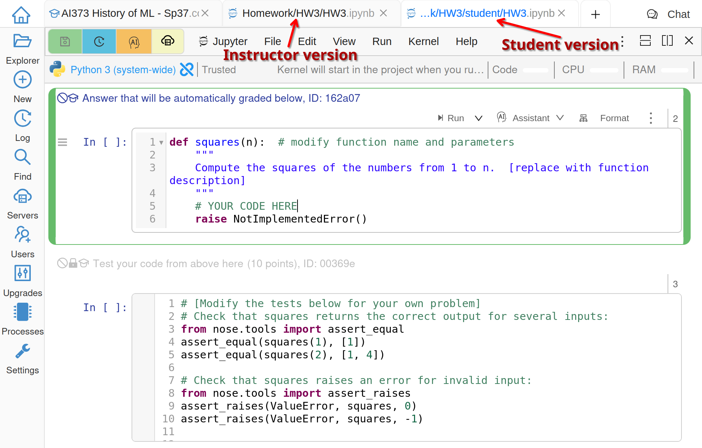
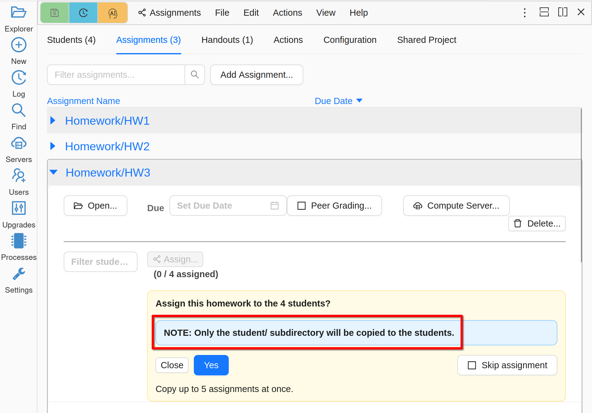
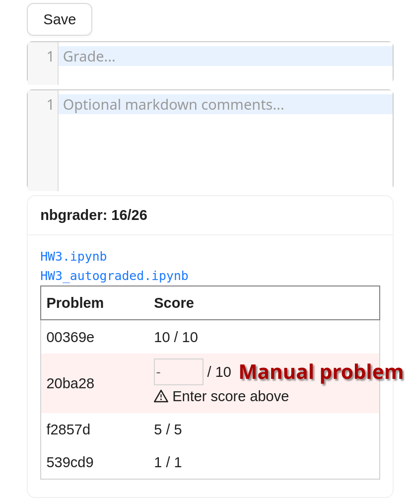
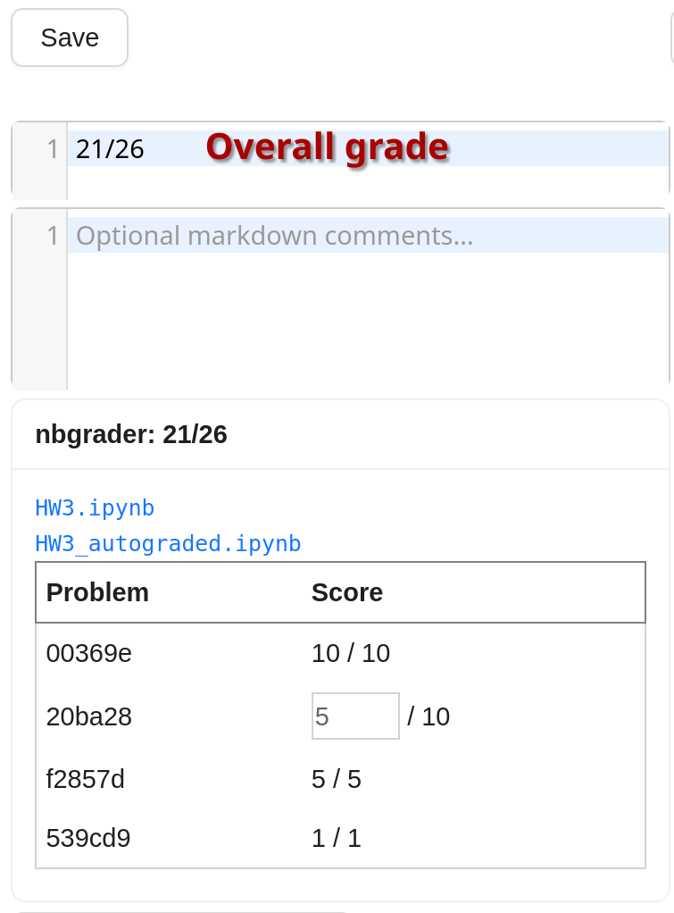
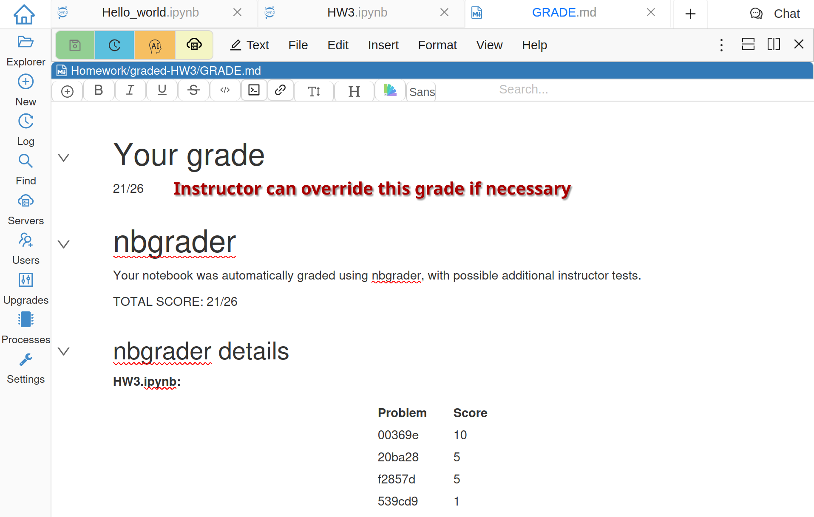

.. index:: Courses; nbgrader
.. index:: nbgrader; teaching with
.. _nbgrader-doc:

Using nbgrader
==============

As the main page of the `nbgrader`_ project states, "``nbgrader`` is a tool that facilitates creating and grading assignments in the Jupyter notebook. It allows instructors to easily create notebook-based assignments that include both coding exercises and written free-responses. ``nbgrader`` then also provides a streamlined interface for quickly grading completed assignments."

CoCalc has its own independent implementation of ``nbgrader``
in order to fully support realtime collaboration,
course management, and other functionality of CoCalc.
The Jupyter metadata format of CoCalc's ``nbgrader`` is the same as that of the
official one, and the user experience is similar. Some changes are:

* No need to install special modules, extensions, or configure anything.
* Students see an annotation next to answer cells, so they know that evaluating these cells without errors gives a certain number of points.
* Instructors have a toolbar that inserts a template with example input or automated tests.
* Integration with CoCalc's course management tools for distributing and collecting assignments.
* Automated grading safely runs code in the student's project, not in the instructor's project.

Below we assume that you are already familiar with CoCalc's course management system, especially with :ref:`assignments-and-handouts`, so we focus only on the extra steps needed to use ``nbgrader``.

.. contents::
   :local:

Show nbgrader UI
----------------

Once you have created a Jupyter Notebook for which you want to use ``nbgrader``, go to **View > Cell Toolbar > Create Assignment Using nbgrader**: `📺 video <yt-nbgrader_>`_

.. _yt-nbgrader: https://youtu.be/EfsAA9QvrlA?feature=shared

     Show ``nbgrader`` UI

You will get a button to generate the student version at the top and each cell will have a dropdown for its type in ``nbgrader`` workflow:

     ``nbgrader`` Cell Types

Create Questions
----------------

When you select a cell type from the dropdown, you will get a sample working snippet that you need to modify for your problem:

     Code Snippets For Creating Problems

Student Version
---------------

Once your assignment is ready, generate the student version (without solutions and hidden tests) using that button at the top of the notebook. The student version is placed into ``student`` subfolder of the assignment folder. It automatically opens in another tab so you can preview it:

     Student Version

.. warning::

    If you are using a previously created assignment for ``nbgrader``, make sure that you add the folder with the instructor version as an assignment in the course file, **NOT** just the ``student`` subfolder.

When you distribute an ``nbgrader`` assignment, i.e. one that has ``student`` subfolder, only this subfolder will be copied to students:

     Distribute ``nbgrader`` assignment

While students work on the assignment, they can use **Run > Validate** to check that all open tests pass.

Grading Process
---------------

After collecting your assignment from students, you will be able to run ``nbgrader`` on them. This grading is done in memory in the student projects (for security) and the results are saved in the course project. Once automatic grading is done, you have to grade manual questions and record their grades:

     Manual Problems Without Grades

When all manual scores are entered, the overall score is automatically updated:

     Fully Graded Assignment

The file ``GRADE.md`` that each student gets when the assignment is returned shows a table of scores of problems from ``nbgrader``:

     ``GRADE.md`` File

.. _nbgrader: https://nbgrader.readthedocs.io/
.. _official nbgrader documentation: https://nbgrader.readthedocs.io/en/stable/user_guide/creating_and_grading_assignments.html#developing-assignments-with-the-assignment-toolbar
