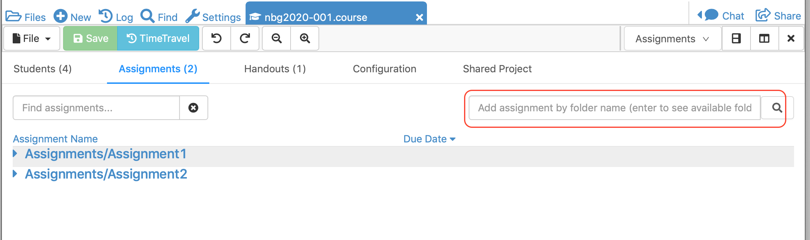
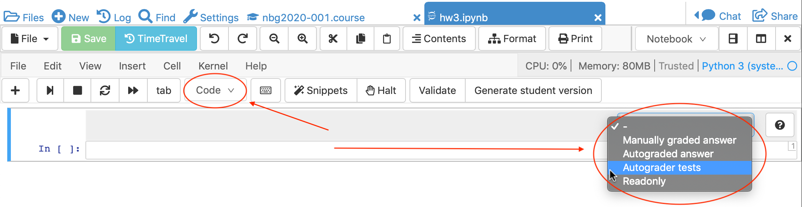
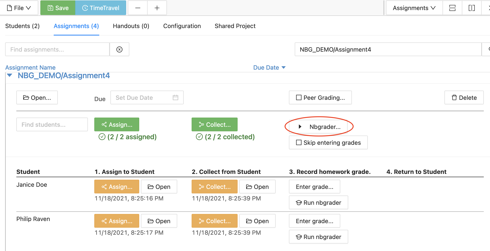
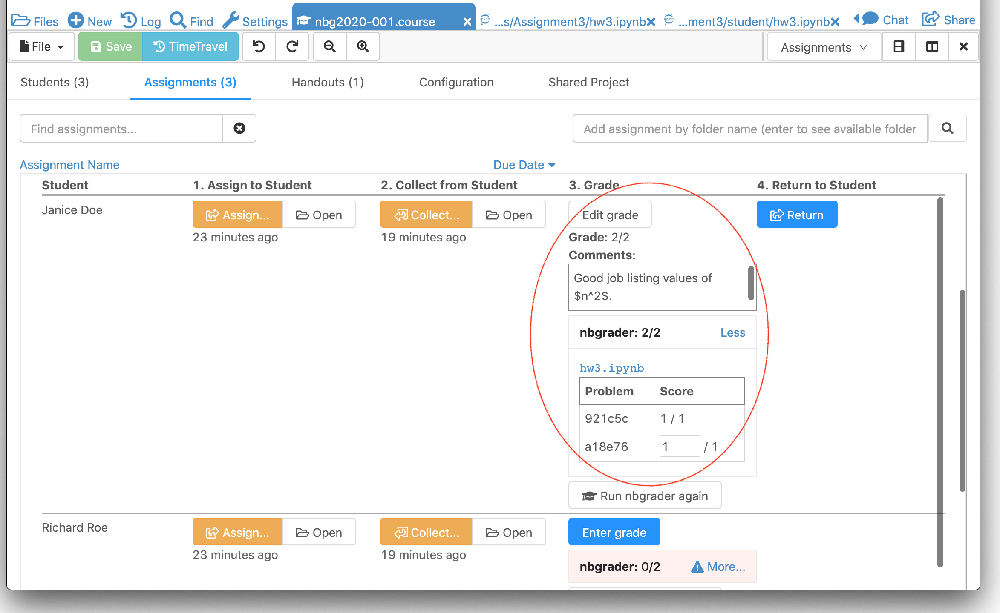

.. index:: Courses; nbgrader
.. index:: nbgrader; teaching with
.. _nbgrader-doc:

================================
Teaching with nbgrader
================================

`nbgrader`_ is a tool for creating and grading assignments in Jupyter notebooks. CoCalc Jupyter notebooks include support for nbgrader core features without the need for added modules and extensions.

.. contents::
   :local:
   :depth: 2

.. _nbgrader-purpose:

Purpose of nbgrader
===============================

**nbgrader**  allows an instructor to do the following when teaching in a Jupyter notebook environment:

#. Maintain separate instructor & student versions of Jupyter notebooks.
#. Automatically grade coding exercises written using Python, R, Julia, and more.
#. Manually grade free-form exercises and other tasks.
#. Leave comments for students.
#. Track student grades.

CoCalc nbgrader
===============

The official nbgrader project is implemented as Python scripts
and `extensions to Jupyter classic and JupyterLab <https://nbgrader.readthedocs.io/en/stable/user_guide/installation.html>`_.
CoCalc has its own completely new implementation of nbgrader
from scratch in order to fully support realtime collaboration,
course management, and other functionality of CoCalc.

The Jupyter metadata format of Cocalc's nbgrader is the same as that of the
official nbgrader extension, and the user experience is similar,
though with some changes.

* There is no need to install special modules, extensions or configure anything.
* Students see an annotation next to answer cells, so they know that evaluating these cells without errors gives a certain number of points.
* Instructors have a toolbar that inserts a template with example input or automated tests.
* There is a Table of Contents overview that shows a link to each question, and whether or not each question passes tests (coming soon).
* Integration with CoCalc's course management tools for distributing and collecting assignments.
* Automated grading safely runs code in the student's project, not in the instructor's project.

.. index:: nbgrader; getting started

The following steps illustrate CoCalc course integration with nbgrader. We start with a course file and assume that at least one student has been :ref:`added to the course <adding-students>`.

Create an assignment folder
===============================

Open the course file and select the ``Assignments`` tab. There is field at upper right with the prompt "Add assignment by folder name ..."

     About to create an assignment

You can enter the path of a new folder you want to create:

.. figure:: img/nbgrader/nbg-create-assg.png
     :width: 95%
     :align: center
     :alt: create assignment folder

     Creating a folder for ``Assignments/Assignment3``

Or the enter name of an existing folder that hasn't been assigned yet:

.. figure:: img/nbgrader/nbg-create-assg-1.png
     :width: 95%
     :align: center
     :alt: select existing assignment folder

     Selecting the existing folder ``Assignment4``

Start a Jupyter notebook for the assignment
===========================================

With the assignment folder created, open the folder for the assignment:

.. figure:: img/nbgrader/nbg-open-assg-folder.png
     :width: 95%
     :align: center
     :alt: open existing assignment folder

     Opening the folder for ``Assignments/Assignment3``

Start a new Jupyter notebook:

.. figure:: img/nbgrader/nbg-new-notebook.png
     :width: 95%
     :align: center
     :alt: start jupyter notebook in assignment folder

     Starting notebook ``hw3.ipynb`` in folder ``Assignments/Assignment3``

In the Jupyter notebook, use the top menu to select View --> Cell Toolbar... --> Create assignment (nbgrader)

.. figure:: img/nbgrader/nbg-view-ca.png
     :width: 95%
     :align: center
     :alt: set jupyter notebook as nbgrader assignment with View / Cell toolbar / Create assignment (nbgrader)

     Starting nbgrader assignment in a Jupyter notebook

There is a dropdown cell-type menu in the upper right of each cell. Use it to create problems, answer tests, etc. What you see depends on whether the cell is a code cell or a markdown cell. Here is an example of the cell-type menu for a code cell:

     Cell-type menu for a code cell

Create questions
================

When you select a menu option from the dropdown for the cell, e.g., "Autograded answer", a sample working snippet of code will be inserted in the notebook (assuming you are using a Python, R, or Julia kernel). You can then modify this template for your purposes.

.. figure:: img/nbgrader/nbg-code-snippet.png
     :width: 95%
     :align: center
     :alt: example of python snippet for code cell

     Sample working snippet inserted in Python code cell

The `official nbgrader documentation`_ explains the use of each nbgrader cell type. For your convenience, CoCalc has a button at right with a link to the  documentation for whichever type of nbgrader cell has been selected.

At this point, go ahead and create all the cells for the assignment.

Generate student version of the notebook
========================================

After creating cells for the assignment, click ``Generate student version.`` button at the top of the notebook.

.. figure:: img/nbgrader/nbg-gen-sv.png
     :width: 95%
     :align: center
     :alt: generate student version of notebook

     About to generate student version of the notebook

A confirmation screen appears. Click ``Create or update student version``. CoCalc will generate the student version of the notebook, with solutions removed, and only the student-visible tests, and place it in the ``student`` subdirectory of the assignment folder. For example, if you have been creating questions in ``Assignments/Assignment3/hw3.ipynb``, the filesystem will look like this::

    Assignments/
    ...
    ├── Assignment3
    │   ├── hw3.ipynb      ← instructor version
    │   └── student
    │       └── hw3.ipynb  ← student version

The student version of the notebook automatically opens in another tab, where you can review the contents. When the student uses that notebook, they can "self evaluate" their code by running the test cells and seeing whether or not there are errors, or they can click the "Validate..." button at the top of the notebook to run all code.

Notebook table of contents
===========================

If you click the "Contents" button at the top of your Jupyter notebook, you'll see a table of contents appear to the left that has links to all the nbgrader problems. You can create section headings using markdown titles. The table of contents view is available in instructor and student versions of the notebook.

.. figure:: img/nbgrader/nbg-contents.png
     :width: 95%
     :align: center
     :alt: automatic table of contents has headings for nbgrader problems

     Notebook table of contents

Distribute the assignment to students
======================================

Back in the course file under "Assignments", click ``Assign...`` to distribute the homework to students. This step copies contents of the "student/" folder into student projects. Here's a view of the files in the *student project*::

    Assignments/
    ...
    ├── Assignment3
    │   └── hw3.ipynb  ← student version

.. note::

   When there is a "student/" subdirectory in the assignment folder, as is the case with all nbgrader notebooks, the ``Assign...`` button will ONLY distribute contents of the "student/" subdirectory. This is a new feature.

Students complete the assignment
================================

Have your students complete the assignment. All student work takes place in the student's project. Students can click ``Validate`` to see if all tests pass.

Collect the assignment
======================

In the course file under "Assignments", click ``Collect...`` to collect homework from students.

Option: Skip entering grades
============================

As with non-nbgrader assignments, you have the option to :ref:`Skip entering grades<skip-entering-grades>`. After checking the box, proceed directly to returning the assignment below.

Run nbgrader
============

When you click the "Run nbgrader" button, nbgrader is run on the collected notebooks **in memory in the student projects (for security)** and the results are saved in the course.
This step runs CoCalc's re-implementation of the nbgrader validation steps. It is *not* running nbgrader's python scripts behind the scenes.

     About to run nbgrader for all collected copies of Assignment4

After running nbgrader, a summary of scores is displayed for each graded assignment. Click ``More...`` to see a small table with scores for each problem.

At this point, all cells of type "Manually graded answer" will show a blank score.

.. figure:: img/nbgrader/run-nbgrader-3.png
     :width: 95%
     :align: center
     :alt: one question has a blank for manually entering a point score

     After autograding, before reviewing manually graded questions

Do manual grading and add instructor comments
=============================================

You can enter scores for manually-graded cells in an nbgrader notebook as needed. When all manual scores are entered, the overall scores are automatically updated.

If you want to make additional comments, click ``Edit grade``. You can use Markdown in the comments, including LaTeX expressions.

     Entering a manual grade and an instructor comment

Option: Sync grades
=====================

In rare situations, it may happen that nbgrader grades are not copied to the assigned grade for some students. In this case, click the button "Sync grades" to retry the copy. An explanatory message will pop up with an "OK" button to proceed with the operation.

.. image:: img/nbgrader/sync-grades-2.png
     :width: 95%
     :align: center
     :alt: sync grades to retry copying nbgrader grades to assigned grades

Return the assignment
=====================

Click ``Return...`` to return the assignment to the student. Here's a view of the files in the *student project* after graded work is returned::

    Assignments/
    ...
    ├── Assignment3
    │   ├── hw3.ipynb
    └── graded-Assignment3
        ├── GRADE.md
        ├── STUDENT - Janice Doe.txt
        └── hw3.ipynb

The file GRADE.md appears in the returned assignment. It uses markdown and shows a table of scores of problems from nbgrader. Here's an example of the GRADE.md file that the student receives (rendered view only):

.. figure:: img/nbgrader/nbg-student-grade.png
     :width: 65%
     :align: center
     :alt: GRADE.md file returned to the student

     Sample grade report returned to the student

.. _nbgrader: https://nbgrader.readthedocs.io/
.. _official nbgrader documentation: https://nbgrader.readthedocs.io/en/stable/user_guide/creating_and_grading_assignments.html#developing-assignments-with-the-assignment-toolbar
