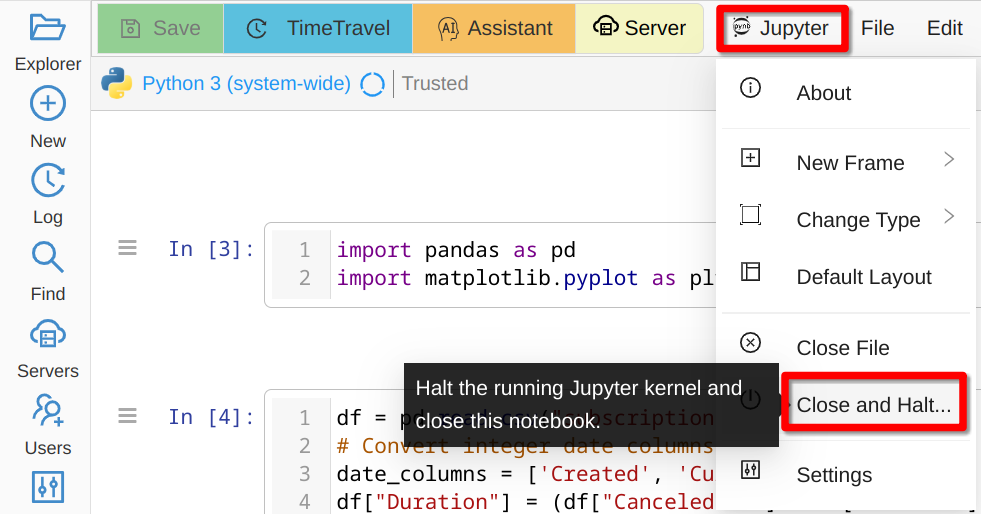

====================================
Student Guide
====================================

Hello and welcome to CoCalc! You are part of a course ... now what?

.. contents::
   :local:
   :depth: 3

Getting Started
===============

You are very welcome to take a look at our general :doc:`getting-started` section or explore `▶ Quick CoCalc Tutorials <https://youtube.com/playlist?list=PL_eb0V_eeLiFPpX4gtywjA286JBggENnu&feature=shared>`_ and other `▶ YouTube videos <https://www.youtube.com/@cocalc-cloud/playlists>`_! Below we highlight the most important features for you as a student.

What is CoCalc?
---------------

CoCalc is a collaborative cloud environment that supports courses based on interactive resources such as :ref:`Jupyter Notebooks <jupyter-notebook>`, :doc:`the Linux terminal <terminal>` , :ref:`LaTeX document editors <latex-editor>`, etc.
You can access it from your browser, meaning that you do not need to install anything.

Access Your Course Content
--------------------------

All work in CoCalc is done in :doc:`project` that work as virtual computers and give you computational resources, a file system for your work, and a preconfigured software environment. You will have a dedicated project automatically created for each course that you are enrolled into.

Student projects are named with the student name followed by the course title,
like this: **Jane Doe - MATH 101**.

**If you do not have a CoCalc account yet** and you are enrolled into a course using CoCalc, you *should* receive an email indicating the name of the course and inviting you to create a CoCalc account. Make sure to use the same email address to which this invitation was sent, otherwise the system won't be able to link your new account to the course. It may happen for many reasons that you do not receive such an email at all, but don't panic! That email is only for convenience and all you need to do is to create an account *with the same email that your instructor has used.*

**If you already have a CoCalc account**, a new project will appear in your project list. There will be no email invitation to create an account.

.. hint::

    *Contact your instructor* if you cannot see your course project and make sure that you both are using *exactly the same email*.

Once you see your course project, you can open and *start it to see the files* that your instructor shared with you, including assignments.

.. _student-pay-for-course:

Paying for the Course
---------------------

Your instructor has either applied a license to your project, in which case you do not need to pay anything, or configured a license that will provide you with necessary computational resources after you purchase it. In that case you will see a banner at the top after opening your project.

.. hint::

    Until you pay the course fee your project has quite restricted computational resources corresponding to our :doc:`trial`. The sooner you purchase your required license, the sooner you will gain access to the intended hardware it provides.

If the course has started and the payment deadline has already passed,
you are required to pay the course fee before you can access files in your course project.

Working in Your Course Project
==============================

Assignments
-----------

When you get an assignment in CoCalc, a corresponding directory is created in your course project with your own copy of relevant files. You can modify them, e.g. by adding code and text cells to a Jupyter notebook, as well as upload or create new files - follow your instructions.

.. warning::

    **Do not move or rename** any of the directories related to your assignment!
    Otherwise it will not be possible to collect it, i.e. to make a copy of your prepared files for grading.

Note that you can work with your assignment files after the due date, but those changes won't be seen by the instructor. Once your assignment has been graded, you will get a separate copy of the graded work as well.

Add Files
---------

First of all, make sure you have navigated to the correct assignment directory. Then :doc:`howto/upload` (`▶ YouTube <yt-upload_>`_) or :doc:`Create <plus-new>` new ones.

.. _yt-upload: https://youtu.be/5baQ-p0DgB4?feature=shared

Minimize User Interface
-----------------------

CoCalc is a very flexible environment with support for many features and ways to use them. You many not need all of them and may prefer a bit simpler interface that takes less of the screen real estate. :doc:`fullscreen` is very likely to help you! `▶ YouTube <yt-fullscreen_>`_

.. _yt-fullscreen: https://youtu.be/quzKaEByL4Q?feature=shared

Open Two Files Side-by-side
---------------------------

CoCalc does not allow you to open two different files in a single browser tab, but you can open as many tabs as you want. To open a particular file in a new browser tab, **Shift+Click** its CoCalc tab.

Recover Lost Work
-----------------

It is almost impossible to lose a big chunk of your work in CoCalc thanks to :doc:`time-travel` (`▶ YouTube <yt-timetravel_>`_) and automatic :doc:`backups` (`▶ YouTube <yt-backup_>`_). It may be prudent to familiarize yourself with these features in advance!

.. _yt-timetravel: https://youtu.be/qAo7E0wpuhk?feature=shared
.. _yt-backup: https://youtu.be/VPp-AleMUXg?feature=shared

Use AI
------

CoCalc has a very powerful :doc:`ai`. Note, however, that your instructor may have disabled some or all of the AI features. Make sure to follow course rules regarding AI use and other sources. `▶ YouTube <yt-ai_>`_

.. _yt-ai: https://youtu.be/piLqlxb84kQ?feature=shared

Contact Your Instructor or a Group Member
-----------------------------------------

If you need assistance with a piece of coursework you can contact your instructor, TAs, or other group members if you are working in a group. The best way to do so is to use :ref:`chat-at-mentions` in a :ref:`side-chat` of the document you are working on. `▶ YouTube <yt-sidechat_>`_

.. _yt-sidechat: https://youtu.be/XQYJrFbvhB4?feature=shared

Get Help from CoCalc Support
----------------------------

.. warning::

    CoCalc support is there for you to resolve **technical issues** with the platform. We are not able to help you with the course material and you will only lose some time if you ask us about it instead of your instructor.
    
Use the :ref:`Help <help-button>` button at the top right to create a support request ticket. Make sure to include all relevant details to reproduce the problem you are experiencing. `▶ YouTube <yt-help_>`_

.. _yt-help: https://youtu.be/4Ef9sxX59XM?feature=shared

Troubleshoot
------------

:doc:`howto/trouble` is inevitable. In addition to that collection of specific advises, below are two tricks to keep in mind.

Every time you open a Jupyter Notebook, its state is stored in memory. You might experience slow navigation or sluggish behaviour (e.g. cells not being evaluated).
To solve this you can try to **Close and Halt** your running Jupyter Notebook:

    
    Close and Halt Jupyter Kernel

Alternatively, you can restart the entire project, which will cleanup all running processes:

.. figure:: img/teaching/restart_project.png
    :width: 80%
    :align: center
    :alt: Restart Project
    
    Restart Project
    
If you experience "general instability" or get a message "CoCalc crashed", it may help to disable browser extensions, use an incognito mode, or a different browser/computer.

After the Course End
====================

Once you have finished your course, you will still be able to access its project, unless your instructor explicitly deletes it or revokes your access. The license is typically valid for the duration of the course only, although your institution may have an ongoing subscription.

If you enjoyed using CoCalc, you are more than welcome to keep using it for your own projects! Take a look at :doc:`licenses` and, perhaps, :doc:`compute_server` to understand what resources are available.
