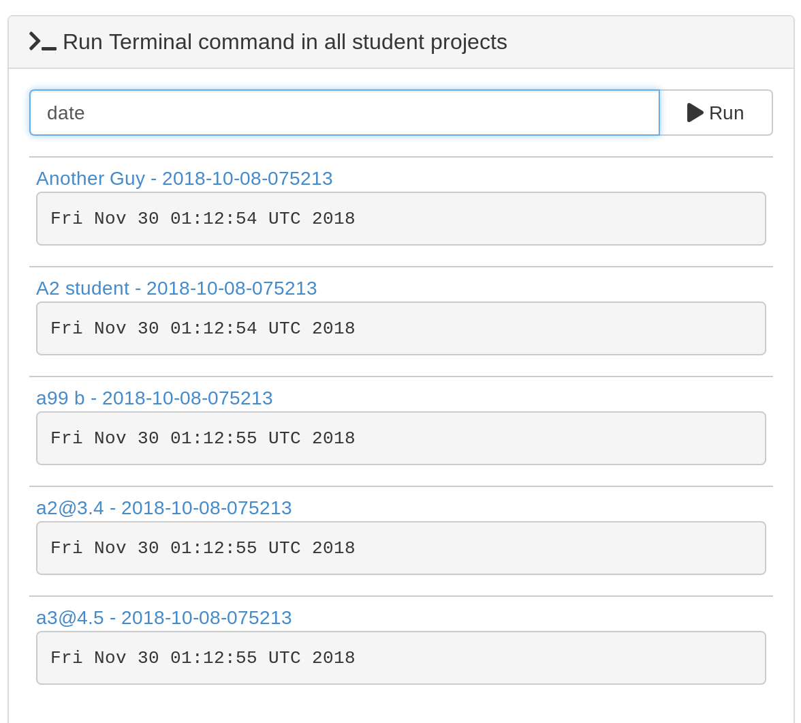

.. index:: Courses; faq

=======================
FAQ, Tips and Tricks
=======================

In this section we will present some CoCalc features and useful tricks that will make the management of your project easier and answer some common questions.

.. contents::
   :local:
   :depth: 2

.. _add-del-student:

Delete and undelete students
==========================================================

Enrollments can change after initial course setup. CoCalc offers a convenient way of deleting a student from a student list, and reversing that deletion step. Deleting a student removes upgrades from the student project. Handouts and assignments will not be distributed after the student is deleted. However, files already in the project for a deleted student are not altered, and the student project is not deleted.

.. index:: Courses; delete student

**To delete a student from a course**, open the course file and select the Students tab. Expand the entry for the student to be deleted.
Click the "Delete" button at right and the confirmation button that appears next.

.. note::

    If you are using a shared project, you will have to remove a deleted student from the collaborators list for the shared project manually. This is a `known issue <https://github.com/sagemathinc/cocalc/issues/4495>`_ which we expect to resolve soon.

.. figure:: img/teaching/delete-student.png
     :width: 90%
     :align: center

     Deleting a student from the student list for a course.

.. figure:: img/teaching/delete-student-2.png
     :width: 90%
     :align: center

     Deleting a student, continued.

.. index:: Courses; undelete student

**To undelete a student**, open the course file and select the Students tab.
Scroll to the bottom of the list. If any students have been deleted, there will be a link saying "Show *n* deleted students". Click that link and entries for all the deleted students will be visible in the student list.
Expand the entry for the student to be undeleted.
Click the "Undelete" button at right to restore the student to the course. There will be a link at the bottom of the student list that says "Hide *n* deleted students" to stop showing entries for deleted students.

.. figure:: img/teaching/undelete-student.png
     :width: 90%
     :align: center

     Enabling display of deleted student records.

.. figure:: img/teaching/undelete-student-2a.png
     :width: 90%
     :align: center

     Undeleting a student.

After a student is undeleted:

- If you are using a CoCalc site license, upgrades to the student project will be restored the next time it is started.
- If you are using a subscription or course plan, you will need to open the Configuration tab for the course and add back the upgrades to the student project. See :ref:`adding-student-upgrades` for details.
- To add handouts and assignments that the student may have missed when their student record was deleted, see the documentation on how to :ref:`catch up a student <copy-missing-files>`.

.. index:: Courses; download student work
.. index:: Courses; convert student work to pdf

.. _export-collected:

Convert student notebooks to pdf for export
==========================================================

Here is a convenience feature that can be useful for offline grading and archiving of student work. Assume that an assignment consists of one or more Jupyter notebooks or Sage worksheets and that you have run ``Collect...`` for the assignment. With a single click, you can now do the following:

* gather student work into a single folder, prepending each notebook or worksheet name with the student first and last name
* create a pdf file of each notebook or worksheet and place it in the same folder
* create a single zip archive of all notebooks and worksheets for that assignment

Open the the course file and select the Assignments tab. Then click the triangle next to the assignment you are interested in. Click to the bottom of the assignment area and select ``Export collected student files...`` and the export folder with pdfs and zipfile will be created.

.. figure:: img/teaching/export-collected.png
     :width: 90%
     :align: center

     *create pdf files and zip archive from collected notebooks*

For example, if the course is "Math_202", collected notebooks are gathered into folder "Math_202-export" as shown:

.. figure:: img/teaching/math-202-tree.png
     :width: 90%
     :align: center

     *terminal view, showing export folder and zipfile contents*

Note: in some cases, the pdf file cannot be created; in this case, the utility creates html instead of pdf.

.. index:: Courses; copy missing files
.. index:: Courses; catch up student

.. _copy-missing-files:

Copy missing files to a student project
==========================================================

If a student project is missing some of the handouts or assignments previously distributed, you can copy those materials to their project. Click on the student name in the Students list in the course file. At the bottom of the expanded content for that student is a button "Catch up this student" that will do that.

.. image:: img/teaching/copy-missing.png
     :width: 66%

.. index:: Text fields; Markdown and LaTeX

.. index:: Export student file use
.. index:: Courses; export student file use

.. _export-file-use:

Export student file use
=====================================

This feature  provides 1-click export of extensive data about what students do in an assignment or handout. Getting information about what happens with anonymous users of shares is not implemented.

To get a report about all the times when students opened or edited any file in an assignment or handout, do the following:

#. Open a .course file.
#. Toggle to show the information about a handout or assignment, and scroll to the bottom.
#. There is a new button "Export file use times for this..."
#. Click that button.
#. A json file will open in a new tab. Hopefully the format is self explanatory. The times are all in milliseconds since the epoch, so in Javascript you can write new Date(time) to make this a date, and in Python do `this <https://stackoverflow.com/questions/3694487/in-python-how-do-you-convert-seconds-since-epoch-to-a-datetime-object>`_. You can also load json into python using the json module (import json).

The json files are created in the following path::

    course-exports/[name of course]/file-use-times/[handouts|assignments]/assignment_name.json

.. figure:: img/export-file-use-times.png
     :width: 75%
     :align: center

     Exporting file use times in course file Assignments tab.

Text fields generally support Markdown and LaTeX
==========================================================

CoCalc not only facilitates the creation of LaTeX documents, but most input areas in CoCalc support and render LaTeX and markdown  (specifically  `GitHub Flavored Markdown`_).

For example, you can use LaTeX math formulas in the chat rooms:

.. image:: img/teaching/before_latex_render.png
     :width: 66%

which renders as

.. image:: img/teaching/after_latex_render.png
     :width: 100%

.. _GitHub Flavored Markdown: https://github.com/adam-p/markdown-here/wiki/Markdown-Cheatsheet

.. index:: Courses; multiple assignment folders

Making multiple assignment folders quickly
==========================================================

So far we have shown how to create folders and files by using the **New** button every time. → |NEW_BUTTON|

However, such a method could be quite time consuming when you need to create multiple folders, subfolders, and documents. If you are a terminal fan you could create a shell script in your preferred programming language and run it from the terminal.

Alternatively, in the files menu of your project, you can enter paths such as `assignments/assignment1/directions.md` then hit **enter** or **ctrl+enter** to create `directions.md` inside the folder `assignment1` within `assignments`. Hitting **enter** will open up the new file while **ctrl+enter** will silently create the necessary files and folders in the path.

.. image:: img/teaching/file.png
     :width: 100%

You can also create folders here just by ending with a `/`

.. image:: img/teaching/folder.png
     :width: 100%

.. index:: Courses; start all student projects

Starting up everyone's project before class
==========================================================

By default, projects have an idle time of 24 hours before they spin down and need to be restarted. However, it may be handy to start everyone's project before a class or presentation so that they are all "hot loaded".

You can easily do this from your course manager:
first, open the course configuration tab:

.. image:: img/teaching/settings.png
     :width: 100%

Then scroll down to find and click on the `Start all...` button

.. image:: img/teaching/start_all_clicked.png
     :width: 100%

.. index:: Courses; restarting a project

Restarting a project
==========================================================

Every time you open a Jupyter notebook or a Sage Worksheet, its state is stored in memory. This can become quite costly if you open multiple files one after the other (e.g. when you are marking your students' work).

To solve this, you can stop every instance using the stop button (for both Jupyter notebooks and Sage worksheets) once you are done with your marking.

.. image:: img/teaching/stop_notebook.png
     :width: 100%

Alternatively, you can restart the entire project, which will clean everything. You just need to go to your project settings and click on **Restart project**.

.. image:: img/teaching/restart_project.png
     :width: 60%

.. _teaching-using-git:

.. index:: Courses; teaching with Git

Using Git
==========================================================

CoCalc support for the terminal enables students (and instructors) to collaborate using Git within a course-affiliated project.

If you already have a project or some files allocated in GitHub you can add them to your project.
Click on the **New** button and add/paste the link to your repository in the appropriate text box. Click on the **Download from Internet** button.

Also you can use the terminal to commit and push changes to your repository in GitHub.
(see howto: :doc:`howto/git`)

.. image:: img/teaching/download.png
     :width: 100%

.. note::

    You need to have internet access enabled in your project.

.. index:: Courses; timetravel diffs

Time Travel Diffs
==========================================================

The editor based documents (e.g. Python code, LaTeX documents, markdown files, etc.) as well as Jupyter notebooks and Sage worksheets are Time Travel Diffs supported. The Time Travel Diffs feature allows you to see what happened with a file within a certain time interval.

Open up **Time travel** from any document:

.. image:: img/teaching/time_travel.png
     :width: 100%

then click on changes and drag the sliders to see the document in a given time interval.

.. image:: img/teaching/time_travel_sliders.png
     :width: 100%

If you need to revert the document to a previous state, drag the slider to the desired revision and click on **Revert live version to this**. Doing so reverts the document contents to that specific version. If you have checked the **Changes** box to compare two revisions and click on **Revert live version to this**, contents are reverted to the latter of the two revisions being compared. Note that reverting a file simply creates a new version of the file equal to the old file at that point in time; in particular, no work is lost!

.. index:: Courses; run a command in all student projects
.. _run_cmd_students:

Run Terminal command in all student projects
============================================

If you are managing a course, there may be a time when you want to
run a shell command in every student project. The following
feature allows you to do that, if you are using a .course file
for the course.

In the ``Configuration`` tab of the course there is a
panel called ``Run Terminal command in all student projects``.  You
can use it to run a command (e.g., to create a file or whatever) in
*all* projects in a course...  It's a single arbitrary bash command.

.. index:: Courses; copying assignments to students
.. _course-copy-assignments:

How exactly are Assignments copied to students?
==================================================

When you assign an assignment to your students,
it is copied from your project to your students' projects.

**What happens when you assign again.**

* For files that have a *newer* timestamp than the corresponding file in the target directory, the target file is copied to a backup and the new source is copied over.

* For files that have an old timestamp and you've already assigned the assignment (and students may have worked on it), nothing at all will happen on copy.

**Adding a new file to an assignment.**

If you just want to add a new file to an assignment, you could ensure that all the other files are very old, e.g., by using the touch command in a :doc:`terminal`.  E.g.,

::

    touch -d 'Jan 1' *

would make it so that everything appears to be from January 1.

Alternatively, you could just remove the files from the assignment folder, then move them back later.

**Behind the scenes.**

Assignments are copied with the command:

::

    rsync -zaxs --update --backup [...] source/  dest/

There are two important options here::

    --update: do not copy over a file if a NEWER file (by timestamp)
              exists in the destination

and

::

    --backup: if the source file `foo` (say) is NEWER than the destination file
              `foo` (e.g., you edit your homework assignment after students have worked
              on it),  then `dest/foo` is moved to `dest/foo~` and `foo` is copied
              to the destination.

Assigning an assignment never deletes missing files in the target,
`unless` you explicitly clicked and confirmed the ``Replace student files!`` button.
This button adds an additional flag::

       --delete
              This  tells  rsync to delete extraneous files from the receiving side
              (ones that aren’t on the sending side), but only for the
              directories that are being synchronized.

Some tests below illustrate how rsync works::

    $ mkdir tmp2
    ~$ cd tmp2
    ~/tmp2$ mkdir a b
    ~/tmp2$ echo "0" > a/x
    ~/tmp2$ rsync -zaxs --update --backup a/ b/
    ~/tmp2$ ls a
    x
    ~/tmp2$ ls b
    x
    ~/tmp2$ rsync -zaxs --update --backup a/ b/
    ~/tmp2$ vi b/x
    ~/tmp2$ rsync -zaxs --update --backup a/ b/
    ~/tmp2$ ls -lht b
    total 1.5K
    -rw------- 1 user user 4 Oct 13 16:27 x
    ~/tmp2$ more b/x
    0
    1
    ~/tmp2$ touch a/x
    ~/tmp2$ rsync -zaxs --update --backup a/ b/
    ~/tmp2$ ls b
    x  x~
    ~/tmp2$

.. note::

    We would like to add a new 3-way merge option, which would be more clever and instead of making a backup file of students modified work, would merge your changes into their file.  This is not done yet.

.. index:: Courses; invite students without email

Invite Students Without Having Their Email Addresses
=====================================================

**Question:** The course management software at my university makes it hard to get a list of student emails. Is there a way I can send them a generic invitation link that they can click to join the course?

**Answer:** We don't support sending generic invitations yet (see `CoCalc issue #886 <https://github.com/sagemathinc/cocalc/issues/886)>`_). However, you can use the following workaround:

Assign fake email addresses to all students in your class, e.g.:: c

    student+<student_id>@your-university.edu

Then tell the students to sign up for CoCalc using that "fake" email address. This assumes you have some way to communicate with your students, perhaps in class.

Once students sign up, they will be added as collaborators to their project for the course. At that point, they can change their email address to anything they want, in order to ensure they get @mention notifications, can do password reset, etc.

If student_id's are secret/sensitive, you could use something derived from them, e.g., the last two digits.

.. index:: Courses; verifying student activity

Verifying Student Activity
=============================

In some situations it may be useful to confirm when work was done in a student project. (See also: :ref:`Export student file use <export-file-use>`.)

* If you open the :doc:`activity log <project-log>` for a student project, you can see who opened any file and when.

* With any file open in a student project, you can see exactly what was done with it and when by clicking the :doc:`TimeTravel <../time-travel>` button, including the total number of edits made to the file (as recorded by TimeTravel) and time and date of the last change. You can click the "Changes" checkbox and see what happened for any range of dates.

* It's impossible for users to delete or change something once it is recorded in TimeTravel (except by explicitly requesting deletion via a support request). However, it's conceivable maybe something got lost, since no software is perfect.

* Folders under :ref:`Backups <project-snapshot>` are snapshots of the exact state of the filesystem, which are independent of TimeTravel, but provide a good double check.

.. index:: Courses; Moodle integration

Moodle integration
===================

Q: Is there a way to integrate CoCalc into my `Moodle <https://moodle.org/>`_ environment?

A: Unfortunately, not really. We do have our own fairly sophisticated course management functionality for creating and distributing assignments, working in real time with students, and collecting, grading and returning. See :doc:`teaching-instructors`.

You can also publish an assignment to the `CoCalc share server <https://share.cocalc.com/share/>`_ (you can make content "you must know the link"), point students at that link, and have them download the work when they are done and submit it via Moodle.

.. index:: Courses; change assignment due date

Change the due date of an assignment
=====================================

When an assignment is distributed, the due date, if any, is written to file ``DUE_DATE.TXT`` in the folder for the assignment in each student project.

.. image:: img/teaching/due-date.png
     :width: 66%
     :align: center

To change the date after distributing an assignment, the instructor could run a Linux shell command in all student projects that changes the due date file. See :ref:`run_cmd_students` above for how to run the command.
In the example above, the command to be run could be:

.. code-block:: bash

    echo "new due date: 2020-10-09 11:00 AM" > Assignments/Assignment1/DUE_DATE.txt