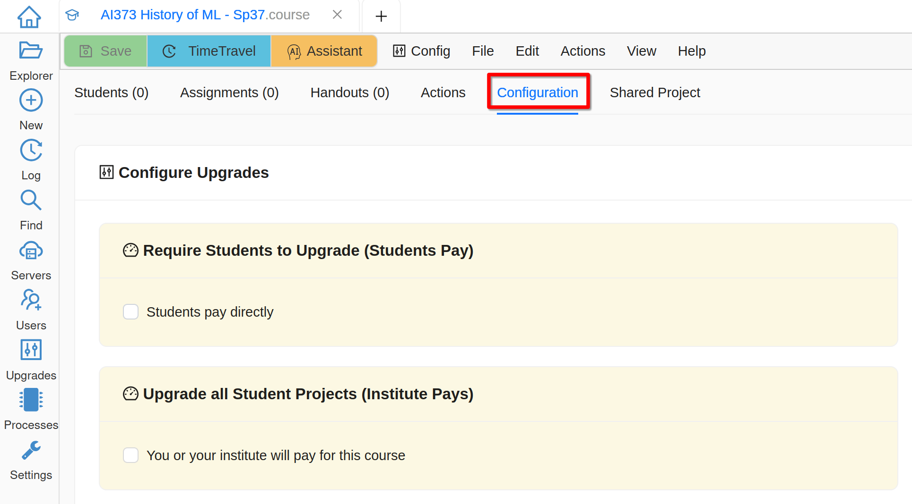
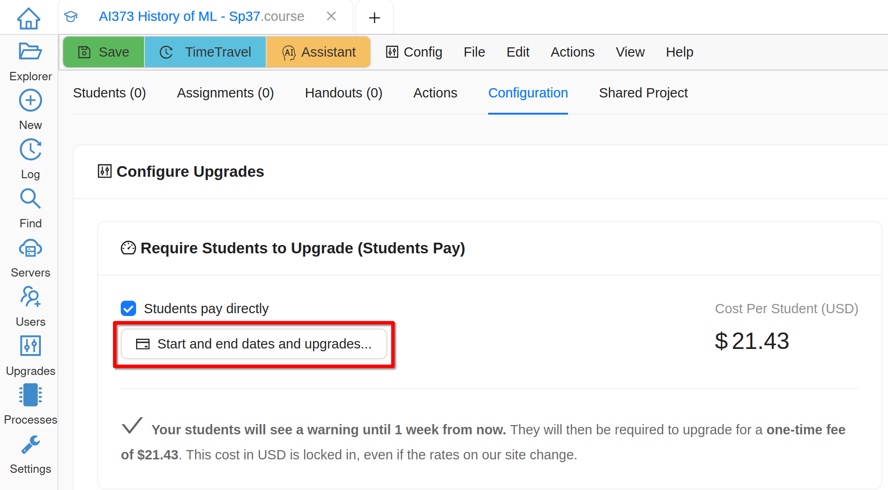
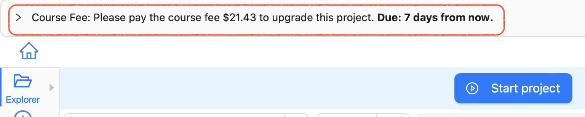
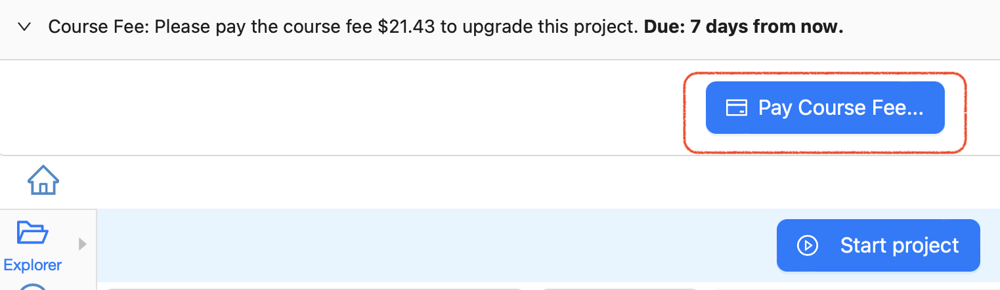
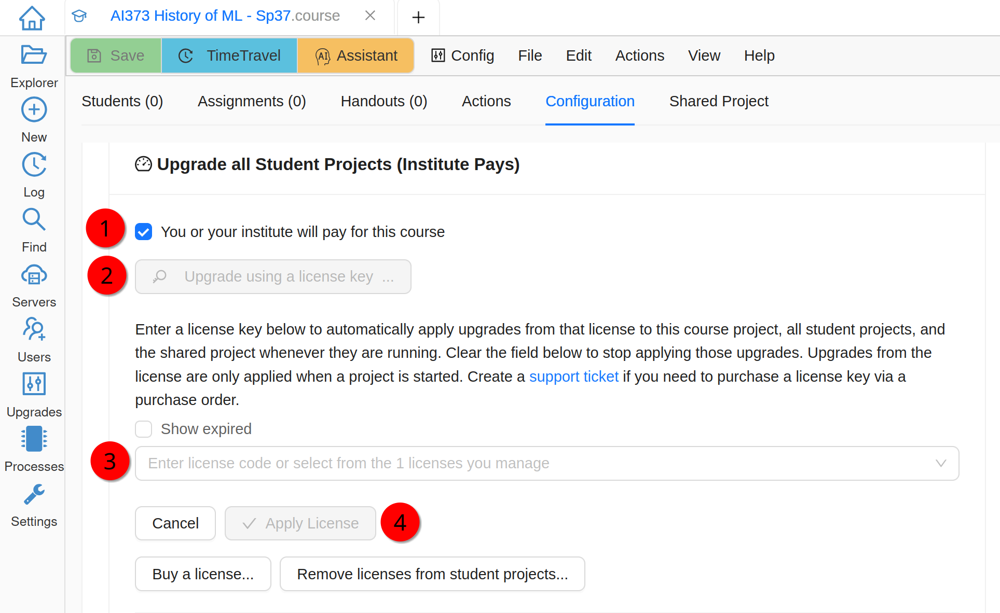

.. _course-upgrading-students:

Licensing Student Projects
==========================

CoCalc supports two ways to license students' projects:

     
     Student or Institute Pay Model

.. contents::
   :local:
   :depth: 2

.. index:: Upgrading students; students pay
.. _course-students-pay:

Students Pay For Licenses
-------------------------

You can require every student to pay for CoCalc resources needed for the course, by configuring the start and end dates, etc.

     
     Students Pay Directly

.. hint::

  If you are running multiple sections of the same course, you probably want to configure these licenses to be exactly the same, including the dates, so that students in different sections pay exactly the same fee.

When students open their course projects, they will see a banner at the top:

     Payment Banner

Clicking the banner will reveal a button allowing them to pay for the course:

     Student Payment

.. note::

  As of August, 2023, students in a course must buy the license specified for that course. Upgrading the student project in some other way is not sufficient.

.. index:: Upgrading students; institution pays
.. _inst-pays:
.. _install-course-license:

Institute Pays for Licenses
---------------------------

You can provide a license that will cover all student projects. If you already have a license for this course, click **Upgrade using a license key...**, select it from the dropdown, and click **Apply License**. Otherwise use **Buy a license...** button below, get a license, and come back to the course. `📺 video <yt-apply-course-license_>`_

.. _yt-apply-course-license: https://youtu.be/h9crGN7PpBI?feature=shared

     
     Institute Pays

Once you successfully apply your license key, you will see its details including the maximum number of simultaneously running projects. Please make sure that you have applied the correct license!

.. warning::

    You must use a license with at least the same limit of running projects as the number of enrolled students. Otherwise some students may not be able to get the upgrades, preventing them from completing their work. (Add 1 if you plan to use the shared project.)
    
.. hint::

    You can easily adjust the number of projects your license can upgrade at any time if your enrollment number changes - click on the license description and then **Edit license...** button!
    

No actions are required from the students to benefit from an instructor provided license.

Teaching with Compute Servers
-----------------------------

If CoCalc projects are not sufficient for your needs, e.g. because you need GPUs or more CPU cores, you can consider :ref:`teaching_with_compute_servers`!