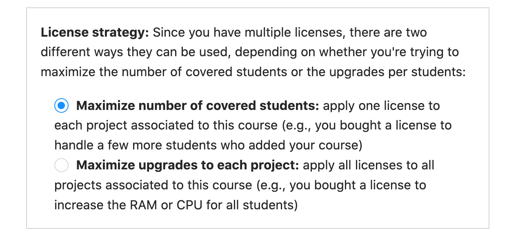
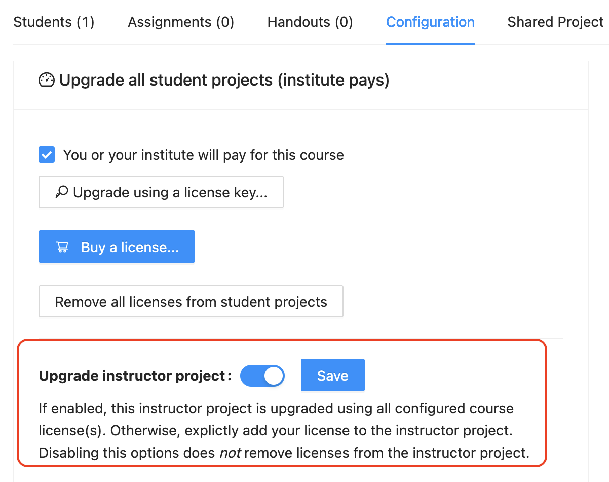
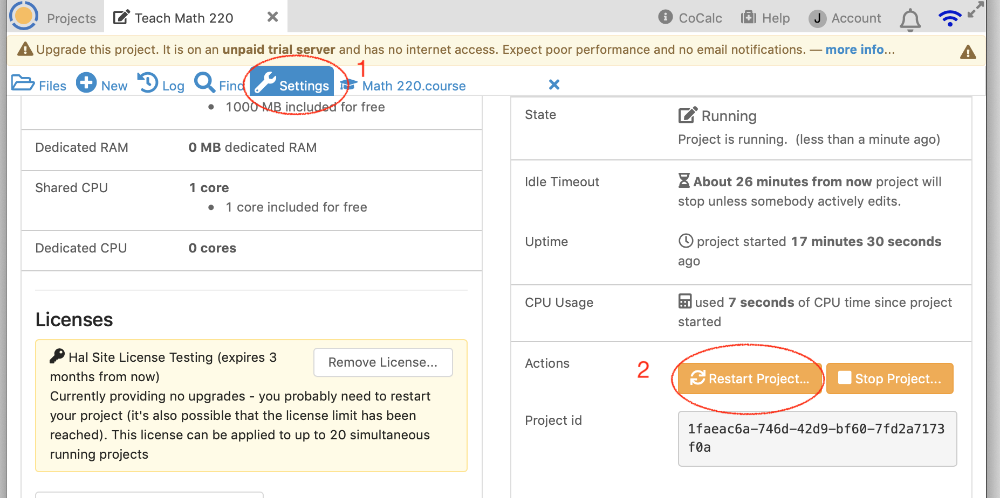

.. _course-upgrading-students:

=============================
Upgrading Student Projects
=============================

The **Configuration** tab of a **.course** file allows you to upgrade students' course projects in two ways, indicated by the checkboxes in the image below:

.. image:: img/teaching/upgrading_students.png
     :width: 75%
     :align: center
     :alt: student pay vs institute pays, choices for upgrading student projects

.. contents::
   :local:
   :depth: 2

.. index:: Upgrading students; students pay
.. _course-students-pay:

----------------------------------------------------
Students pay for upgrades
----------------------------------------------------

You can request that the students pay a one-time fee of $14 for four months.
This will move their projects to members-only hosts and enable full internet access.

If you click "Students will pay for this course", another checkbox appears, "Require that students upgrade...":

.. image:: img/teaching/students-pay-2.png
     :width: 50%
     :align: center
     :alt: student pay, step 1

When you check that checkbox, a calendar form opens. The default is to require students to pay within one week, but you can change the deadline. Select a different date if you want, or leave it at the default, and click "Close".

.. image:: img/teaching/students-pay-3.png
     :width: 50%
     :align: center
     :alt: student pay, step 2

To continue from the perspective of your students,
read the :ref:`instructions for students to pay for a course <student-pay-for-course>`.

**Can we mix free and upgraded student projects?**

Yes.
Just set the due date by which the students have to pay to be at the end of the course.
Give them the opportunity to pay for an upgrade for the first few weeks (say),
then just unclick the student pay checkbox and thus no longer requiring them to pay at all.
In short, whether they have to pay or not is something you can change at any time,
they have a grace period before being required to pay,
and you can change any of these settings at any time.

.. index:: Upgrading students; institution pays
.. _inst-pays:

--------------------------------------------
Teacher or institution pays for upgrades
--------------------------------------------

This section describes adding upgrades to student projects if you are using a CoCalc license. Please see :doc:`teaching-upgrade-legacy` if you need to upgrade student projects with one of the older upgrade packages.

We assume you have created an instructor project and a course file in that project, and have added students under the ``Students`` tab in the course file. You do not need the instructor project licensed at this time. See step 4 below if you plan to use your course license to upgrade the instructor project as well as student projects.

1. Obtain a license key.
------------------------

Obtain a license, if you haven't already. See :ref:`buying-licenses`.

Your license key is a hexadecimal uuid string. It looks like this::

    78caa80a-4ddf-11ea-a5e5-53e10ace7b7b

.. _install-course-license:

2. Install your license(s) in the course file.
-----------------------------------------------

- Open the ``course`` file and click "Configuration."
- Check the box for "You or your institute will pay for this course".
- Click "Upgrade using a license key...".
- Paste in your license key and click "Save". You will see additional text where you entered the license key, indicating which upgrades will be applied and the maximum number of simultaneous running projects that can use this license.

.. image:: img/teaching/site-lic-course-config.png
     :width: 85%
     :align: center
     :alt: Adding a license key in course configuration.

- You can apply more than one license. After you install the first license, a new button will appear, "Add another license key (more students or better upgrades)". Click this to add more licenses, one at a time.

.. index:: Site licenses; course strategy

3. License strategy (multiple licenses only)
---------------------------------------------

If you have applied two or more licenses to a course, a dialog appears
for choosing how those licenses are combined. The two options are:

- **Maximize number of covered students:** apply one license to each project associated to this course (e.g., you bought a license to handle a few more students who added your course). This is the default.
- **Maximize upgrades to each project:** apply all licenses to all projects associated to this course (e.g., you bought a license to increase the RAM or CPU for all students).

4. Apply course license to instructor project. (Optional)
---------------------------------------------------------

If you want, you can use the same license that you're using for the students to upgrade the instructor project. This will count against the maximum number of running projects (run limit) for the license. With this option, if you have 10 students and plan to run your instructor project at the same time as all 10 students, your course license should allow for at least 11 projects.

If you already have upgraded your instructor project from another CoCalc product, or want to use a different license than your students, then you will want to disable this option.

5. Restart the instructor project
-----------------------------------

If you enabled "Upgrade instructor project" in the previous step, then open project Settings (wrench icon) and restart your project so that the license will be applied. Click "Restart Project..." then click "Yes, restart project" in the confirmation dialog.

     license entered in course Configuration; about to restart instructor project

In project Settings, within a few seconds you will see that the instructor project is being upgraded. The warnings about running on an unpaid server will be gone, and you will see your license upgrades applied to the instructor project, including Member Hosting and Internet Access.

.. figure:: img/teaching/site-lic-course-restart-post.png
     :width: 85%
     :align: center
     :alt: confirm member hosting and internet access applied to instructor project

     project settings after restarting instructor project

.. index:: Site licenses; adding capacity to course

6. Adding capacity
-------------------

After you have courses up and running, you may discover that you need to provide for more students,
or increase computing resources on student projects. You can do either of those by obtaining
additional licenses and applying them as shown above.
If you need more flexibility than the available strategies offer,
contact CoCalc support at help@cocalc.com.

What the student sees
============================

Here is what a student will see upon opening the student project for the course.

First, this is what is seen if the instructor has not yet applied a license for the course. Note the red banner warning that the project is not upgraded.

.. image:: img/teaching/inst-pay-03-student-before.png
     :width: 50%
     :align: center
     :alt: Student project quotas before applying course license.

Second, this is what is seen if the instructor has added a license in the course Configuration tab. The exact resource amounts will vary depending on the license.

.. image:: img/teaching/student-license-view.jpg
     :width: 50%
     :align: center
     :alt: Student project quotas after applying course license.
