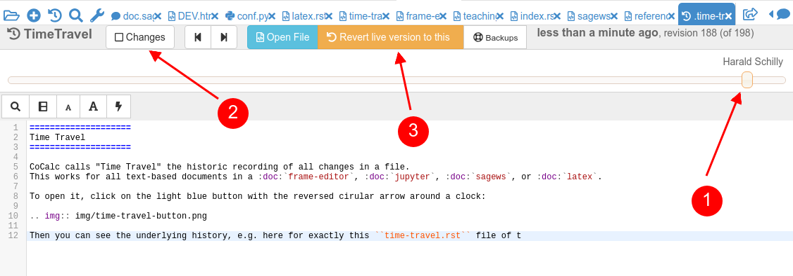

====================
Time Travel
====================

CoCalc calls "Time Travel" the historic recording of all changes in a file.
This works for all text-based documents in a :doc:`frame-editor`, :doc:`jupyter`, :doc:`sagews`, or :doc:`latex`.

To open it, click on the light blue button with the reversed cirular arrow around a clock:

.. image:: img/time-travel-button.png

Then you can see the underlying history, e.g. here for exactly this ``time-travel.rst`` file of the documentation in front of you.

* **(1)** is the control knob of the slider
* **(2)** to view changes between two revisions
* **(3)** to revert the file back to the given revision. This doesn't undo the history, but adds a **new** entry at the end. No changes get lost.

For very long histories, another button will show up to load the entire history.

With ``[x] Changes`` enabled, you get a two-ended slider to see the changes between these two revisions:

.. image:: img/time-travel-changes.png
    :width: 100%

For more information, read this `blog post about time travel <http://blog.sagemath.com/2016/09/08/timetravel-diffs.html>`_.
