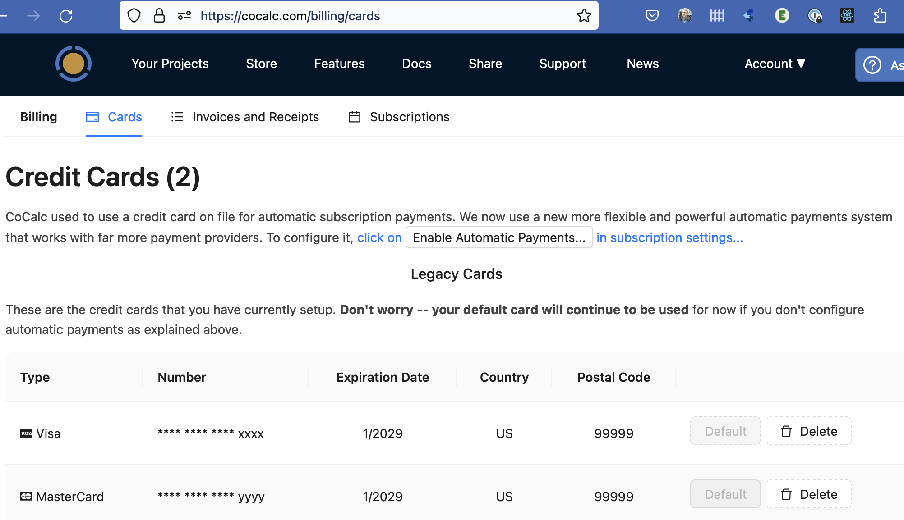

.. index:: Update Your Credit Card

.. _update-credit-card:

===========================
Update Your Credit Card
===========================

Update Credit Card Information
==================================

To add or remove credit cards, sign into CoCalc and browse to https://cocalc.com/billing/cards. If you have more than one card on file and want to change which card will be used for your next purchase, click the "Default" button for the desired card.

     update cards at https://cocalc.com/billing/cards