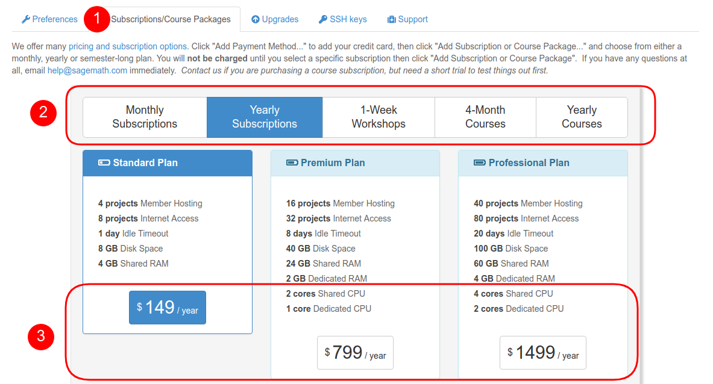
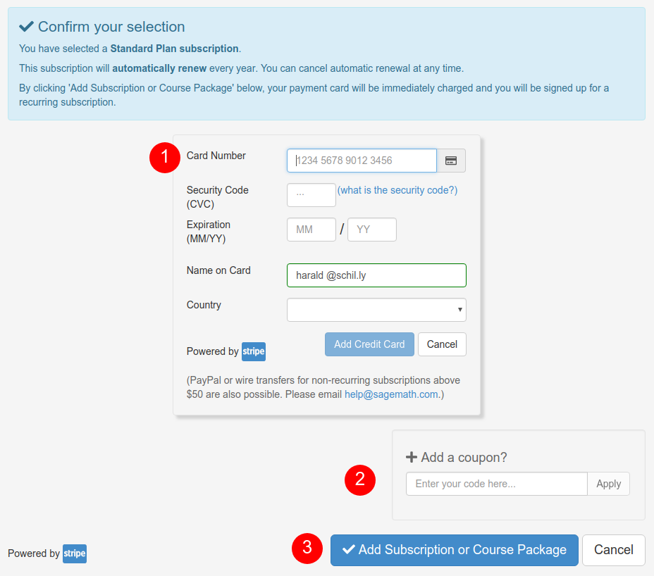
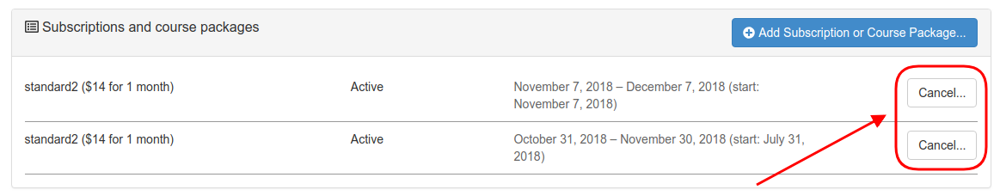
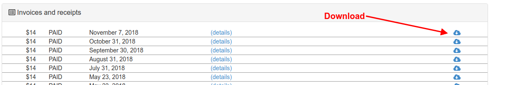
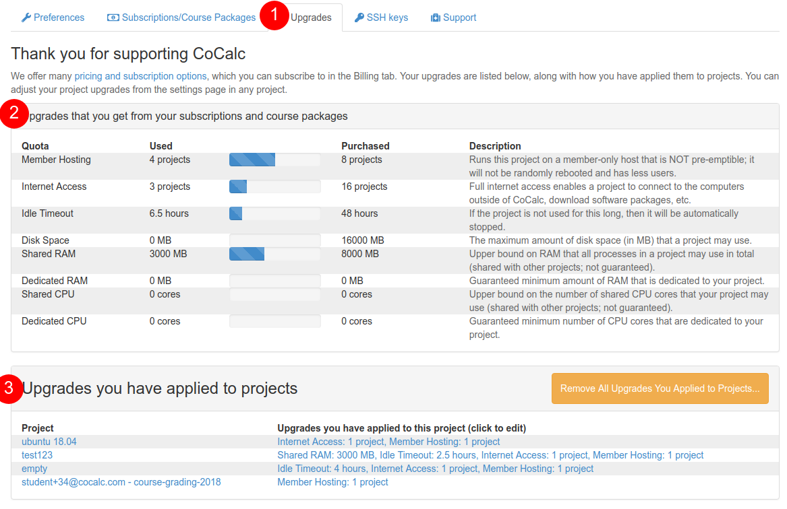
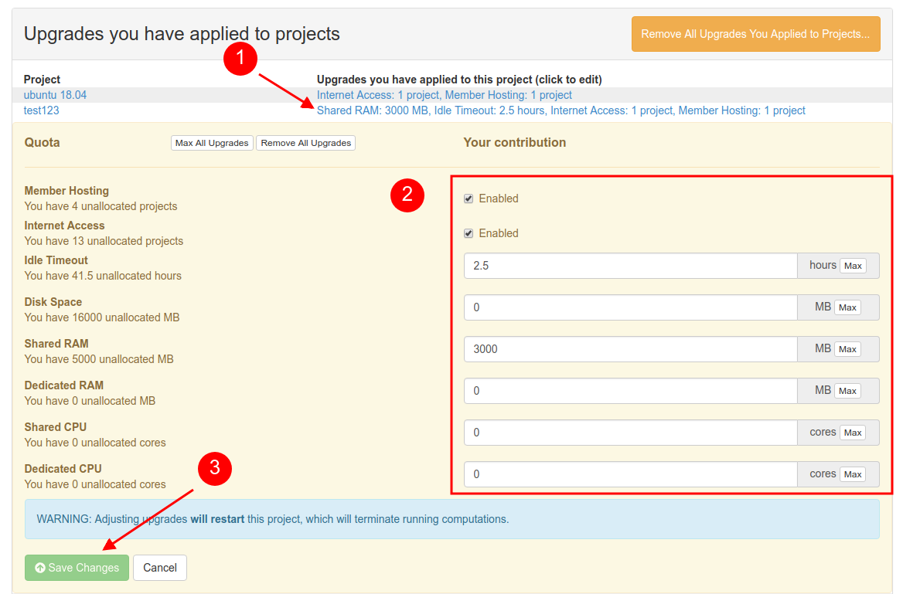

.. index:: Project Upgrades
.. _upgrade-guide:

=====================
Project Upgrades
=====================

.. contents::
   :local:
   :depth: 2

Overview
========================

This page outlines the steps for upgrading projects from :doc:`trial projects <trial>`.

Questions about quotas, upgrades, and billing are answered in :doc:`billing`.

.. index:: Purchase a Plan
.. index:: Subscription; purchasing

Select your plan
===============================

In order to purchase a `personal subscription or course package <https://cocalc.com/policies/pricing.html>`_,
go to **Account** settings and click on **Subscriptions/Course Packages**.
In the dialog visible below, continue your selecting by first selecting the type and then the specific plan.
The example shows a 1-year personal "Standard Plan" subscription.

.. index:: Credit Card

Credit card information
===============================

CoCalc also needs to know how to charge you, in case we do not already have your payment information on file with you.
Please enter your credit card information in the purchase information dialog below.
If you got a coupon, you can also add it here.

.. index:: Invoice, Receipt
.. index:: Subscription; view active
.. index:: Subscription; canceling

Active subscriptions
============================

After you have completed the steps above, the dialog changes to show you your ongoing subscriptions.
You can check their status at any time.
This dialog allows you to **cancel** them as well.

Below that part, you also find "Invoices and receipts".

.. index:: Applied Upgrades

Applied Upgrades
==============================

You can review your usage of CoCalc upgrades and where they are currently applied to.

You can even adjust upgrades right from there, or remove all of them from all projects in order to redistribute them.
For adjusting per project, click on the upgrade information on the right hand side of the "Upgrades you have applied to projects" table. Then make your changes and confirm it.

.. note::

    This dialog is identical to the :ref:`upgrade adjustment dialog <project-upgrades>`
    in the :doc:`project-settings`.

