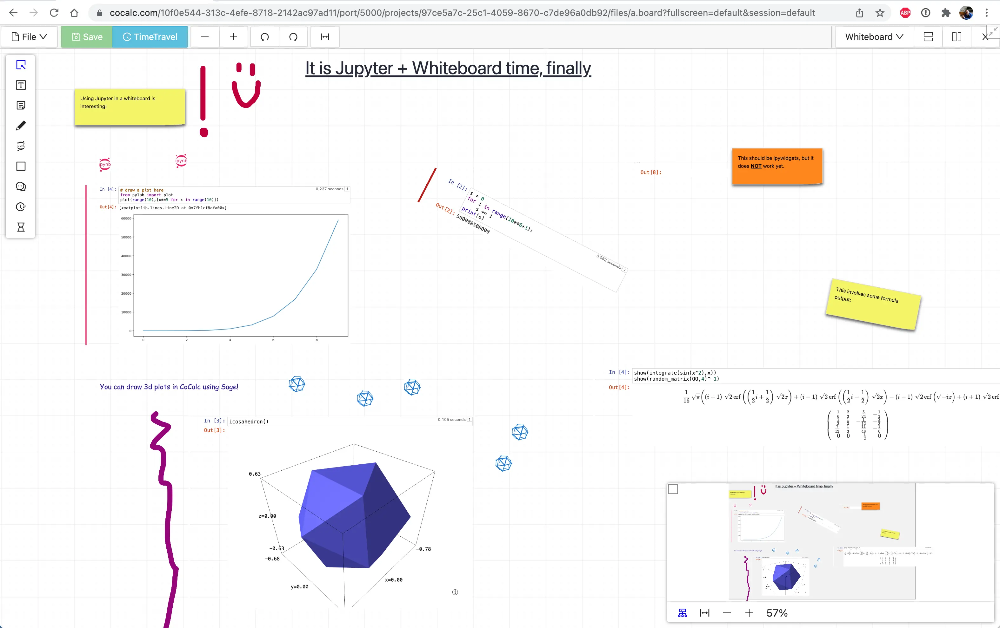

.. index:: whiteboard

========================
Whiteboard
========================

CoCalc offers you a full-featured online collaborative whiteboard.

Read more about `Whiteboard on the CoCalc website <https://cocalc.com/features/whiteboard>`_.

.. contents::
     :local:
     :depth: 2

##########################
List of Features
##########################

CoCalc's collaborative mathematical whiteboard supports an infinite canvas with these features:

* text with mathematical LaTeX expressions
* sticky notes
* sketching with pens
* chat conversations with collaborators
* hundreds of icons
* manage to-do lists with whiteboards
* copy and paste between whiteboards
* search view of whiteboard contents (see below)
* frames to group objects and organize the whiteboard into sections
* stopwatches and countdown timers to organize and track work.
* create edges between all objects
* infinitely split editor windows to view multiple parts of the whiteboard simultaneously
* easily navigate with an overview map with two preview modes
* every change you make is recorded via browsable TimeTravel and you can copy/paste from any point in the history
* publish your whiteboards to the CoCalc share server

##########################
To-do Lists
##########################

In a sticky note, text, etc., mark action items by placing a pair of brackets in the item, preceded and followed by a space and with a space between the brackets. The item will be displayed with an empty checkbox. Click the checkbox when the item is done, or place an "x" between the brackets, and it will show as a checked item.

.. figure:: img/wb-tasks-code.png
    :width: 60%
    :align: center
    :alt: code for to-do list in a whiteboard sticky note
    
    Code for an unchecked box and a checked box in a sticky note.

.. figure:: img/wb-tasks-rendered.png
    :width: 50%
    :align: center
    :alt: rendered list in a whiteboard sticky note

    How the unchecked and checked boxes are displayed

##########################
Search View
##########################

*Search View* of a whiteboard gives you a panel that lists all text, sticky notes and code in order, with a search box at the top. You can search for text and click on any matching item to center the whiteboard on it.
Search view can make your whiteboards easier to manage as they get larger.

.. figure:: img/wb-search-view.png
    :width: 100%
    :align: center
    :alt: example search view of a whiteboard

    Whiteboard, showing search view in right panel

Search view works well with to-do lists. To find all not done items, put :code:`"[ ]"` (note the quotes) in the search box. To find all completed items, search for :code:`"[x]"`.

You can put hashtags on notes, e.g. :code:`#foo` and search for those as well, or put :code:`-` (minus sign) in front to exclude matching items from search, e.g. :code:`-#foo`. 

If you don't see a menu choice for Search View in a current whiteboard, then refresh your browser, click the "split vertically" button (upper right), then click the dropdown that says "Whiteboard" and change it to "Search".

By default, the search panel is open to the right for new whiteboards.

##########################
Jupyter Cells
##########################

A CoCalc whiteboard can include Jupyter code cells. Whiteboard code cells allow:

* over a dozen supported kernels
* CoCalc's massive library of pre-installed software
* interactive widgets
* execution order determined by a directed graph

.. image:: img/code-cells-in-wb.png
    :width: 80%
    :align: center
    :alt: whiteboard with two code cells and a sticky note
