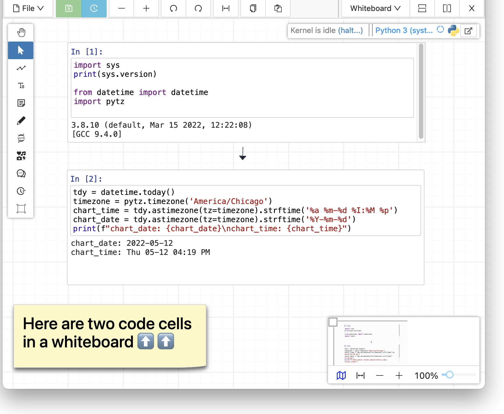
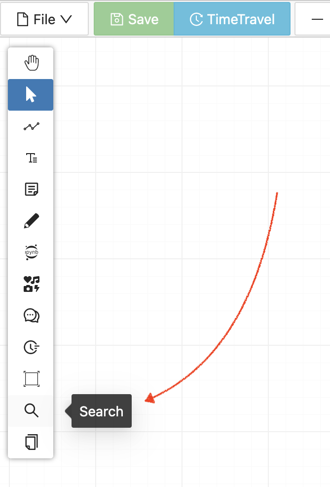
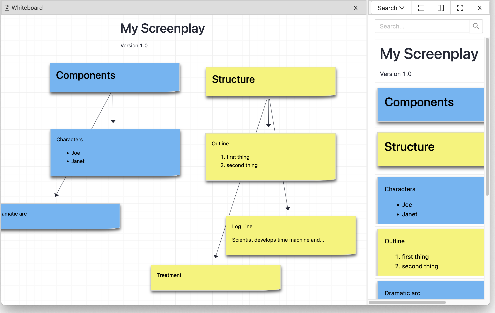
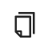

.. index:: whiteboard

========================
Whiteboard
========================

CoCalc offers you a full-featured online collaborative whiteboard.

Read more about `Whiteboard on the CoCalc website <https://cocalc.com/features/whiteboard>`_.

.. contents::
     :local:
     :depth: 2

.. figure:: img/search-and-pages.png
    :width: 90%
    :align: center
    :alt: simple whiteboard with Pages and Search view
    
    sample whiteboard with Pages and Search views open

##########################
List of Features
##########################

CoCalc's collaborative mathematical whiteboard supports an infinite canvas with these features:

* :ref:`search view <search-view>` of whiteboard contents
* organize your whiteboard as multiple :ref:`pages <pages-view>`.
* :ref:`Jupyter code cells <jupyter-cells>` that execute sequentially
* :ref:`to-do lists <to-do-lists>`
* **text** objects that allow mathematical LaTeX expressions
* **sticky notes**
* sketching with **pens**
* **chat** conversations with collaborators
* hundreds of **icons**
* **copy and paste** between whiteboards
* **frames** to group objects and organize the whiteboard into sections
* **stopwatches and countdown timers** to organize and track work.
* create **edges** (arrows) between all objects
* infinitely **split whiteboard windows** to view multiple parts of the whiteboard simultaneously
* easily navigate with an **overview map** with two preview modes
* every change you make is recorded via browsable **TimeTravel** and you can copy/paste from any point in the history
* **publish** your whiteboards to the CoCalc share server

.. note::

    At this time, the only way to export an image of all or part of a whiteboard is by taking a screenshot. Exporting a whiteboard to a pdf, png, or svg file is not yet implemented. See `CoCalc issue #6024 <https://github.com/sagemathinc/cocalc/issues/6024>`_.

.. _whiteboard-hashtags:

########################
Hashtags
########################

You can put hashtags on notes, e.g. :code:`#foo` and search for those as well, or put :code:`-` (minus sign) in front to exclude matching items from search, e.g. :code:`-#foo`. You can search for regular expressions by enclosing them in slashes, for example ``/^# /``.

.. _jupyter-cells:

##########################
Jupyter Cells
##########################

A CoCalc whiteboard can include Jupyter code cells. Whiteboard code cells allow:

* over a dozen supported kernels
* CoCalc's massive library of pre-installed software
* interactive widgets
* execution order determined by a directed graph

.. _pages-view:

##########################
Pages
##########################

If you click the "Pages" icon: |pages-icon|, the Pages panel appears.

.. figure:: img/open-pages-view.png
    :width: 40%
    :align: center
    :alt: pages icon in toolbar

    pages icon in toolbar opens Pages view

There's a button "+ New" that creates a new page. You can see previews of all your pages in the pages panel, and click a preview to jump to any page.

You can also see a page number in upper left of the main whiteboard, and click or edit to go to a page.

.. figure:: img/page-one-of-two.png
    :width: 40%
    :align: center
    :alt: page number displayed at upper left

    whiteboard is showing page 1 of 2

The Search panel is ordered by page number. Putting things in different pages imposes an ordering in the search.

.. _search-view:

##########################
Search View
##########################

By default, the search panel is open to the right for new whiteboards. You can also use the vertical toolbar at left and select the icon for the search panel: |search-icon|.

    search icon in toolbar opens Search view

*Search View* of a whiteboard gives you a panel that lists all text, sticky notes and code in order, with a search box at the top. You can search for text and click on any matching item to center the whiteboard on it. The ordering of items in Search View is lexicographic by the \(y,x\) coordinates: items closer to the top are listed first; items at the same height are listed left to right.

Search view can make your whiteboards easier to manage as they get larger.

    Whiteboard, showing search view in right panel

Search view works well with to-do lists. To find all not done items, put :code:`"[ ]"` (note the quotes) in the search box. To find all completed items, search for :code:`"[x]"`.

If you don't see a menu choice for Search View in a current whiteboard, then refresh your browser, click the "split vertically" button (upper right), then click the dropdown that says "Whiteboard" and change it to "Search".

.. _to-do-lists:

##########################
To-do Lists
##########################

In a sticky note, text, etc., you can mark action items by placing a pair of brackets in the item, preceded and followed by a space and with a space between the brackets. The item will be displayed with an empty checkbox. Click the checkbox when the item is done, or place an "x" between the brackets, and it will show as a checked item.

.. figure:: img/wb-tasks-code.png
    :width: 60%
    :align: center
    :alt: code for to-do list in a whiteboard sticky note
    
    Code for an unchecked box and a checked box in a sticky note.

.. figure:: img/wb-tasks-rendered.png
    :width: 50%
    :align: center
    :alt: rendered list in a whiteboard sticky note

    How the unchecked and checked boxes are displayed

.. |search-icon| image:: img/antd-icons/search-icon.png
    :height: 20px
    :alt: search icon

